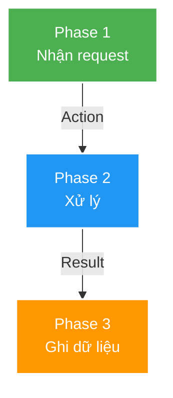

# 🎨 Mermaid Diagram Readability & Styling Standards

> **Purpose**: Đảm bảo Mermaid diagrams vừa đúng ngữ nghĩa, vừa đọc được trong viewport Markdown cố định.

---

## 🎯 4 GOLDEN RULES

1. **LAYOUT TRƯỚC MÀU SẮC**: ưu tiên `flowchart TB`/`TD`; không nén một flow dài vào một hàng ngang.
2. **TEXT MÀU TRẮNG**: `color:#fff` cho tất cả nodes có background.
3. **NỀN ĐẬM**: dùng Material Design colors, KHÔNG pastel.
4. **BORDER TRẮNG**: `stroke:#fff,stroke-width:2px`.

---

## 📏 Width-safe layout rules

Mermaid tự co toàn bộ SVG theo chiều rộng của Markdown viewport. Vì vậy một chuỗi ngang càng dài thì chữ và node càng nhỏ, dù màu sắc đúng.

### Direction và horizontal budget

- Mặc định dùng `flowchart TB` hoặc `flowchart TD` cho tài liệu Markdown.
- Chỉ dùng `LR`/`RL` cho flow ngắn có **tối đa 4 node trên trục chính** và label ngắn.
- Không tạo một path ngang quá **5 node**. Nếu vượt ngưỡng, đổi sang `TB`/`TD`, chia phase bằng `subgraph`, hoặc tách thành nhiều diagram.
- Một rank/hàng ngang nên có tối đa **3–4 node**. Database/cache phụ nên đặt thành nhánh bên, không kéo dài trục chính.

### Label budget

- Giữ mỗi visual line khoảng **24 ký tự** khi có thể.
- Dùng `<br/>` để wrap label dài thành 2–4 dòng có nghĩa; không nhét component, method và SQL vào cùng một dòng.
- Rút gọn label trong node; đưa chi tiết dài, SQL đầy đủ và caveat ra prose/table ngay dưới diagram.

### Scope budget

- Một diagram nên trả lời **một câu hỏi chính** và thường không quá **10–12 node**.
- Tách riêng các abstraction level khi diagram vừa mô tả component, transaction, SQL, lock và solution.
- Với flow nhiều phase, dùng `subgraph` đánh số và bố trí dọc; chỉ dùng `direction LR` bên trong phase có 2–4 node ngắn.
- Với decision tree, lifecycle hoặc transaction sequence dài, luôn ưu tiên `TD`/`TB`.

### Readability gate

Trước khi hoàn tất, kiểm tra bằng mắt theo viewport Markdown thông thường:

1. Không có một hàng ngang chạy gần hết diagram với hơn 4 node.
2. Node dài đã được wrap bằng `<br/>`.
3. Text vẫn đọc được mà không cần zoom ảnh.
4. Nếu chưa đạt, đổi direction hoặc tách diagram; không cố sửa bằng màu hay thêm text.

---

## 📐 Standard Color Palette

```yaml
# Config/Repository (Green)
fill:#4CAF50,stroke:#fff,stroke-width:2px,color:#fff

# Server/Service (Blue)
fill:#2196F3,stroke:#fff,stroke-width:2px,color:#fff

# Application (Orange)
fill:#FF9800,stroke:#fff,stroke-width:2px,color:#fff

# Queue/Critical (Pink)
fill:#E91E63,stroke:#fff,stroke-width:2px,color:#fff

# Database (Purple)
fill:#9C27B0,stroke:#fff,stroke-width:2px,color:#fff

# Cache/Storage (Teal)
fill:#009688,stroke:#fff,stroke-width:2px,color:#fff
```

---

## ✅ Template



---

## ❌ Common Mistakes

| ❌ BAD | ✅ GOOD |
|--------|---------|
| `flowchart LR` với 6–10 node nối tiếp | `flowchart TB`, chia phase hoặc tách diagram |
| Label dài trên một dòng | Wrap thành các dòng ngắn bằng `<br/>` |
| Một diagram trộn component + SQL + lock + solution | Tách mỗi câu hỏi thành một diagram |
| `fill:#90EE90,stroke:#333` | `fill:#4CAF50,stroke:#fff,stroke-width:2px,color:#fff` |
| `fill:#87CEEB,stroke:#333` | `fill:#2196F3,stroke:#fff,stroke-width:2px,color:#fff` |
| `fill:#FFD700,stroke:#333` | `fill:#FF9800,stroke:#fff,stroke-width:2px,color:#fff` |

**Vấn đề**: layout quá rộng làm Mermaid scale nhỏ toàn bộ SVG; màu pastel, border tối và thiếu `color:#fff` tiếp tục làm text khó đọc.

---

## 🎨 Color Mapping

| Component | Color | Style String |
|-----------|-------|--------------|
| Config/Repo | 🟢 Green | `fill:#4CAF50,stroke:#fff,stroke-width:2px,color:#fff` |
| Server | 🔵 Blue | `fill:#2196F3,stroke:#fff,stroke-width:2px,color:#fff` |
| App | 🟠 Orange | `fill:#FF9800,stroke:#fff,stroke-width:2px,color:#fff` |
| Database | 🟣 Purple | `fill:#9C27B0,stroke:#fff,stroke-width:2px,color:#fff` |
| Queue | 🔴 Pink | `fill:#E91E63,stroke:#fff,stroke-width:2px,color:#fff` |

---

## 📋 Quick Checklist

- [ ] Mặc định `TB`/`TD`; nếu dùng `LR`/`RL`, trục chính không quá 4 node
- [ ] Không có hàng ngang quá 3–4 node hoặc path ngang quá 5 node
- [ ] Label dài đã wrap bằng `<br/>`; chi tiết dài nằm ngoài diagram
- [ ] Diagram không quá 10–12 node; đã tách abstraction level nếu cần
- [ ] Text đọc được trong Markdown mà không cần zoom
- [ ] Tất cả nodes có `color:#fff`
- [ ] Tất cả nodes có `stroke:#fff,stroke-width:2px`
- [ ] Không dùng pastel (`#90EE90`, `#87CEEB`, `#FFD700`)
- [ ] Text dễ đọc trên nền tối

---

## 🎯 5-Step Process

1. **Chốt câu hỏi** mà diagram cần trả lời; tách diagram nếu có nhiều abstraction level.
2. **Chọn layout**: mặc định `TB`/`TD`; chỉ dùng `LR`/`RL` khi đạt horizontal budget.
3. **Giảm width**: chia phase/subgraph, wrap label, chuyển chi tiết dài ra prose/table.
4. **Chọn màu** từ palette và apply `fill:#HEX,stroke:#fff,stroke-width:2px,color:#fff` cho tất cả styled nodes.
5. **Qua readability gate**: text phải đọc được trong viewport Markdown mà không cần zoom.

✅ **Done!**

