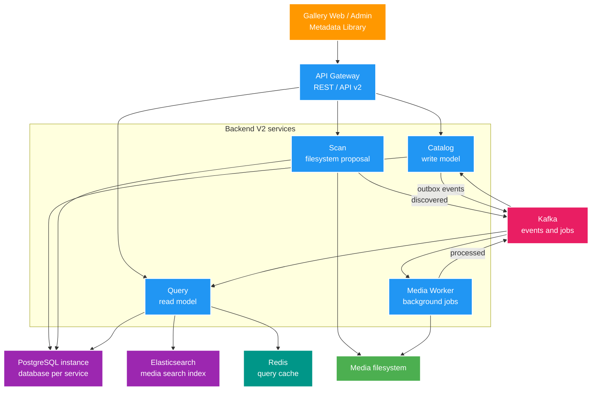
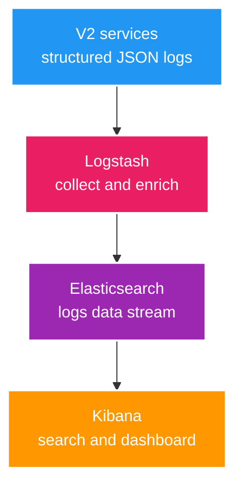

# Backend V2 — Kế hoạch và High Level Design

## High Level Design



## Contract event chung

```text
eventId, eventType, eventVersion, occurredAt,
correlationId, aggregateType, aggregateId, payload
```

Topic đầu tiên:

- `media.file.discovered.v1`
- `media.subject.changed.v1`
- `media.metadata.changed.v1`
- `media.processing.requested.v1`
- `media.processing.completed.v1`
- `media.dead-letter.v1`

Producer ghi business data và outbox trong cùng transaction. Relay publish Kafka; consumer lưu `eventId` để idempotent, retry hữu hạn và chuyển lỗi không phục hồi sang DLT.

## Log pipeline



Log mang `correlationId`, service name, environment, level và exception fields. Log shipping không được chặn request nghiệp vụ; logs data stream chỉ phục vụ quan sát/debug, tách khỏi media search index.

## Monorepo mục tiêu

```text
apps/                 gateway, catalog, scan, query, media-worker
platform/             event-contracts, observability, test-support
infra/                compose và observability
docs/                 architecture, ADLC, contracts, ADR, feature docs
```

Mỗi service theo `domain/`, `application/`, `adapter/in/`, `adapter/out/`, `config/`. Chỉ `platform/event-contracts` được chia sẻ; không chia sẻ entity/repository/domain service.

## Giai đoạn 0 — Bootstrap

1. Tạo Maven Wrapper, parent BOM và năm application module.
2. Pin Java 25, Spring Boot 4.0.3, plugin và Docker image.
3. Tạo Docker Compose cho PostgreSQL, Kafka KRaft, Redis.
4. Tạo health endpoint và ADR cho boundary, ownership, event envelope, retry.

Xong khi một lệnh bật hạ tầng và từng service có health check.

## Giai đoạn 1 — Catalog vertical slice

1. Tạo database `catalog_db` và Flyway.
2. Làm `media_subject`, `media_asset`, API create/get/list.
3. Dùng record, sealed result, generic command/query handler.
4. Thêm OpenAPI và Testcontainers PostgreSQL.

Chưa dùng Kafka/Redis cho đến khi domain model rõ.

## Giai đoạn 2 — Scan và parser strategy

1. Tạo database `scan_db`, scan job/item, preview/review API.
2. Strategy parser cho JOKE video/assets, USE video/assets, USE Album và candidate link `FULL_ALBUM_OF` Album → Syncdroid.
3. Registry chọn parser theo root config.
4. Thử virtual thread cho metadata I/O và đo kết quả.

Scan chỉ tạo proposal, không ghi Catalog và không sửa filesystem.

## Giai đoạn 3 — Kafka, Outbox, idempotency

1. Scan approved item ghi outbox `file.discovered`.
2. Relay publish Kafka.
3. Catalog consume, xử lý idempotent, publish `subject.changed`.
4. Thêm partition key, retry, DLT và màn xem outbox/DLT tối thiểu.

Không thêm Saga: chưa có transaction dài giữa nhiều service.

## Giai đoạn 4 — Media Worker

1. Consume `processing.requested` bằng consumer group.
2. Đọc technical metadata, rồi thêm thumbnail, GIF, hash theo thứ tự.
3. Publish `processing.completed` và lỗi có cấu trúc.
4. Catalog cập nhật asset từ completion event.

Giới hạn concurrency để không nghẽn ổ đĩa.

## Giai đoạn 5 — Query + Redis

1. Consume event thành projection trong database `query_db`.
2. Dựng Elasticsearch index `media-subject-*` từ cùng event projection, tách biệt với logs data stream.
3. API search/filter/order/pagination cho Gallery/Media Library dùng Elasticsearch cho full-text, fuzzy match và autocomplete.
4. Redis cache-aside cho card/detail hoặc query nóng đã đo được; không cache tùy tiện mọi search result.
5. Có cơ chế rebuild index từ Query projection và phản hồi degraded rõ ràng khi search index chưa đồng bộ/không sẵn sàng.
6. Đo search latency, index lag và cache hit rate trước/sau tối ưu.

## Giai đoạn 6 — Gateway và frontend cutover

1. Route `/api/v2/catalog`, `/scan`, `/query`.
2. Truyền correlation ID qua HTTP và Kafka headers.
3. Chuyển Media Library trước, sau đó Metadata Library và Gallery Web.
4. Điều hướng bằng ID, không nhét display name vào search.

V1 và V2 cùng chạy; chưa xóa consumer V1.

## Giai đoạn 7 — Import V1

1. Importer read-only hoặc export snapshot từ V1.
2. Dry-run, batch idempotent, checkpoint và đối soát.
3. Rebuild Query projection từ Catalog/event.

Chỉ import thật sau khi người dùng duyệt dry-run.

## Giai đoạn 8 — Observability và hiệu năng

> FT014 được kéo lên trước FT013 để tạo khả năng debug và quan sát hiệu năng của code hiện có. FT014 chỉ làm metrics/dashboard và structured logs/ELK; k6/load test, OpenTelemetry trace xuyên Kafka, alert/SLO, JFR/JMH và profiling sâu vẫn để lát sau của Phase 8.

1. Micrometer: HTTP, Kafka lag, cache, DB pool.
2. OpenTelemetry trace xuyên Gateway, service và Kafka.
3. Prometheus/Grafana cho metrics; OpenTelemetry cho trace; ELK cho structured log.
4. Thêm Elasticsearch, Logstash, Kibana bằng Compose profile `observability`; pin cùng version, dùng logs data stream và không dùng `latest`.
5. Chuẩn hóa JSON log có `correlationId`, service name, exception fields; shipping failure không chặn request.
6. JFR/JMC, JMH, k6/Gatling, `EXPLAIN ANALYZE`.

Luôn baseline trước khi tối ưu.

## Giai đoạn 9 — Learning lab tùy chọn

- Schema Registry + Avro/Protobuf.
- Kafka Streams.
- Resilience4j.
- Kubernetes local bằng kind/k3d.
- GraalVM native image.
- Structured Concurrency/Scoped Value khi trạng thái Java 25 phù hợp.

Các lab không chặn core flow.
