# 001 Bootstrap platform — Design

Owner: platform (cross-service)
Brief: [01-brief.md](./01-brief.md)

## High Level Design

Diagram trả lời câu hỏi: Cấu trúc monorepo multi-module Maven và môi trường runtime containerized local của 5 microservices được kiến trúc như thế nào?

```mermaid
flowchart TB
    ROOT["<font color='white'>Maven Monorepo Root<br/>(file_mngt_microservice)</font>"] --> PLATFORM["<font color='white'>Platform Modules</font>"]
    ROOT --> APPS["<font color='white'>Application Services</font>"]
    ROOT --> INFRA["<font color='white'>Local Infrastructure</font>"]

    subgraph PLATFORM_MOD["Platform Modules"]
        direction TB
        EC["<font color='white'>:platform:event-contracts</font>"]
        TS["<font color='white'>:platform:test-support</font>"]
    end

    subgraph APP_MOD["Applications"]
        direction TB
        GW["<font color='white'>:apps:gateway-service</font>"]
        CAT["<font color='white'>:apps:catalog-service</font>"]
        SCAN["<font color='white'>:apps:scan-service</font>"]
        QUERY["<font color='white'>:apps:query-service</font>"]
        WORKER["<font color='white'>:apps:media-worker</font>"]
    end

    subgraph INFRA_CONTAINERS["Docker Compose Local"]
        direction TB
        PG["<font color='white'>PostgreSQL<br/>(catalog_db, scan_db, query_db)</font>"]
        KAFKA["<font color='white'>Apache Kafka<br/>(KRaft Mode)</font>"]
        REDIS["<font color='white'>Redis Cache</font>"]
    end

    PLATFORM --> PLATFORM_MOD
    APPS --> APP_MOD
    INFRA --> INFRA_CONTAINERS

    style ROOT fill:#4CAF50,stroke:#fff,stroke-width:2px
    style PLATFORM fill:#2196F3,stroke:#fff,stroke-width:2px
    style APPS fill:#2196F3,stroke:#fff,stroke-width:2px
    style INFRA fill:#FF9800,stroke:#fff,stroke-width:2px
    style EC fill:#4CAF50,stroke:#fff,stroke-width:2px
    style TS fill:#4CAF50,stroke:#fff,stroke-width:2px
    style GW fill:#2196F3,stroke:#fff,stroke-width:2px
    style CAT fill:#2196F3,stroke:#fff,stroke-width:2px
    style SCAN fill:#2196F3,stroke:#fff,stroke-width:2px
    style QUERY fill:#2196F3,stroke:#fff,stroke-width:2px
    style WORKER fill:#2196F3,stroke:#fff,stroke-width:2px
    style PG fill:#9C27B0,stroke:#fff,stroke-width:2px
    style KAFKA fill:#E91E63,stroke:#fff,stroke-width:2px
    style REDIS fill:#009688,stroke:#fff,stroke-width:2px
```

## Quyết định

- Dùng Java 25, Spring Boot 4.0.3 và Maven multi-module; Maven Wrapper là entry build duy nhất.
- Root `pom.xml` là aggregator/parent; application module độc lập đóng gói executable jar.
- Group/package gốc: `com.filemngt.v2`.
- Mỗi service đặt tại `apps/<service>/`, còn module được chia sẻ có kiểm soát ở `platform/`.
- Mỗi service có package `domain`, `application`, `adapter.in`, `adapter.out`, `config` ngay từ đầu; P0 chỉ tạo class tối thiểu, không tạo domain rỗng hàng loạt.
- Docker Compose local chỉ gồm PostgreSQL, Kafka KRaft và Redis. Observability để feature sau.
- Spring Actuator cung cấp `/actuator/health/liveness` và `/actuator/health/readiness`.
- Cấu hình lấy từ environment variable với default local an toàn; secret chỉ qua `.env` local bị gitignore.

## Module và runtime

| Module | Artifact dự kiến | Port local | Persistence P0 |
| --- | --- | --- | --- |
| `apps/gateway-service` | `gateway-service` | Theo [ADR-004](../../adr/ADR-004-local-port-allocation.md) | Không |
| `apps/catalog-service` | `catalog-service` | Theo ADR-004 | `catalog_db` sau P1 |
| `apps/scan-service` | `scan-service` | Theo ADR-004 | `scan_db` sau P2 |
| `apps/query-service` | `query-service` | Theo ADR-004 | `query_db` sau P5 |
| `apps/media-worker` | `media-worker` | Theo ADR-004 | Không |
| `platform/event-contracts` | `event-contracts` | — | Không |
| `platform/test-support` | `test-support` | — | Không |

P0 tạo `catalog_db`, `scan_db`, `query_db` cùng user riêng qua Compose init script; chưa có bảng nghiệp vụ. Mỗi feature owner tự chạy Flyway trong database của mình, không tạo database cho service khác.

## Data ownership và contract

- Không có REST business API, Kafka business event hoặc database migration trong P0.
- Gateway chỉ có health; chưa route sang downstream service.
- Không service nào gọi service khác ở P0.
- `event-contracts` chỉ có event envelope placeholder/documentation alignment, không có domain event cụ thể.
- Quyết định ownership dài hạn được ghi tại [ADR-001](../../adr/ADR-001-v2-service-and-data-ownership.md).

## Local infrastructure contract

Compose service name dự kiến: `postgres`, `kafka`, `redis`.

- PostgreSQL: persistence source of truth cho service schemas về sau.
- Kafka: KRaft, single broker local, dùng cho event và background job ở phase sau.
- Redis: cache only, có thể tắt mà core persistence không mất dữ liệu.
- Image phải pin version hoặc digest sau khi xác minh compatibility. Không dùng `latest`.

## Luồng lỗi, idempotency và consistency

- P0 chưa có write nghiệp vụ, Kafka consumer hoặc outbox nên chưa phát sinh eventual consistency.
- Startup failure phải hiện rõ dependency/config thiếu qua Actuator health và log; không dùng fallback giả.
- Health endpoint không được tiết lộ secret/config value.

## Hiệu năng, quan sát và bảo mật tối thiểu

- Chỉ bật Actuator health/info; metrics/tracing dashboard thuộc feature observability.
- Virtual thread, Kafka tuning, Redis cache và connection pool tuning chưa bật cho đến khi có workload đo được.
- Port/config local được ghi trong `.env.example`; `.env`, volume data và secret bị gitignore.
