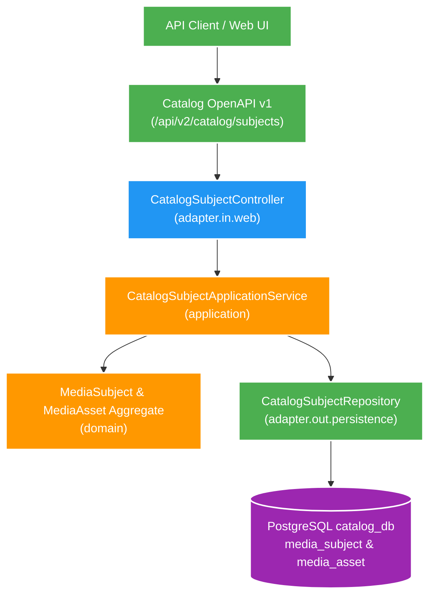

# 002 Catalog vertical slice — Design

Owner: `catalog-service`
Brief: [01-brief.md](./01-brief.md)

## High Level Design

Diagram trả lời câu hỏi: Cấu trúc vertical slice Hexagonal/DDD của Catalog Service tiếp nhận API OpenAPI và persist canonical `media_subject`/`media_asset` vào PostgreSQL như thế nào?

## Quyết định

- Catalog là canonical write/read owner duy nhất cho subject và asset trong feature này.
- Dùng Spring MVC, Spring Data JPA, Flyway và PostgreSQL; package theo `domain`, `application`, `adapter.in`, `adapter.out`, `config`.
- API contract source of truth: [catalog-v1.yaml](../../contracts/openapi/catalog-v1.yaml). Controller không tự định nghĩa contract.
- API v1 chỉ có create, detail và list. Không thêm update/delete để giữ vertical slice nhỏ.

## Domain và data ownership

`media_subject`:

- `id` UUID, `subject_type` (`VIDEO` | `ALBUM`), `region` (`JOKE` | `USE`), `identity_key`, `display_title`, audit timestamp.
- Unique `(region, subject_type, identity_key)` bảo vệ canonical identity và retry tạo trùng.

`media_asset`:

- `id` UUID, `subject_id`, `role` (`PRIMARY_VIDEO` | `VIDEO` | `IMAGE` | `GIF`), `relative_path`, audit timestamp.
- Unique `(subject_id, relative_path)`; partial unique index đảm bảo một `PRIMARY_VIDEO` mỗi subject.
- Create subject và asset chạy trong một transaction; database Catalog là nơi duy nhất được ghi.

P1 chưa có event nghiệp vụ hoặc outbox. Khi feature Kafka bắt đầu, thay đổi cần publish sẽ ghi outbox cùng transaction; P1 không tạo topic hay fake relay.

## REST/event contract

- `POST /api/v2/catalog/subjects`: tạo subject và optional initial assets, trả `201` hoặc `409` khi identity đã tồn tại.
- `GET /api/v2/catalog/subjects/{subjectId}`: trả subject detail hoặc `404`.
- `GET /api/v2/catalog/subjects`: filter `region`, `subjectType`, pagination `page`/`size`, sort mặc định `createdAt,desc`.
- Error dùng `application/problem+json`; schema, request/response và validation nằm trong OpenAPI.
- Không có Kafka event, outbox, consumer hay gọi sang service khác ở feature này.

## Luồng lỗi, idempotency và consistency

- Validation thực hiện ở request boundary và vẫn có constraint ở database.
- Race condition create identity được database chặn; application chuyển unique violation thành `409` ổn định.
- Retry HTTP sau khi request tạo thành công nhưng client mất response có thể nhận `409`; caller dùng canonical identity để list/get, không suy diễn đã tạo thất bại.
- Không có eventual consistency vì chỉ một database owner và không có projection.

## Hiệu năng, quan sát và bảo mật tối thiểu

- List giới hạn `size` tối đa 100, có index theo unique identity và filter/sort list phù hợp.
- Actuator health giữ nguyên; log lỗi không chứa path hoặc payload nhạy cảm ngoài mức cần debug.
- Không thêm Redis/cache, virtual thread hay tuning pool trước khi có số đo.
