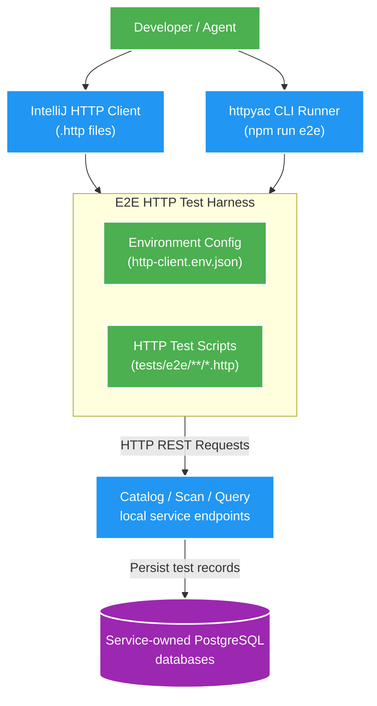

# 003 E2E HTTP harness — Design

Owner: platform test tooling
Brief: [01-brief.md](./01-brief.md)

## High Level Design

Diagram trả lời câu hỏi: Harness E2E HTTP được tổ chức và thực thi như thế nào để kiểm thử các microservice REST API endpoint đang chạy local?

## Quyết định

- Dùng JetBrains-style `.http` và `httpYac` CLI `6.16.7` pin trong `tests/e2e/package.json`.
- `tests/e2e/README.md` là hướng dẫn vận hành duy nhất cho E2E; `AGENTS.md` chỉ route tới tài liệu này khi task có E2E.
- `tests/e2e/http-client.env.example.json` được commit; `http-client.env.json` chỉ local.
- Mỗi API owner có folder riêng. Request đặt tên, assertion `??`, và dùng data `E2E-` để cô lập dữ liệu.

## Giới hạn

- E2E kiểm tra runtime đã được người dùng khởi động; Testcontainers Maven vẫn là integration test tự động độc lập.
- Catalog hiện không có delete API nên E2E create sẽ để lại subject `E2E-*` ở local DB. Không dùng scenario này với dữ liệu production.
- Không có contract/architecture/data ownership thay đổi.
