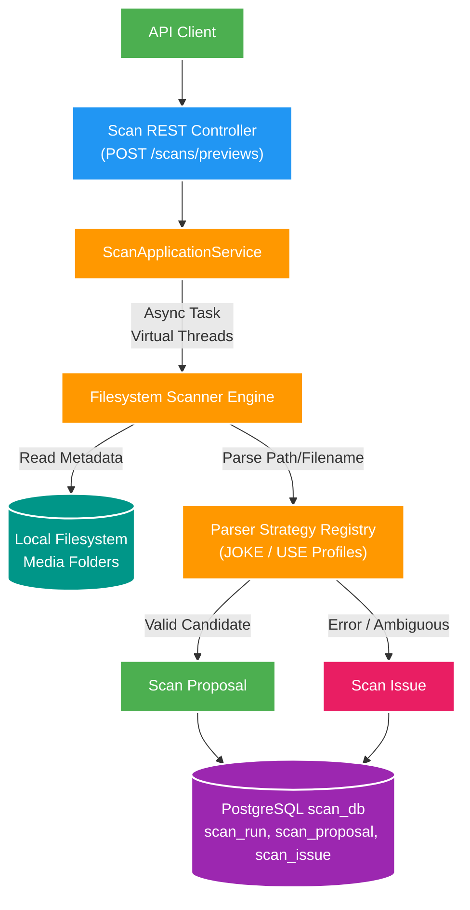

# 004 Scan preview — Design

Owner: `scan-service` / `scan_db`
Brief: [01-brief.md](./01-brief.md)

## High Level Design

Diagram trả lời câu hỏi: Luồng scan preview filesystem không đồng bộ từ API request đến parser profile và lưu trữ proposal/issue diễn ra như thế nào?

## Boundary và consistency

- `scan-service` là owner duy nhất của `scan_db`; không join/ghi `catalog_db`.
- Request `POST /api/v2/scans/previews` chỉ chứa `rootKey`. Root registry local ánh xạ key → absolute path + parser profile.
- Request trả `202`; background scan cập nhật cùng một run. `GET` đọc run, proposal và issue. Không có event trong feature này.
- Một root chỉ có một run `RUNNING`; request trùng trả `409`. `COMPLETED`/`FAILED` giữ lại để review.

## Root profile và parser

| Profile | Nguồn | Kết quả chính |
| --- | --- | --- |
| `JOKE_VIDEO` | Root video JOKE | Video subject theo code |
| `JOKE_ASSET` | Cover/Pics/GIF JOKE | Asset candidate theo code |
| `USE_VIDEO` | Syncdroid | Video subject theo normalized basename |
| `USE_ASSET` | FullPics/GIF USE | Asset candidate theo normalized basename |
| `USE_ALBUM` | Album USE | Album theo relative folder; optional `FULL_ALBUM_OF` candidate |

Parser chỉ đọc relative path/filename và tạo proposal hoặc issue. `FULL_ALBUM_OF` chỉ là candidate evidence trong proposal, chưa tạo relation Catalog.

## Data model

- `scan_run`: root key, profile, `RUNNING|COMPLETED|FAILED`, timestamps, counter và `last_error`.
- `scan_proposal`: run, source relative path, parser profile, candidate subject/asset identity và evidence JSON tối thiểu.
- `scan_issue`: run, source relative path, code (`UNPARSEABLE`/`AMBIGUOUS`/`IO_ERROR`) và detail.

Proposal/issue là item review của phase này; không cần status item riêng. Mỗi run/path chỉ có một proposal hoặc issue cùng loại.

## Contract và failure

- Contract source: `docs/contracts/openapi/scan-v1.yaml`.
- Root không cấu hình/không đọc được là `400`; run không tồn tại là `404`; root đang scan là `409`.
- Lỗi I/O một file tạo issue và tiếp tục scan. Lỗi root/fatal chuyển run sang `FAILED` với `last_error`.
- Đệ quy chỉ lấy regular file; bỏ qua symlink để tránh thoát root/cycle.

## Performance

- Dùng virtual thread cho metadata I/O khi scan đủ lớn, nhưng giới hạn concurrency qua config; không tối ưu trước khi có benchmark.
- API list luôn phân trang; không trả toàn bộ proposal trong run detail.
