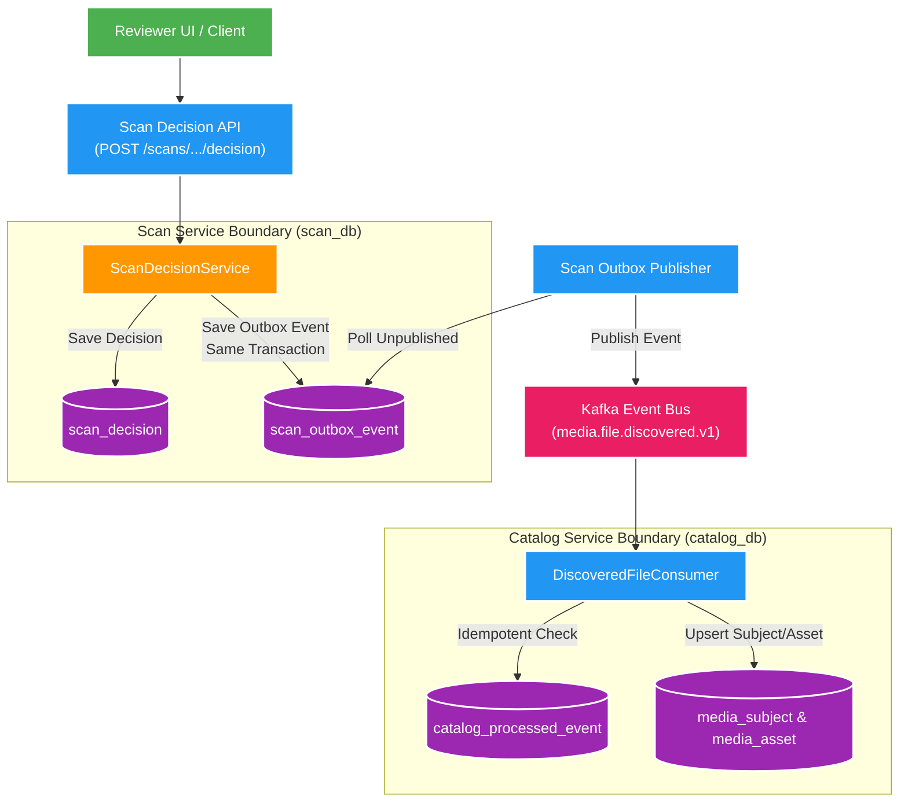

# 005 Scan approval outbox — Design

Owner: `scan-service` (Scan API, `scan_db`, producer) và `catalog-service` (`catalog_db`, consumer)
Brief: [01-brief.md](./01-brief.md)

## High Level Design

Diagram trả lời câu hỏi: Luồng duyệt proposal với Transactional Outbox từ Scan Service qua Kafka đến idempotent consumer tại Catalog Service diễn ra như thế nào?



## Quyết định

- Scan là owner của review decision và outbox; Catalog là owner duy nhất của canonical subject/asset.
- `POST /api/v2/scans/{scanId}/proposals/{proposalId}/decision` nhận `APPROVE` hoặc `REJECT`.
- Một proposal chỉ có một decision. Gửi lại cùng decision trả record hiện có (`200`); gửi decision khác trả `409`.
- `APPROVE` tạo outbox `media.file.discovered.v1`; `REJECT` chỉ lưu decision. Không tạo thêm workflow status cho proposal hay approval.
- Outbox dùng `published_at`, `attempt_count`, `last_error` thay vì enum status. Publisher chỉ lấy record chưa có `published_at`; gửi thành công mới đánh dấu published.
- Catalog consumer xử lý at-least-once: unique `event_id` trong `catalog_processed_event`, cùng transaction với upsert subject/asset.

## Domain và data ownership

### Scan (`scan_db`)

- `scan_proposal` giữ candidate đã parse, không sửa dữ liệu scan gốc.
- `scan_decision`: `proposal_id` unique, `decision`, `decided_at`. Decision là lịch sử tối thiểu và idempotency boundary.
- `scan_outbox_event`: `id`/`event_id`, aggregate proposal, topic/type, JSON payload, `created_at`, `published_at`, `attempt_count`, `last_error`.
- `APPROVE` insert decision + outbox cùng `@Transactional`; event payload được dựng từ proposal đã persist.

### Catalog (`catalog_db`)

- `catalog_processed_event`: `event_id` unique, `processed_at`; chỉ phục vụ consumer dedupe.
- Consumer map profile sang `JOKE`/`USE`, candidate type `VIDEO`/`ASSET` sang canonical `VIDEO`, `ALBUM` sang canonical `ALBUM`.
- Consumer tìm subject theo identity canonical; nếu chưa có thì tạo. Nếu event có `assetRole`, chỉ thêm asset nếu subject chưa có cùng `relativePath + role`.
- Asset và video cùng identity vì vậy hội tụ về một subject, kể cả asset đến trước video.

Không service nào query/write database của service kia.

## REST/event contract

### Scan REST

`POST /api/v2/scans/{scanId}/proposals/{proposalId}/decision`

```json
{ "decision": "APPROVE" }
```

Response `200` gồm `proposalId`, `decision`, `decidedAt`, `eventId` (`null` với reject). Lỗi: `400` request invalid, `404` run/proposal không tồn tại hoặc proposal không thuộc run, `409` decision khác đã tồn tại.

### Kafka event

Contract: [media.file.discovered.v1.md](../../contracts/events/media.file.discovered.v1.md)

- Topic: `media.file.discovered.v1`.
- Producer: Scan outbox publisher; consumer: Catalog.
- Partition key: `region:subjectType:identityKey`.
- Payload v1 mang `eventId`, proposal/source identity, canonical region/type/key/title và asset role/path.
- Kafka không phải source of truth; Catalog dedupe bằng `eventId`.

## Luồng lỗi, idempotency và consistency

1. Client quyết định proposal. Scan xác thực ownership proposal/run.
2. Transaction Scan insert decision; nếu approve thì insert outbox. Nếu cùng decision đã có, trả record cũ; nếu khác, `409`.
3. Publisher retry outbox chưa published. Lỗi giữ `last_error`/`attempt_count`; không làm mất event.
4. Catalog consumer nhận event. Nếu `eventId` đã processed thì no-op. Nếu chưa, upsert subject/asset và insert processed event trong một transaction.
5. API approval trả khi decision đã bền vững; dữ liệu Catalog có thể xuất hiện muộn do eventual consistency. Không tạo thêm status API chỉ để biểu diễn độ trễ này ở phase này.

## Hiệu năng, quan sát và bảo mật tối thiểu

- Publisher batch nhỏ, polling interval cấu hình được; không giữ transaction database trong lúc gọi Kafka.
- Log `eventId`, `proposalId`, `scanId`, correlation ID và số attempt. Expose số outbox pending/failed qua metrics sau nếu Actuator hiện có hỗ trợ.
- Chỉ root đã cấu hình mới có thể tạo proposal. Không đưa absolute filesystem path vào Kafka event hoặc API response.
