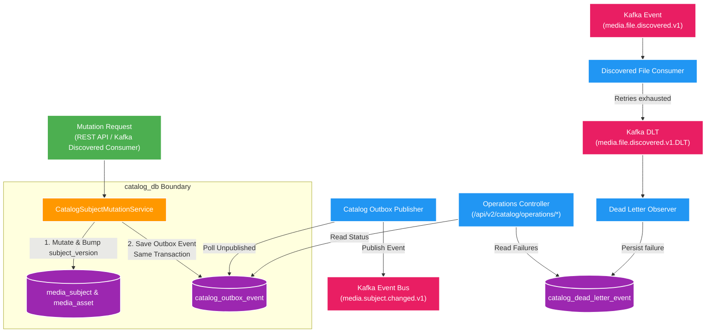

# 006 Catalog subject changed outbox — Design

Owner: `catalog-service`; `query-service` là consumer dự kiến ở feature sau
Brief: [01-brief.md](./01-brief.md)

## High Level Design

Diagram trả lời câu hỏi: Catalog Service thực thi Transactional Outbox cho event snapshot `media.subject.changed.v1` kèm versioning và DLT monitoring như thế nào?

## Quyết định

- Catalog là producer duy nhất của `media.subject.changed.v1`; canonical write và outbox được commit trong cùng transaction.
- Event mang full snapshot subject/assets. Không dùng `CREATED`/`UPDATED` vì consumer chỉ cần upsert snapshot mới nhất.
- Mỗi subject có `version` số tăng dần và `updated_at`. Outbox unique theo `subject_id + subject_version`; event dùng `subjectVersion` để chống stale/out-of-order delivery.
- Tạo subject qua REST và thay đổi do `media.file.discovered.v1` đều đi qua cùng một application component ghi subject + outbox.
- Duplicate/no-op không tạo event mới. Processed-event dedupe của input vẫn nằm trong cùng transaction.
- Observability dùng dữ liệu kỹ thuật sẵn có: `published_at`, `attempt_count`, `last_error`; không persist enum status.

## Domain và data ownership

### `catalog_db`

- Bổ sung `version BIGINT NOT NULL` và `updated_at TIMESTAMPTZ NOT NULL` cho `media_subject`.
- `catalog_outbox_event`: `event_id`, `subject_id`, `subject_version`, `event_type`, `partition_key`, JSON payload, `created_at`, `published_at`, `attempt_count`, `last_error`.
- Unique `(subject_id, subject_version)` bảo đảm một canonical version chỉ có một event; index partial theo `created_at` cho record chưa publish.
- `catalog_dead_letter_event`: lưu original topic/partition/offset, key, payload, exception summary và `received_at`; unique theo original topic/partition/offset.
- Catalog không đọc/ghi `query_db`; Query không đọc `catalog_db`.

### Transaction boundary

1. Application service xác định canonical mutation.
2. Persist và flush subject để có `subjectVersion` mới.
3. Tạo snapshot và insert outbox trong cùng transaction.
4. Với input Kafka, insert `catalog_processed_event` trong cùng transaction; duplicate input trả no-op trước khi tạo mutation/outbox.

Nếu insert outbox thất bại, toàn bộ canonical mutation rollback. Publisher chạy ngoài transaction nghiệp vụ và chấp nhận at-least-once delivery.

## REST/event contract

### Kafka

Contract: [media.subject.changed.v1.md](../../contracts/events/media.subject.changed.v1.md)

- Topic/event type: `media.subject.changed.v1`.
- Producer: Catalog outbox publisher.
- Consumer dự kiến: `query-service` ở Giai đoạn 5.
- Partition key: `subjectId`, giữ thứ tự thay đổi của cùng subject.
- Payload: event metadata, canonical identity, `subjectVersion`, `createdAt` và full asset snapshot.
- Consumer dedupe theo `eventId`, chỉ áp dụng khi `subjectVersion` lớn hơn version projection hiện có.

### Operational read API

OpenAPI owner: `docs/contracts/openapi/catalog-v1.yaml`.

- `GET /api/v2/catalog/operations/outbox`: phân trang, lọc `published` và `failedOnly`; không trả full payload mặc định.
- `GET /api/v2/catalog/operations/dead-letters`: phân trang DLT record mới nhất.
- API chỉ đọc, không replay/delete/update. `failedOnly=true` nghĩa là chưa publish và `attemptCount > 0`.

## Luồng lỗi, idempotency và consistency

1. Canonical transaction thành công thì outbox chắc chắn tồn tại; Kafka có thể nhận muộn.
2. Publisher lấy batch nhỏ theo `created_at`, publish bằng cùng `eventId`, rồi mới ghi `published_at`.
3. Publish lỗi tăng `attempt_count` và cập nhật `last_error`; lần poll sau retry. Không tạo event mới cho retry.
4. Nhiều publisher có thể phát trùng nhưng không làm sai dữ liệu vì consumer dedupe `eventId` và kiểm tra `subjectVersion`.
5. Catalog DLT observer lưu raw record idempotent theo Kafka coordinates. Lỗi observer được retry hữu hạn nhưng không republish sang chính DLT đó để tránh vòng lặp.
6. Query projection sẽ eventual consistent; feature này chưa bổ sung trạng thái đồng bộ vào Catalog API.

## Hiệu năng, quan sát và bảo mật tối thiểu

- Publisher batch tối đa 20 record, fixed delay cấu hình được; không giữ database transaction trong lúc chờ Kafka acknowledgement.
- Log có cấu trúc tối thiểu gồm `eventId`, `subjectId`, `subjectVersion`, topic và attempt; không log toàn payload media.
- Meter gồm outbox publish success/failure, pending count, oldest pending age và DLT received count; expose qua Actuator theo cấu hình local.
- Operations API giới hạn `size <= 100`, sắp xếp mới nhất trước và không trả stack trace/full exception.
- Chưa có auth nên API vận hành chỉ được gọi trực tiếp trong local; Gateway chưa route các endpoint này.

## Compatibility và rollback

- Đây là event mới, không sửa `media.file.discovered.v1`; producer/consumer hiện tại tiếp tục tương thích.
- Query chưa consume nên rollout Catalog producer trước là an toàn. Kafka giữ event đến khi Query feature được triển khai hoặc projection được rebuild.
- Rollback code bằng revert; giữ nguyên migration/outbox/DLT records. Có thể tắt publisher bằng property mà không mất canonical data hoặc pending event.
