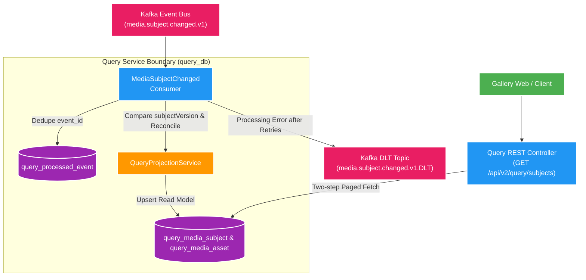

# 007 Query subject projection — Design

Owner: `query-service`; producer contract: [media.subject.changed.v1.md](../../contracts/events/media.subject.changed.v1.md)

## High Level Design

Diagram trả lời câu hỏi: Query Service tiêu thụ event snapshot từ Kafka để xây dựng Read Model PostgreSQL và phục vụ API query phân trang như thế nào?

## Quyết định

- `query_media_subject`/`query_media_asset` là snapshot projection PostgreSQL, không phải canonical data.
- Consumer dedupe `eventId`; subject chưa tồn tại luôn nhận snapshot đầu tiên kể cả `subjectVersion=0`. Event version thấp hoặc bằng projection hiện có là no-op nhưng vẫn được đánh dấu processed.
- Snapshot mới reconcile assets theo `assetId` trong cùng transaction: cập nhật asset còn tồn tại, thêm mới và xóa asset vắng mặt. DLT theo `<topic>.DLT`, retry 2 lần với backoff 1 giây.
- REST chỉ đọc projection; `search` là contains-ignore-case trên identity/title. `order=CREATED_AT|TITLE`. List phân trang subject trước rồi fetch assets theo tập ID của trang để không phân trang trên collection fetch.

## Contract

- Kafka input: `media.subject.changed.v1`, key `subjectId`, at-least-once.
- REST owner: `docs/contracts/openapi/query-v1.yaml`.
- Eventual consistency biểu diễn bằng `projectionVersion` và `projectedAt`; không thêm status.

## Rollback

Revert code có thể dừng consumer; không xóa projection/processed records. Rebuild/backfill là feature riêng.
