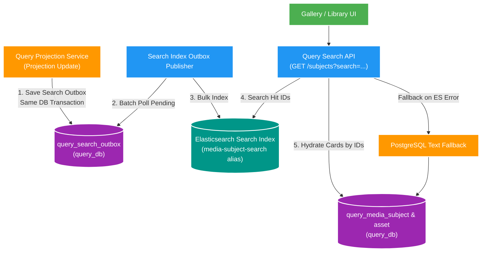

# 008 Elasticsearch media search — Design

Owner: `query-service`
Brief: [01-brief.md](./01-brief.md)
ADR: [ADR-003](../../adr/ADR-003-elasticsearch-media-search.md), [ADR-004](../../adr/ADR-004-local-port-allocation.md)

## High Level Design

Diagram trả lời câu hỏi: Query Service duy trì search projection trên Elasticsearch qua Transactional Outbox và xử lý REST search request kèm fallback PostgreSQL như thế nào?

## Quyết định

- PostgreSQL `query_db` tiếp tục là durable projection; Elasticsearch là rebuildable search projection do Query sở hữu.
- Dùng official Elasticsearch Java Client do Spring Boot 4.0.3 quản lý ở version `9.2.5`; local server image cũng pin `9.2.5`. Không khai báo lại version trong service POM.
- Alias đọc/ghi ổn định là `media-subject-search`; physical index có dạng `media-subject-v1-<timestamp>`. Mapping version nằm trong resource của Query.
- Document ID là `subjectId`. Elasticsearch external version dùng `projectionVersion + 1`, cho phép event version `0` và ngăn retry/out-of-order ghi đè snapshot mới hơn.
- Mapping tối thiểu: exact keyword cho `region`, `subjectType`, `identityKey.keyword`; text có `index_prefixes` cho `identityKey` và `displayTitle`; date cho `createdAt`/`projectedAt`; assets chỉ giữ dữ liệu cần hydrate/search, không làm canonical data.

## Domain và data ownership

- Consumer Feature 007 vẫn ghi projection và processed event trong `query_db`.
- Cùng transaction đó tạo `query_search_outbox` khi snapshot mới thực sự được áp dụng. Outbox không có business status: dùng `indexed_at`, `attempt_count`, `last_error` và unique `(subject_id, projection_version)`.
- Search index publisher đọc batch pending, tải snapshot mới nhất từ Query PostgreSQL và gửi Elasticsearch Bulk API. Thành công mới đánh dấu `indexed_at`; lỗi item được retry, duplicate an toàn nhờ document ID/external version.
- Không đọc `catalog_db`, không import Elasticsearch client/document vào shared platform module.

## REST/event contract

- Giữ `GET /api/v2/query/subjects`. Khi `search` có giá trị, Query tìm ID trên Elasticsearch rồi hydrate card/detail từ PostgreSQL theo đúng thứ tự hit.
- Bổ sung `order=RELEVANCE`; chỉ hợp lệ khi có `search`. `CREATED_AT|TITLE` giữ compatibility. `page * size + size` không vượt 10.000.
- `QuerySubjectPage` bổ sung additive fields `searchBackend=POSTGRESQL|ELASTICSEARCH|POSTGRESQL_FALLBACK` và `degraded`.
- Thêm `GET /api/v2/query/subjects/suggestions?q=&region=&subjectType=&size=`; `q` dài 1–100, `size` 1–20.
- Thêm synchronous operation `POST /api/v2/query/operations/search-index/rebuild`. Response chỉ trả index mới, số document, lỗi và thời gian; không tạo workflow status.
- Không đổi `media.subject.changed.v1` và không thêm Kafka topic.

## Luồng lỗi, idempotency và consistency

- Elasticsearch lỗi không rollback Query projection. Outbox giữ pending để retry; text search tạm fallback PostgreSQL và trả `degraded=true`.
- Fuzzy search dùng `multi_match`, boost `identityKey`, fuzziness `AUTO`; autocomplete dùng `bool_prefix` trên text field có `index_prefixes`. Exact filters luôn là keyword filter.
- Rebuild giữ transaction PostgreSQL `REPEATABLE_READ`, khóa chung với search publisher, tạo physical index mới và bulk toàn bộ snapshot theo batch trước khi alias swap. Projection update vẫn ghi PostgreSQL/outbox trong lúc rebuild; publisher xử lý pending trên alias mới sau khi khóa được nhả. Bất kỳ batch nào lỗi thì không đổi alias và xóa index candidate.
- Feature này vận hành một instance `query-service` local. Distributed rebuild lock chỉ bổ sung khi triển khai nhiều instance.

## Hiệu năng, quan sát và bảo mật tối thiểu

- Bulk index theo batch cấu hình được; không gửi từng document khi rebuild. Search chỉ hydrate PostgreSQL cho ID của đúng một page. Publisher retry exponential backoff từ 5 giây đến 5 phút khi Elasticsearch unavailable.
- Metrics: pending outbox, bulk indexed/failure, search latency, search failure và fallback count. Spring Boot Elasticsearch health contributor báo search component; readiness group mặc định của Query không lấy Elasticsearch làm điều kiện nhận request.
- Compose dùng profile `search`, single-node, security disabled chỉ cho local, host port `18113`; frontend không truy cập trực tiếp.
