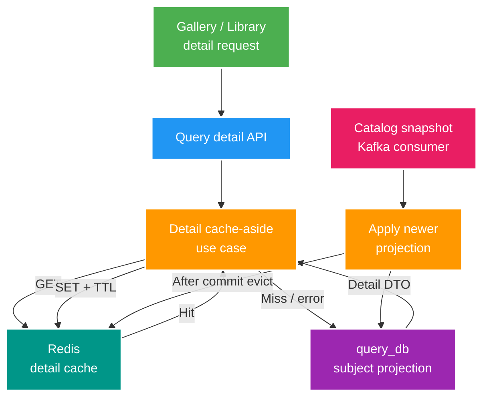

# 009 Query detail Redis cache — Design

Owner: `query-service`
Brief: [01-brief.md](./01-brief.md)

## High Level Design

Diagram trả lời câu hỏi: detail request đọc qua cache như thế nào và cache được vô hiệu hóa khi projection đổi?

## Quyết định

- Dùng Spring Data Redis 4 do Spring Boot 4.0.3 quản lý; dùng `RedisTemplate` với String key và JSON value để kiểm soát rõ cache-aside, fallback, TTL và metrics. Không dùng Redis Repository hoặc `@Cacheable` trong feature đầu tiên.
- Cache key: `query:subject-detail:v1:<subjectId>`. `v1` là schema cache, độc lập REST version và cho phép bỏ dữ liệu cũ bằng namespace mới.
- Cache value là immutable `QuerySubjectCacheEntry`, chỉ chứa dữ liệu cần tạo `SubjectDetail`; không cache JPA entity, lazy proxy hay object framework.
- TTL mặc định 10 phút, override bằng `QUERY_DETAIL_CACHE_TTL`; không có business status mới.

## Domain và data ownership

- PostgreSQL `query_db` vẫn là durable Query projection; Redis chỉ là dữ liệu rebuildable/best-effort do `query-service` sở hữu.
- Detail use case đọc Redis trước, hydrate PostgreSQL khi miss và ghi cache sau khi đọc thành công.
- Khi `QueryProjectionService` thực sự áp dụng version mới, phát application event nội bộ; listener `AFTER_COMMIT` evict đúng subject key. Duplicate/stale event không phát eviction.

## REST/event contract

- Giữ nguyên `GET /api/v2/query/subjects/{id}` và `QuerySubjectDetail`; client không biết response đến từ Redis hay PostgreSQL.
- Không đổi `media.subject.changed.v1`, Kafka topic hoặc OpenAPI. Metrics là operational contract qua Actuator, không thêm endpoint nghiệp vụ.

## Luồng lỗi, idempotency và consistency

- Redis get/put/evict bắt lỗi data-access/serialization tại adapter boundary, tăng error metric và tiếp tục PostgreSQL; lỗi Redis không rollback projection transaction.
- Eviction sau commit giảm nguy cơ xóa cache khi transaction rollback. Crash đúng khoảng trống sau DB commit có thể giữ value cũ, nhưng TTL 10 phút giới hạn stale window; không thêm outbox riêng cho cache eviction ở dự án local.
- Cache put lặp lại và eviction key không tồn tại đều an toàn. Không cache not-found để tránh che khuất subject vừa được projection.

## Hiệu năng, quan sát và bảo mật tối thiểu

- Metrics tối thiểu: `query.detail.cache.hit`, `miss`, `put`, `eviction`, `error` và timer đọc detail; theo dõi hit rate và p95 trước khi cache thêm list/search.
- Key không chứa filename, title hoặc dữ liệu nhạy cảm; value chỉ chứa Query detail đang được API trả về.
- Connection timeout phải ngắn để Redis lỗi không làm tăng mạnh API latency. Redis health không phải điều kiện readiness của Query.
