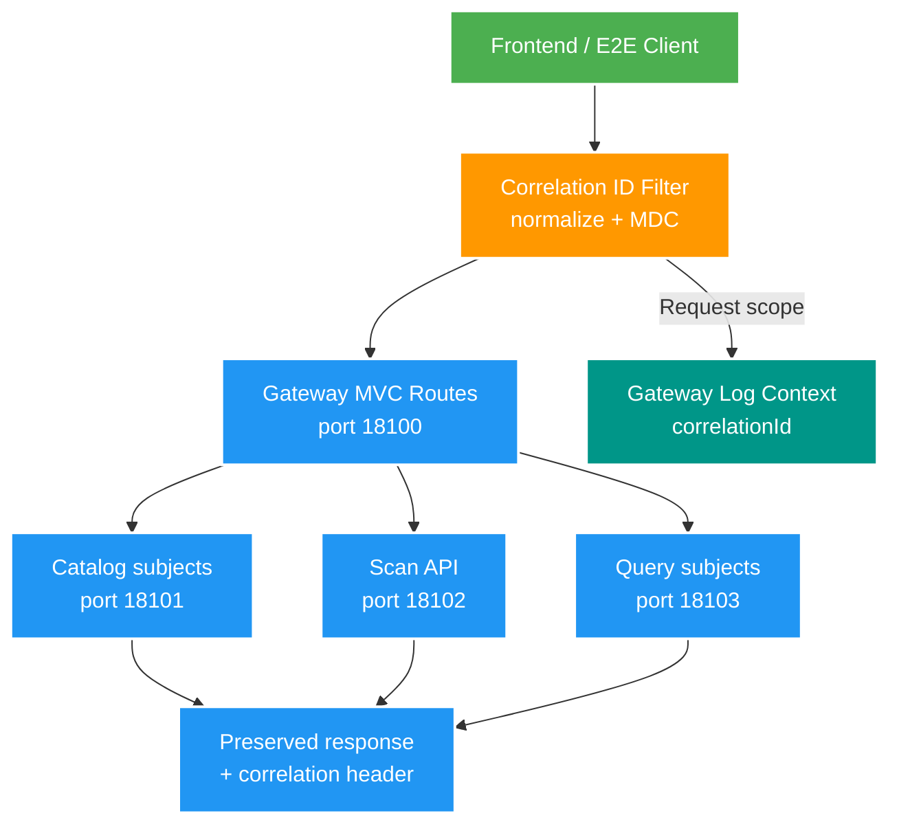

# 010 Gateway routing và correlation ID — Design

Owner: `gateway-service`
Brief: [01-brief.md](./01-brief.md)

## High Level Design

Diagram trả lời câu hỏi: Gateway chuẩn hóa correlation ID và chuyển request đến đúng business API như thế nào?

## Quyết định

- Dùng Spring Cloud Gateway Server Web MVC 5.0.2 với starter `spring-cloud-starter-gateway-server-webmvc`. Gateway 5.0 được xây trên Spring Framework 7 và Spring Boot 4; chọn MVC để phù hợp stack Servlet hiện tại, không đưa Reactor/WebFlux vào chỉ để routing.
- Pin version tại Maven root; `gateway-service` thay `spring-boot-starter-web` bằng Gateway MVC starter và giữ Actuator.
- Route tĩnh bằng cấu hình `spring.cloud.gateway.server.webmvc.routes`; downstream URI lấy từ environment, không hard-code trong Java và không thêm service registry ở local.
- Giữ nguyên path khi proxy, không `StripPrefix`/`RewritePath`. Direct service URL vẫn hoạt động trong giai đoạn chuyển tiếp.
- Không route operations endpoint. Việc không có route là deny-by-default và trả `404` tại Gateway.
- Không retry tự động vì cùng route có cả GET lẫn mutation; retry có điều kiện cho idempotent request sẽ là feature riêng nếu có số liệu cần thiết.

## Domain và data ownership

- Gateway không có database, Redis business cache, JPA entity hoặc domain state.
- Catalog, Scan và Query tiếp tục sở hữu API, dữ liệu, validation và error response của mình. Gateway chỉ sở hữu route, timeout và correlation HTTP context.
- Downstream URL local mặc định lần lượt là `http://localhost:18101`, `18102`, `18103`, override bằng `CATALOG_SERVICE_URL`, `SCAN_SERVICE_URL`, `QUERY_SERVICE_URL`. Port không đổi và vẫn theo ADR-004.

## REST/event contract

Contract ingress: [gateway-routing-v1.md](../../contracts/http/gateway-routing-v1.md).

| Gateway path | Downstream | Ghi chú |
| --- | --- | --- |
| `/api/v2/catalog/subjects`, `/api/v2/catalog/subjects/**` | Catalog `18101` | Không route `/operations/**` |
| `/api/v2/scans/**` | Scan `18102` | Giữ nguyên preview/decision paths |
| `/api/v2/query/subjects`, `/api/v2/query/subjects/**` | Query `18103` | Gồm detail/search/suggestions; không route `/operations/**` |

- Header `X-Correlation-Id` hợp lệ có 1–64 ký tự thuộc `[A-Za-z0-9._-]`. Thiếu, trùng hoặc không hợp lệ thì Gateway tạo UUID mới; response và downstream request dùng đúng một giá trị canonical.
- Gateway giữ nguyên method, query, body, content type, downstream status và business error body. Header contract là additive; OpenAPI business hiện tại không đổi.
- FT010 chỉ propagation HTTP. Kafka correlation header được chốt ở feature observability/cross-service sau, không sửa event payload v1.

## Luồng lỗi, idempotency và consistency

- Correlation filter set MDC trước routing, thêm response header và cleanup trong `finally`, kể cả route 404 hoặc downstream lỗi.
- Downstream trả 4xx/5xx thì Gateway chuyển nguyên status/body, không biến lỗi thành response thành công.
- Connect failure trả `502`; response timeout trước commit trả `504`; cả hai vẫn có `X-Correlation-Id`. Nếu body đã được forward một phần thì Gateway đóng response thay vì phát status thứ hai không hợp lệ. Timeout cấu hình mặc định connect 1 giây, response 30 giây.
- Không có distributed transaction hay eventual-consistency mới. Gateway không retry nên một client request tạo tối đa một downstream attempt.

## Hiệu năng, quan sát và bảo mật tối thiểu

- Dùng `http.server.requests` của Actuator cho Gateway; `correlationId` nằm trong MDC request scope để feature logging/trace sau dùng lại, không log request body hay dữ liệu nhạy cảm ở FT010.
- Giới hạn format/độ dài correlation ID để tránh log injection và header abuse; outbound header luôn replace, không append.
- Gateway readiness chỉ phản ánh Gateway; không aggregate health downstream để một service lỗi không làm mất route còn lại.
- Chưa mở CORS rộng, auth hay public internet. V2 local vẫn chạy song song V1.
