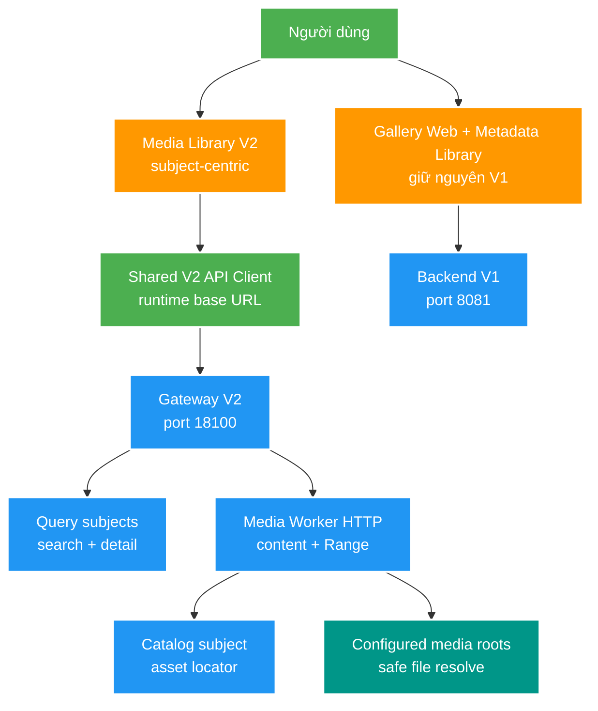

# 011 Frontend Gateway cutover — Design

Owner: `file_mngt_FE` (frontend) phối hợp `gateway-service` và `query-service`
Brief: [01-brief.md](./01-brief.md)

## High Level Design

Diagram trả lời câu hỏi: cutover V2 tách khỏi màn V1 hiện hành và đi qua Gateway như thế nào?

## Quyết định

- Dựng màn Media Library V2 mới theo subject, không đổi ngầm contract của Metadata Library hiện hành. Tên module được thêm vào `file_mngt_FE/docs/MODULE_NAMES.md` khi triển khai.
- Tạo một API client V2 dùng chung cho màn mới; client sở hữu URL building, query params, JSON/problem parsing, abort signal và correlation ID extraction. Component UI không tự ghép URL.
- Gateway là endpoint mặc định duy nhất. Direct Query URL có thể cấu hình cho rollback/dev diagnostics, nhưng không có fallback tự động trong cùng request.
- Dùng server-side pagination/order/filter từ Query. Không tải toàn bộ collection rồi phân trang phía frontend như Metadata Library V1.
- UI giữ state tối thiểu: filter, page và selected subject; không thêm workflow status mới.
- Media Worker dùng cùng deployable hiện tại và mở business HTTP tại `18104`; Actuator dùng cùng server. Không tạo service thứ sáu.
- Content endpoint nhận `subjectId + assetId`. Worker gọi Catalog trực tiếp để xác minh asset và lấy `storageKey + relativePath`, sau đó resolve file trong root registry cấu hình cục bộ.

## Domain và data ownership

- Catalog tiếp tục là canonical write model; Query sở hữu projection phục vụ UI.
- Frontend chỉ giữ presentation state và runtime endpoint configuration, không cache bền business data trong feature này.
- Gateway không biến đổi DTO/content và không sở hữu media metadata.
- Catalog sở hữu `storageKey + relativePath` của asset; `storageKey` được lấy từ `sourceRootKey` của scan event. Giá trị có thể thiếu với asset cũ/manual và không tạo thêm status nghiệp vụ.
- Asset locator duy nhất trong một subject là `storageKey + relativePath`; migration dùng `COALESCE(storage_key, '')` để asset legacy không tạo duplicate path khi `storageKey` null.
- Media Worker sở hữu root registry, safe-path resolution, MIME/range response và file I/O; không lưu metadata vào database.
- Metadata Library V1 và backend V1 tiếp tục độc lập trong giai đoạn rollout.

## REST/event contract

- Frontend dùng qua Gateway:
  - `GET /api/v2/query/subjects`
  - `GET /api/v2/query/subjects/{subjectId}`
  - `GET /api/v2/query/subjects/suggestions`
  - `GET|HEAD /api/v2/media/subjects/{subjectId}/assets/{assetId}/content`
- Contract hiện hành: [query-v1.yaml](../../contracts/openapi/query-v1.yaml) và [gateway-routing-v1.md](../../contracts/http/gateway-routing-v1.md).
- Media delivery contract: [media-delivery-v1.yaml](../../contracts/openapi/media-delivery-v1.yaml). Gateway route mới giữ nguyên path đến Media Worker.
- Catalog asset DTO thêm `storageKey` nullable theo hướng additive. `media.file.discovered.v1.sourceRootKey` được persist vào asset; không đổi Kafka payload hoặc tạo event version mới.
- Query DTO không lộ `storageKey`; client tạo content URL từ subject/asset UUID qua API client, không suy diễn từ `relativePath`.

## Luồng lỗi, idempotency và consistency

- List/detail đều là GET idempotent; thao tác filter hoặc đổi trang hủy request cũ bằng `AbortController` để response trễ không ghi đè state mới.
- `400` hiển thị lỗi filter hợp lệ cho người dùng; `404` detail đưa về empty/not-found state; `502/504` báo Gateway/downstream tạm không sẵn sàng và kèm correlation ID trong phần chẩn đoán.
- `degraded=true` vẫn render dữ liệu PostgreSQL fallback và hiển thị trạng thái search giảm cấp nhẹ, không coi là lỗi toàn màn.
- Projection eventual consistent; frontend không tự merge dữ liệu V1 và V2 thành một subject giả.
- Media Worker trả `404` cho subject/asset/file/root không tồn tại hoặc asset chưa có `storageKey`; không phân biệt chi tiết để tránh lộ filesystem. Range không hợp lệ trả `416`.
- Worker xác minh path chuẩn hóa vẫn nằm trong configured root và từ chối symlink/reparse escape; không có endpoint nhận path tự do.

## Hiệu năng, quan sát và bảo mật tối thiểu

- Debounce suggestion/search, giới hạn page size theo Query contract và không preload toàn bộ detail.
- Không log raw filesystem path hoặc nội dung media ở browser console. Correlation ID chỉ đi vào diagnostic error object.
- Không đưa operation/Actuator endpoint vào client frontend.
- Không tự động retry nhiều lần; người dùng có thể retry GET bằng action rõ ràng.
- Content response dùng MIME phù hợp, `Accept-Ranges: bytes`, `Content-Length`, `Last-Modified` và cache validation; Gateway không buffer toàn bộ media trong memory.
- Gateway chỉ mở CORS local hẹp cho `localhost:8888` và `127.0.0.1:8888`, expose correlation/content headers cần đọc từ browser; không dùng wildcard origin hay credentials.
