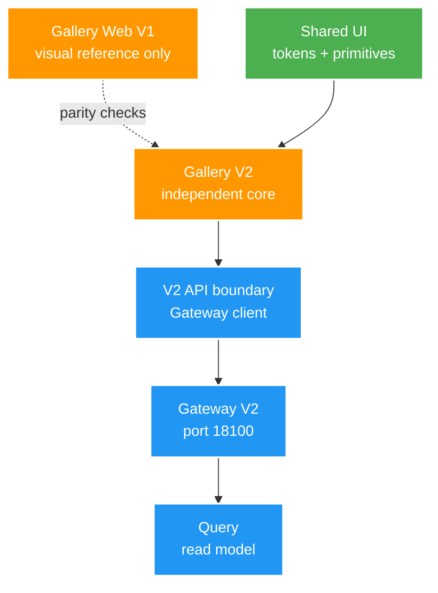

# 012 Gallery V2 parity foundation — Design

Owner: `file_mngt_FE` phối hợp `query-service`, `media-worker`, `gateway-service`
Brief: [01-brief.md](./01-brief.md)

## High Level Design

## Quyết định

- `gallery-v2/` nằm trong `file_mngt_FE` ở giai đoạn đầu để dùng Shared UI trực tiếp, nhưng có entry, context, state, API client và feature owner độc lập.
- V2 domain model do V2 sở hữu. Query DTO map sang V2 view model; không map sang object/render contract V1.
- `gallery-web/` chỉ được mở khi parity contract yêu cầu đối chiếu một khu vực cụ thể; không là dependency runtime/build.
- Shared UI chỉ sở hữu token, control, navbar shell và card chrome. V2 sở hữu composition/card content/behavior nghiệp vụ.
- Trước dữ liệu thật, Gallery V2 dùng fixture V2 cục bộ để hoàn thiện shell/state mà không bị chặn bởi backfill.

## Backfill và rollout

1. **Fixture:** fixture E2E riêng, root key mới, xác minh Scan → Catalog → Query → Media Delivery.
2. **Pilot root:** dry-run inventory V1, ghi sang V2 chỉ với một root nhỏ; đối soát số video/asset có locator trước apply.
3. **Region wave:** JOKE video → ảnh/GIF → USE video → USE Album; mỗi wave phải reconcile count và unresolved locator.
4. **Dual-run:** Gallery V1/V2 URL riêng; cùng filter/dataset so sánh count, card fields và preview, không đổi default.
5. **Opt-in/cutover:** chỉ thêm link V2 khi parity gate pass; V1 giữ rollback read-only đến khi người dùng chốt thay thế.

Backfill chỉ ghi vào database V2, không sửa/xóa V1. Asset thiếu `storageKey` được report unresolved, không đoán path.

## Rủi ro

- DTO V2 chưa đủ field cho một card V1: bổ sung read-model Query theo parity contract, không đẩy join sang frontend.
- Parity bị biến thành copy toàn bộ V1: chỉ giữ baseline state nhỏ; module V2 không import source V1.
- Backfill tạo duplicate: identity/locator canonical Catalog và dry-run/reconciliation là gate.
