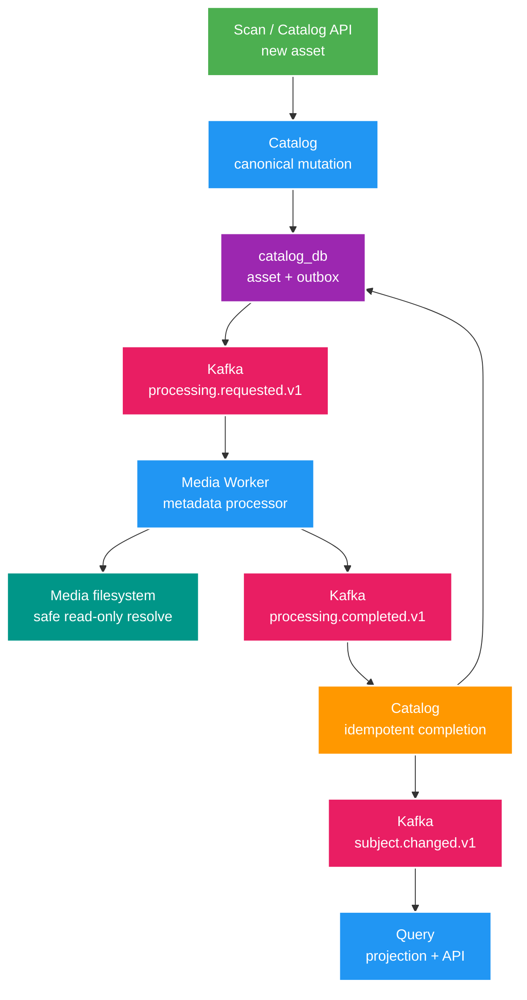

# 013 Media Worker processing foundation — Design

Owner: `media-worker`, phối hợp `catalog-service` và `query-service`
Brief: [01-brief.md](./01-brief.md)

## High Level Design

Diagram trả lời câu hỏi: asset mới đi qua work queue, được xử lý và hội tụ về canonical/read model như thế nào?

## Quyết định

- FT013 chỉ xử lý metadata lấy được bằng Java NIO và MIME resolver hiện hành: kích thước byte, media type và thời điểm sửa nguồn. Metadata sâu cần ffprobe/ImageIO cùng thumbnail/GIF/hash được tách khỏi foundation.
- `assetId` đại diện một physical asset bất biến; cặp `assetId + metadataVersion` là processing identity. Phiên bản đầu là `metadataVersion = 1`.
- Media Worker tiếp tục không có database theo ADR-001. Kafka có thể giao lại request; đọc metadata là read-only, completion event có ID xác định từ processing identity và Catalog dedupe bền vững.
- Worker chỉ return thành công khỏi listener sau khi Kafka xác nhận completion publish. Khoảng crash vẫn có thể tạo duplicate delivery nhưng không làm sai state.
- Không tạo `processing_status`. Thành công thể hiện bằng metadata/version trong Catalog; lỗi kỹ thuật dùng retry, DLT, metric và structured log.

## Domain và data ownership

- Catalog sở hữu request lifecycle ở mức canonical asset và lưu các cột nullable: `content_length`, `media_type`, `source_last_modified_at`, `technical_metadata_version`, `technical_metadata_updated_at`.
- Catalog outbox vẫn là durable source cho processing request. Migration nới unique constraint hiện chỉ cho một event trên mỗi `subjectId + subjectVersion`, để cùng mutation chứa một subject snapshot và nhiều request theo asset mà không mất tính duy nhất của snapshot.
- Media Worker sở hữu processor, root registry, safe-path resolver, concurrency và Kafka consumer group; không lưu job/result bền vững và không ghi Catalog database.
- Query sở hữu bản sao metadata trong `query_db`; chỉ nhận qua full snapshot `media.subject.changed.v1`.
- Asset thiếu `storageKey` không đủ canonical locator nên Catalog bỏ qua request. Backfill locator thuộc Phase 7, không biến thành trạng thái lỗi trong FT013.

## REST/event contract

### `media.processing.requested.v1`

- Producer: `catalog-service` transactional outbox.
- Consumer: `media-worker`; topic cùng tên, partition key `assetId`.
- Required payload: `eventId`, `eventType`, `occurredAt`, `subjectId`, `assetId`, `storageKey`, `relativePath`, `metadataVersion`.
- Không chứa absolute path. Retry outbox giữ nguyên `eventId` và payload.

### `media.processing.completed.v1`

- Producer: `media-worker`; consumer: `catalog-service`; topic cùng tên, partition key `assetId`.
- Required payload: `eventId`, `eventType`, `occurredAt`, `requestEventId`, `subjectId`, `assetId`, `metadataVersion`, `contentLength`, `mediaType`, `sourceLastModifiedAt`.
- `eventId` được sinh xác định từ `assetId + metadataVersion + eventType`; cùng processing identity luôn tạo cùng completion identity.

### Snapshot và REST additive

- `media.subject.changed.v1.assets[]` thêm các field optional tương ứng. Đây là thay đổi additive; event cũ không có field vẫn deserialize thành `null`.
- Catalog và Query asset response thêm metadata nullable; không đổi path, filter hay pagination hiện hành.
- Contract source of truth cần tạo/cập nhật trong `docs/contracts/events/` và OpenAPI Catalog/Query cùng implementation.

## Luồng lỗi, idempotency và consistency

- Catalog ghi asset, subject snapshot outbox và processing request outbox trong cùng transaction. Rollback canonical mutation cũng rollback cả hai event.
- Worker xác minh locator nằm trong configured root, không follow symlink/reparse escape và chỉ chấp nhận regular file. Nó đọc `BasicFileAttributes` với `NOFOLLOW_LINKS` rồi publish completion.
- Worker retry hữu hạn với backoff; lỗi còn lại đi `media.processing.requested.v1.DLT` cùng record gốc/Kafka error headers. Không phát `processing.failed` khi chưa có consumer nghiệp vụ cần contract đó.
- Catalog dedupe completion theo deterministic `eventId`. Completion có `metadataVersion` thấp hơn hoặc bằng version đã áp dụng là no-op; version mới hơn cập nhật asset, tăng subject version và enqueue snapshot trong cùng transaction.
- Query tiếp tục dùng subject version để bỏ duplicate/stale snapshot. Hội tụ là eventual consistency, E2E phải poll có timeout hữu hạn thay vì sleep cố định.

## Hiệu năng, quan sát và bảo mật tối thiểu

- Consumer concurrency mặc định nhỏ và cấu hình được; không tạo virtual thread không giới hạn. Foundation ưu tiên ổn định I/O trước benchmark.
- Metrics tối thiểu: processing completed/failed/DLT, processing duration và bytes observed; Catalog đếm applied/duplicate/stale completion.
- Structured log chỉ chứa event/subject/asset/storage key và error class; không log absolute path hay nội dung file.
- Giới hạn độ dài locator từ contract hiện có; `contentLength` phải không âm và `metadataVersion` phải dương trước khi Catalog áp dụng.
- Không mở API Worker mới, không mở root/path cho client và không thay đổi Media Delivery security boundary.
