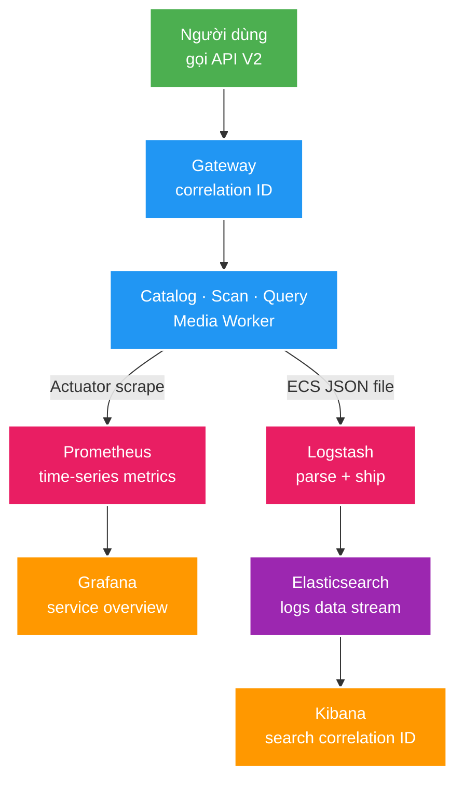

# 014 Observability và performance foundation — Design

Owner: `platform/observability`; runtime owner: `infra/observability`
Brief: [01-brief.md](./01-brief.md)

## High Level Design

## Quyết định

1. **Làm base theo metrics → logs.** Distributed tracing và load testing được tách khỏi FT014 để không kéo thêm collector/backend, instrumentation Kafka và kịch bản tạo tải trước khi các luồng hiện tại được hiểu rõ.
2. **Dùng Spring Boot 4 built-in structured logging ECS.** Không thêm log encoder bên thứ ba. Console vẫn ưu tiên đọc ở IntelliJ; file log dùng ECS JSON để Logstash ingest.
3. **Tạo `platform/observability` cho technical cross-cutting tối thiểu.** Module chỉ chứa MDC/correlation HTTP support và quy ước metric chung; không chứa domain entity, REST DTO hoặc business event.
4. **Prometheus scrape trực tiếp management endpoint của từng service.** Actuator không route qua Gateway và không public như business API.
5. **Dùng một Elasticsearch instance local nhưng tách logical data.** Query giữ media search index; Logstash chỉ ghi logs data stream riêng. Elasticsearch không trở thành source of truth.
6. **Observability là opt-in.** `docker compose --profile observability` bật stack; core PostgreSQL/Kafka/Redis vẫn chạy được độc lập.
7. **Quan sát trước, chưa đặt SLO cứng.** FT014 dùng traffic hiện có để đọc latency, throughput và error rate trên dashboard. Baseline có tải kiểm soát và regression threshold thuộc feature k6 sau.

## Domain và data ownership

- Không có domain state hoặc migration mới.
- Mỗi service sở hữu instrumentation của chính nó; `platform/observability` chỉ cung cấp technical convention dùng chung.
- Prometheus sở hữu time-series tạm thời; Elasticsearch logs data stream sở hữu bản sao log để tra cứu. Cả hai đều có thể rebuild/xóa mà không ảnh hưởng canonical data.
- `query-service` vẫn là owner duy nhất của media search index; pipeline log không ghi vào index nghiệp vụ.
- Grafana dashboard và Logstash pipeline là source-controlled config trong `infra/observability/`.

## REST/event contract

- Không đổi REST/Kafka business contract và không thêm topic.
- Thêm operation surface nội bộ `/actuator/prometheus` cho năm service; chỉ Prometheus/local operator gọi trực tiếp.
- `X-Correlation-Id` giữ contract hiện hành ở Gateway. Downstream filter chỉ đưa giá trị hợp lệ vào MDC và luôn cleanup sau request; không tự tạo một canonical ID khác khi Gateway đã cung cấp.
- Kafka log hiện dùng `eventId`, topic, partition/offset khi đã có trong consumer context; OpenTelemetry propagation qua header để feature sau.

## Luồng lỗi, idempotency và consistency

- Prometheus scrape lỗi biểu diễn bằng target `up = 0`; không retry trong application.
- Structured log được ghi file local trước. Logstash đọc bất đồng bộ; Logstash/Elasticsearch lỗi không làm request fail.
- Log ingest có thể at-least-once và trùng bản ghi sau restart; log không tham gia business consistency.
- Dashboard provisioning idempotent từ file. Data source dùng stable UID để import lại không tạo bản sao.
- Correlation MDC dùng request scope và cleanup trong `finally` để không rò ID giữa thread/request.

## Hiệu năng, quan sát và bảo mật tối thiểu

- Dashboard P0: service availability, HTTP request rate/error/p95, JVM heap/GC/thread/CPU, Hikari active/pending, Kafka consumer/producer metrics có sẵn, Redis/cache và custom Catalog/Query metrics.
- Chỉ dùng label cardinality thấp như service, method, normalized URI, status/outcome. Không dùng identifier, absolute path hoặc error text làm label.
- ECS log tối thiểu có timestamp, service name/version, level, logger, thread, message, correlation ID và exception fields. Không log password, token, raw media path hoặc payload nhạy cảm.
- Retention/heap local đặt nhỏ và ghi rõ trong Compose; mục tiêu là debug/học tập, không mô phỏng production capacity.
- Host port dùng đúng ADR-004: Kibana `18114`, Logstash `18115`, Prometheus `18116`, Grafana `18117`; không thêm port mới.
