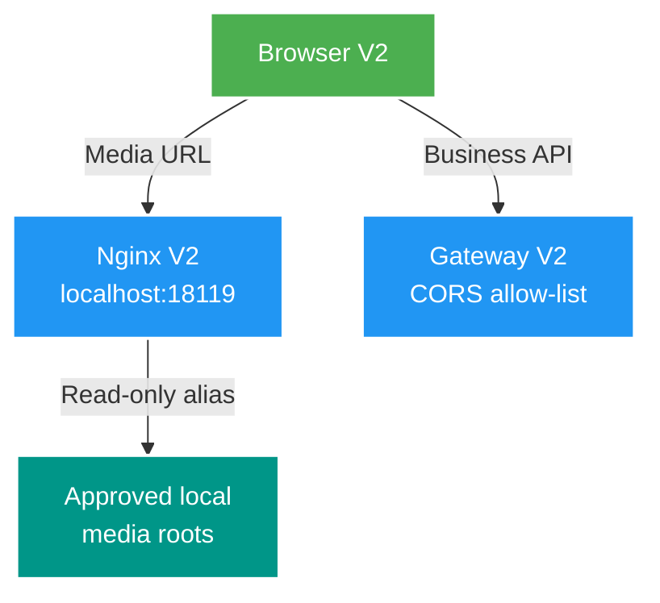

# 015 Nginx media delivery V2 tách biệt — Design

Owner: `infra/compose`; contract owner: `gateway-service`
Brief: [01-brief.md](./01-brief.md)

## High Level Design

## Quyết định

1. Thêm service `nginx-media` vào Compose V2 với container name `file-mngt-v2-nginx-media`, image pin `nginx:1.30.4-alpine`, config `infra/nginx/nginx.conf` và host port `18119` map vào port container `80`.
2. Giữ path public `/files/<drive>:/<path-encoded>` để không đổi format locator URL, nhưng origin V2 là `http://localhost:18119`; V1 `http://localhost:8888` tiếp tục hoàn toàn độc lập.
3. Cấu hình Nginx V2 chỉ có static alias read-only cho các root hiện được ADR-005 chấp nhận và trả `404` cho mọi path khác. Nginx tự phục vụ HEAD, byte range và cache validation của static file.
4. `NGINX_MEDIA_PORT` và `NGINX_MEDIA_VERSION` là override local trong `.env`; default Compose vẫn khớp ADR-004 và không dùng tag `latest`.
5. Gateway CORS đổi atomically cả contract, source và integration test sang hai origin V2 mới. Không giữ origin V1 để tránh browser V1 gọi business API V2 ngoài ý muốn.

## Domain và data ownership

- Không có domain state, service database, migration hoặc event mới.
- `infra/compose` sở hữu container, bind mount và Nginx config local; `gateway-service` sở hữu CORS ingress contract.
- Catalog vẫn sở hữu locator logic; Scan/Media Worker chỉ dùng `storageKey` cho filesystem của chúng. Nginx không đọc database và không tham gia business workflow.

## REST/event contract

- Không đổi REST business path, OpenAPI, Kafka topic/payload hay HTTP method.
- Local deployment contract đổi public media origin từ `8888` sang `18119`; path `/files/<drive>:/...` giữ nguyên.
- Gateway CORS cho `/api/v2/**` chỉ chấp nhận `http://localhost:18119` và `http://127.0.0.1:18119`.

## Luồng lỗi, idempotency và consistency

- Root/path không khớp alias trả `404`; Nginx không suy diễn hay chuyển tiếp filesystem path.
- Nginx container không có state business; restart không tạo duplicate hay ảnh hưởng consistency.
- Khi Nginx V2 chưa chạy hoặc media không tồn tại, browser nhận lỗi static delivery; Gateway/Catalog/Worker vẫn hoạt động độc lập.

## Hiệu năng, quan sát và bảo mật tối thiểu

- `sendfile` bật; Nginx giữ native static serving, range và cache validation, không đưa Java lên playback hot path.
- Chỉ map media roots read-only; tắt directory listing và không mount frontend/config của V1.
- Không log hay expose absolute host path qua API; không thêm metric label theo path.
