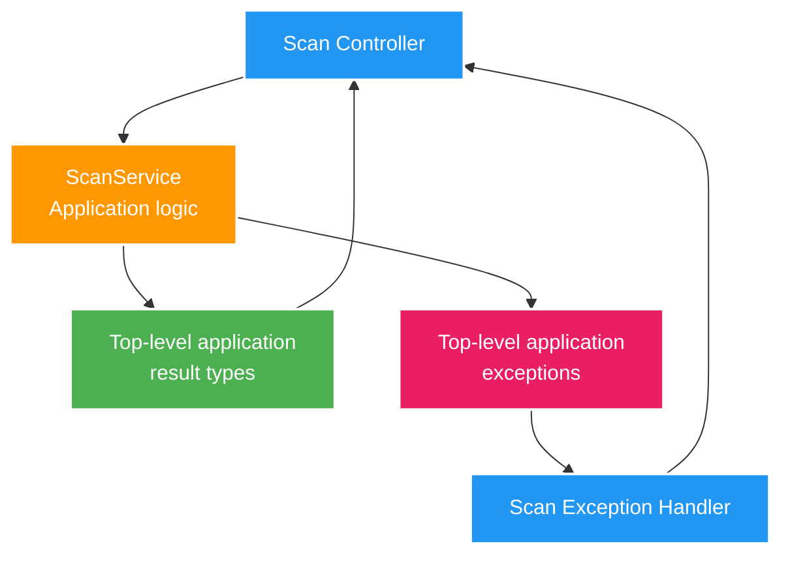

# 016 Scan service boundary cleanup — Design

Owner: `scan-service`
Brief: [01-brief.md](./01-brief.md)

## High Level Design

Diagram trả lời câu hỏi: sau refactor, public result và exception được sở hữu ở đâu trong khi Scan HTTP contract vẫn giữ nguyên?

## Quyết định

- `ScanService` chỉ sở hữu orchestration/application logic; public type được đặt thành top-level trong package application phù hợp.
- Result là immutable và không chứa HTTP annotation hay chi tiết transport.
- Exception đặt tên theo resource/ý nghĩa, ví dụ phân biệt scan run không tồn tại với proposal không tồn tại.
- `Parsed` tiếp tục là private nested record vì là implementation detail của parse nội bộ.

## Domain và data ownership

- `scan-service` vẫn là owner duy nhất của `scan_db`.
- Refactor không thêm, xóa hay đổi entity, repository, schema hoặc transaction boundary.
- Không có service hoặc storage mới.

## REST/event contract

- Scan OpenAPI và JSON response/error là contract phải bảo toàn.
- `ScanController` tiếp tục chuyển application result thành response hiện có; `ScanExceptionHandler` tiếp tục tạo cùng HTTP status và `ProblemDetail`.
- Không có Kafka event mới hoặc thay đổi event hiện hữu.

## Luồng lỗi, idempotency và consistency

- Các trường hợp lỗi hiện hữu được biểu diễn bằng exception riêng nhưng giữ cùng mapping HTTP.
- Idempotency của scan preview/approval không đổi vì không thay đổi command, persistence hay transaction.
- Refactor chỉ đổi compile-time dependency và tên type, không đổi consistency behavior.

## Hiệu năng, quan sát và bảo mật tối thiểu

- Không có I/O, query, metric, log field, root path hay dữ liệu nhạy cảm mới.
- Mọi lợi ích là khả năng đọc/bảo trì và thông điệp lỗi rõ ràng hơn trong code.
