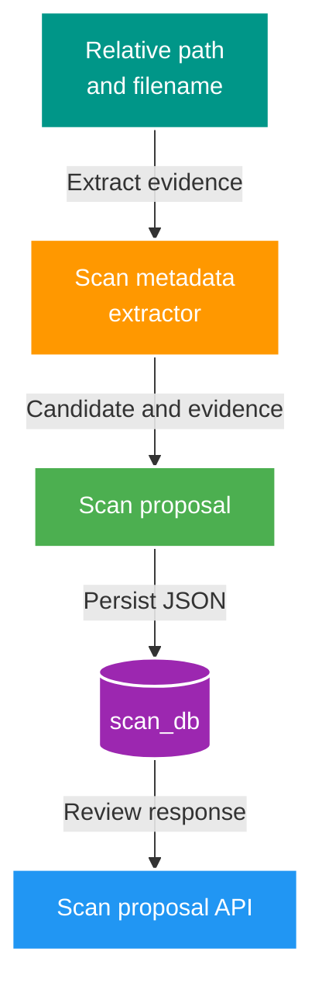

# 017 Scan semantic metadata extraction — Design

Owner: `scan-service` / `scan_db`  
Brief: [01-brief.md](./01-brief.md)

## High Level Design

## Quyết định

- Evidence JSON là snapshot parse tại thời điểm scan, không tái parse khi đọc proposal.
- Common evidence: `parserVersion`, `fileName`, `fileStem`, `extension`, `parentPath`, `pathSegments`, semantic `title`, `actressNames`, `studioName`, `tagNames`, status/warnings.
- Profile evidence: `bracketCode` cho `JOKE_*`, `normalizedBasename` cho `USE_VIDEO`/`USE_ASSET`, `albumRelativePath` cho `USE_ALBUM`.
- `sourceRelativePath` là nguồn duy nhất; không log/trả absolute root path.
- Actress/studio/tag không được suy ra từ segment chung. Baseline trả list/string rỗng cùng warning `*_NOT_ENCODED`; feature sau chỉ thêm extractor có rule theo root/profile và warning khi ambiguous.

## Contract và ownership

- `scan_proposal.evidence` đã tồn tại; dùng JSON string được serialize/deserialize ở Scan, không migration.
- `ScanProposal` response đã có field OpenAPI `evidence`; implementation phải hydrate field này. Đây là additive completion, không đổi request/event.
- Không đổi `media.file.discovered.v1`: Catalog vẫn chỉ nhận metadata canonical hiện có sau approval.

## Failure và compatibility

- Không parse được evidence phụ thì proposal vẫn được tạo với common evidence; không làm fail cả run.
- Run cũ có `{}` trả object rỗng; không backfill hay mutation.
- Parser version cho phép thêm field tương thích mà không diễn giải lại snapshot cũ.
