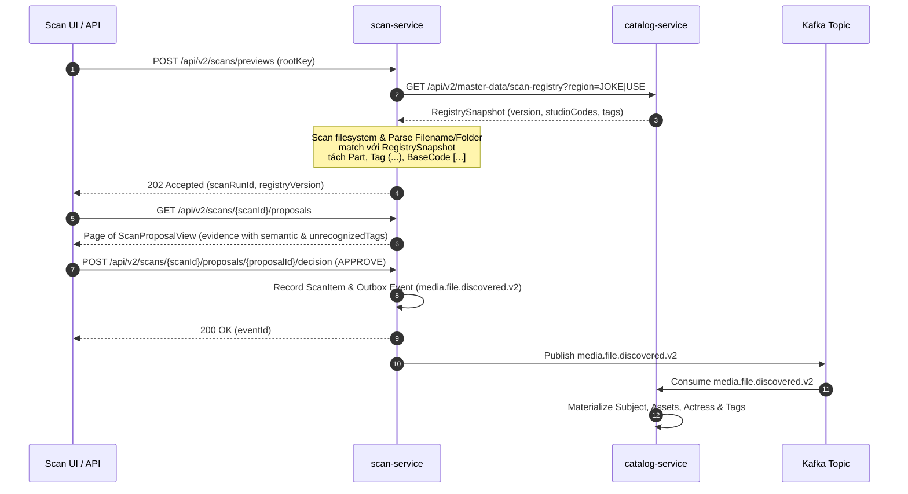

# Feature Design — FT018: Scan Semantic Rule Normalization

## Architecture Overview

High-Level Flow của FT018 khi thực hiện Scan & Approval:



---

## Technical Components & Design Details

### 1. Semantic Parser Component (`scan-service`)
- Class `ScanSemanticParser`: Dịch và parse chuỗi filename/foldername thành object `ScanSemanticResult`.
- **Result Object**:
  ```java
  public record ScanSemanticResult(
      String candidateType,
      String identityKey,
      String baseCode,
      String part,
      String studioCode,
      String title,
      List<String> actressNames,
      List<String> tagNames,
      List<String> unrecognizedTags,
      boolean isAmbiguous,
      List<String> ambiguousStudioNames,
      String parseStatus // COMPLETED, PARTIAL, AMBIGUOUS, UNPARSEABLE
  ) {}
  ```

### 2. Event Contract Upgrade (`event-contracts`)
- Contract mới `MediaFileDiscoveredV2` (Extends V1 hoặc schema v2 tương thích):
  ```java
  public record MediaFileDiscoveredV2(
      UUID eventId,
      String eventType, // "media.file.discovered.v2"
      Instant timestamp,
      UUID scanRunId,
      UUID proposalId,
      String region,
      String subjectType,
      String identityKey,
      String baseCode,
      String part,
      String studioCode,
      String displayTitle,
      List<String> actressNames,
      List<String> tagNames,
      String role,
      String storageKey,
      String relativePath
  ) {}
  ```

### 3. Catalog Consumer Upgrade (`catalog-service`)
- Cập nhật `MediaFileDiscoveredConsumer` để hỗ trợ payload `media.file.discovered.v2`.
- Khi nhận `v2`, Catalog tiến hành materialize canonical metadata: link Subject, Studio, Actress, và Tag.
