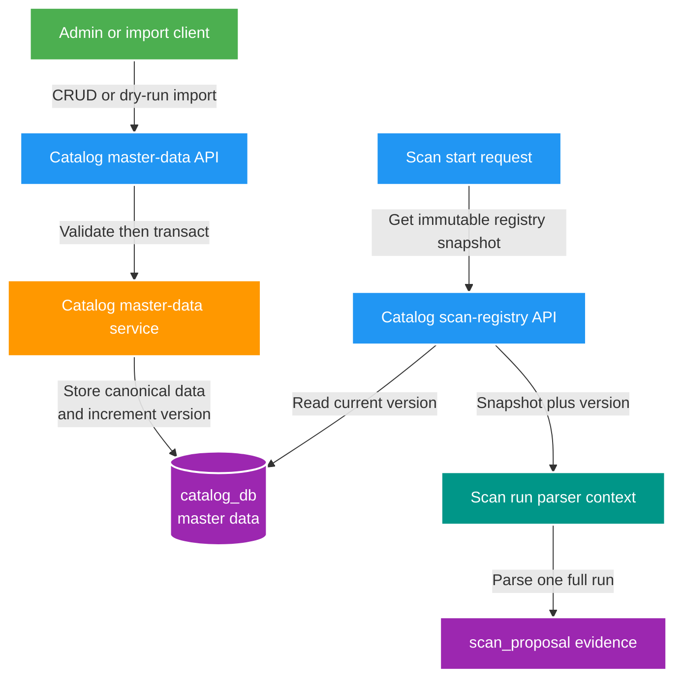

# 019 Catalog master data registry — Design

Owner: `catalog-service` / `catalog_db`; Scan chỉ là REST consumer.  
Brief: [01-brief.md](./01-brief.md)

## High Level Design

## Ownership và data model

`catalog_db` thêm các bảng: `master_data_registry` (một row version), `studio`, `studio_code`, `tag`, `actress` và `master_data_import` audit summary.

- `studio` có `region`; unique `(region, normalized_name)`. Cùng tên ở JOKE và USE là hai Studio record độc lập. `studio_code` kế thừa region của Studio và unique theo `(region, normalized_code)`; conflict import không được ghi đè.
- Tag unique theo `normalized_name`; parser match case-insensitive, không có alias table.
- Actress unique theo `(region, normalized_name)`; Scan chưa cần resolve actress ID hoặc alias.
- Mỗi mutation master data tăng `registryVersion` trong cùng transaction. Catalog là owner duy nhất; Scan không có table projection và không query database Catalog.

## REST contract

Catalog thêm OpenAPI `catalog-master-data-v1.yaml`:

- CRUD/search/pagination cho `/api/v2/master-data/studios`, `tags`, `actresses`; Studio Code là sub-resource của Studio.
- `POST /api/v2/master-data/imports` nhận JSON payload + `dryRun` (default `true`). Apply chỉ được phép khi `dryRun=false`, payload hợp lệ và không conflict.
- `GET /api/v2/master-data/scan-registry?region=JOKE|USE` trả `{ registryVersion, region, studioCodes, tags }`: chỉ Studio Code của region yêu cầu, còn Tag global active. Đây là API nội bộ giữa service, không route qua Gateway và không dùng để UI quản trị.

## Luồng Scan

1. `POST /scans/previews` xác thực root trước.
2. Scan suy ra region từ `ScanProfile`, gọi registry endpoint với timeout ngắn và region đó trước khi tạo `scan_run`.
3. Nếu Catalog unavailable/registry invalid: trả `503`, không tạo run.
4. Nếu thành công: tạo run chứa `registryVersion`, đóng snapshot vào parser context immutable và scan bất đồng bộ.
5. Mọi proposal evidence của run giữ cùng `registryVersion`; thay đổi master data sau đó chỉ tác động run mới.

## Import, validation và failure

- Seed V1 là input JSON một lần, không là runtime dependency. Import dry-run trả counts, duplicate studio code/tag/actress và lỗi validation.
- Apply conflict trả `409` cùng item lỗi; không partial-write. Admin sửa payload/CRUD rồi import lại.
- Disable giữ lịch sử canonical nhưng loại entry khỏi snapshot active. Tag/Studio Code inactive không được parser resolve.
- FT019 không phát Kafka event: Scan pull snapshot lúc bắt đầu run vì dataset nhỏ và cần consistency theo run. Không có cross-database access.

## Compatibility

- Không đổi `media.file.discovered.v1`, subject/asset schema hay Catalog subject API.
- FT018 sau FT019 sẽ dùng `registryVersion` và semantic snapshot để tạo proposal/event v2.
