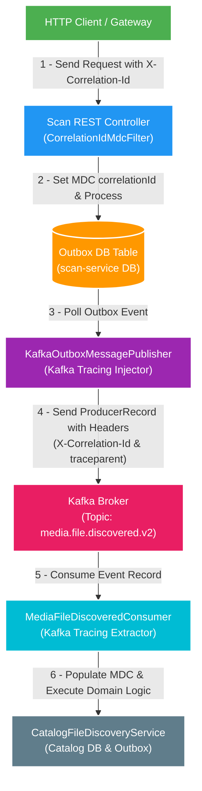

# FT020 — OpenTelemetry Tracing & Kafka Header Propagation — Design

Owner: platform/observability
Brief: [01-brief.md](./01-brief.md)

## High Level Design

[Skill: mermaid-styling]

## Quyết định

1. **Chuẩn hóa Propagation Header**:
   - Sử dụng chuẩn **W3C Trace Context** (`traceparent` header có cấu trúc `00-{trace_id}-{span_id}-{trace_flags}`) làm chuẩn distributed tracing chính.
   - Giữ tương thích ngược với header `X-Correlation-Id` hiện tại của hệ thống.
2. **Vị trí Inject / Extract**:
   - Outbox lưu `correlationId` và `traceparent` như metadata riêng trong cùng transaction với payload; schema JSON event không đổi.
   - **Inject**: Relay khôi phục context từ metadata outbox trước khi `KafkaTemplate` tạo producer observation và truyền header sang `ProducerRecord`.
   - **Extract**: Xảy ra tại Kafka `@KafkaListener` / Consumer Interceptor trước khi gọi hàm nghiệp vụ.
3. **MDC Bridge**:
   - Sau khi extract context từ Kafka Record Header, tự động gọi `MDC.put("correlationId", correlationId)` và `MDC.put("trace_id", traceId)`.
   - Bắt buộc làm sạch MDC trong khối `finally` hoặc sau khi listener kết thúc (`MDC.remove("correlationId")`).

## Domain và data ownership

- **`platform/observability`**: Sở hữu các utility class `KafkaTracingHeaderPropagation`, `CorrelationId`, và cấu hình OpenTelemetry / MDC bridge.
- **Microservices (`scan-service`, `catalog-service`, `query-service`)**: Sử dụng helper từ `platform/observability` để nhúng và trích xuất header mà không can thiệp vào domain logic.

## REST/event contract

- **Event Contract (Payload)**: Không đổi.
- **Kafka Record Headers**:
  - `X-Correlation-Id` (String / UTF-8 Bytes): Correlation ID đại diện cho chuỗi request.
  - `traceparent` (String / UTF-8 Bytes): Chuỗi W3C Trace Context (`00-<32hex_trace_id>-<16hex_span_id>-01`).
  - Spring Kafka Micrometer Observation tạo/extract `traceparent`; helper chỉ bridge MDC, lưu/khôi phục durable context và gắn span attribute `correlation.id` khi có active span.

## Luồng lỗi, idempotency và consistency

- **Lỗi thiếu Header khi Consume**: Nếu tin nhắn không chứa `X-Correlation-Id` (ví dụ event cũ hoặc từ nguồn ngoài), consumer tự động sinh `correlationId` mới; helper không ghi warning và không quăng Exception gây retry/DLQ. Nếu thiếu hoặc sai `traceparent`, `trace_id` không được đặt vào MDC; Spring Kafka Observation vẫn xử lý tracing theo context mà nó nhận được.
- **Rò rỉ ThreadLocal Context**: Consumer thread pool tái sử dụng Thread liên tục, nếu không dọn dẹp MDC thì log event sau sẽ mang ID của event trước. Do đó, việc dọn dẹp MDC ở Consumer là bắt buộc 100%.

## Hiệu năng, quan sát và bảo mật tối thiểu

- **Hiệu năng**: Header String hóa sang UTF-8 bytes có kích thước cực nhỏ (< 100 bytes), không ảnh hưởng băng thông Kafka Broker hay RAM.
- **Quan sát**: Log ghi ra bởi Logback ECS JSON formatter tự động in trường `correlationId` và `trace_id` đồng nhất trên toàn bộ log của HTTP Handler lẫn Kafka Consumer.
