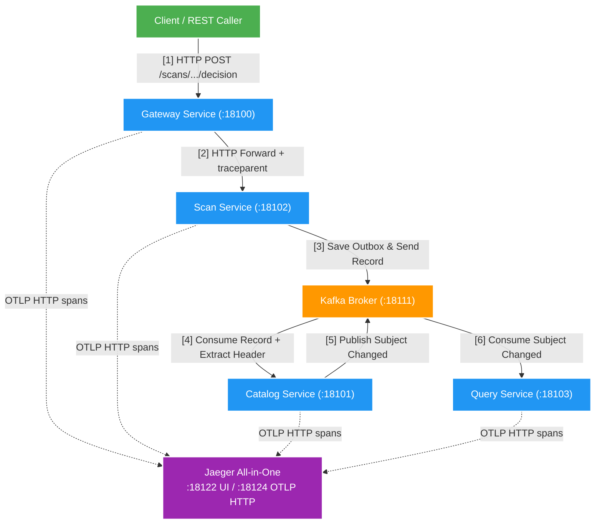

# FT021: Tích hợp Jaeger UI & OpenTelemetry OTLP Exporter — Design

Owner: `platform/observability`
Brief: [01-brief.md](./01-brief.md)

## High Level Design

## Quyết định

1. **Jaeger All-in-One Image**:
   - Sử dụng image Docker `jaegertracing/all-in-one:1.60.0`.
   - Host Port Allocation (theo ADR-004):
     - Host `18122` -> Container `16686` (Web UI).
     - Host `18123` -> Container `4317` (OTLP gRPC Receiver, được expose để dùng khi cần).
     - Host `18124` -> Container `4318` (OTLP HTTP Receiver, endpoint app local đang dùng).
     - Profile Compose: `observability` hoặc `tracing` đều khởi động Jaeger.

2. **OpenTelemetry SDK Configuration**:
   - `spring-boot-starter-opentelemetry` trong `platform/observability` để Spring Boot tự cấu hình OTLP tracing exporter; `ObservabilityAutoConfiguration` chỉ đăng ký correlation-ID HTTP filter, không tự tạo exporter.
   - `management.opentelemetry.tracing.export.otlp.endpoint` của năm application trỏ mặc định tới `http://localhost:18124/v1/traces` để đẩy span về OTLP HTTP receiver của Jaeger.
   - Giữ Prometheus là metrics exporter; đặt `management.otlp.metrics.export.enabled=false` để không gửi metrics mặc định tới `localhost:4318`.

3. **Gantt Chart Trace Correlation**:
   - Trace ID (32 hex) được tạo tại Gateway/Scan Service.
   - Spring Kafka Micrometer Observation tự động truyền W3C `traceparent` qua Kafka Record Header; `KafkaTracingHeaderPropagation` khôi phục durable context của outbox và bridge MDC.
   - Khi mở Jaeger UI tại `http://localhost:18122`, tìm kiếm theo `trace_id`, service name hoặc tag `correlation.id` sẽ hiển thị sơ đồ Gantt Chart phân tích độ trễ từng bước.

## Domain và data ownership

- Không có thay đổi DB schema domain.
- Jaeger lưu trữ trace dữ liệu in-memory trong container local.

## REST/event contract

- Không thay đổi API contract.
- W3C Header `traceparent` (format: `00-<trace_id>-<span_id>-01`) tiếp tục truyền qua HTTP và Kafka Record Headers.

## Luồng lỗi, idempotency và consistency

- Nếu Jaeger container không khởi chạy hoặc không khả dụng, OTLP exporter bất đồng bộ có thể ghi warning kết nối và không xuất được batch span; microservices vẫn tiếp tục xử lý nghiệp vụ HTTP/Kafka.

## Hiệu năng, quan sát và bảo mật tối thiểu

- Môi trường local không cần authentication cho Jaeger UI.
