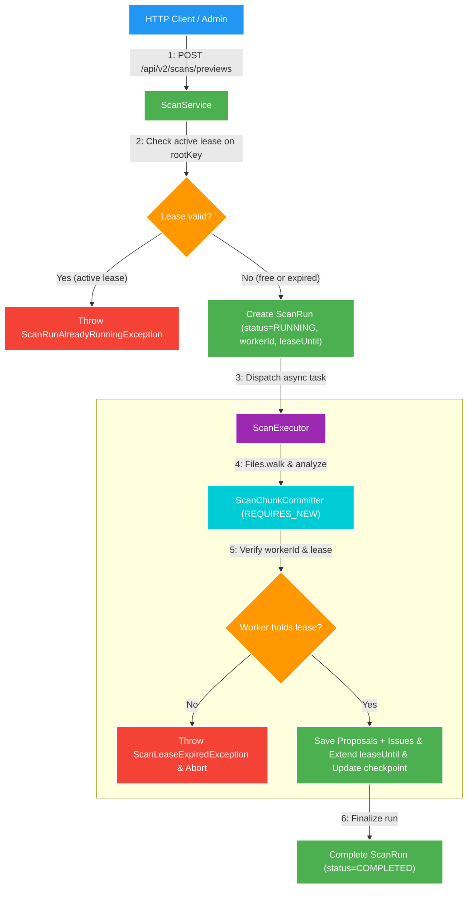

# 022 Durable scan run lease (BT-01) — Design

Owner: `scan-service`
Brief: [01-brief.md](./01-brief.md)

## High Level Design

[Skill: mermaid-styling]

## Quyết định

1. **Cấu trúc Lease và Checkpoint trên `scan_run`**:
   - `worker_id` (varchar 100): Tên định danh tiến trình worker đang giữ lease (ví dụ `worker-hostname` hoặc UUID ngẫu nhiên cho mỗi tiến trình).
   - `lease_until` (timestamptz): Thời điểm hết hạn lease. Mặc định lease gia hạn thêm 60 giây sau mỗi chunk commit.
   - `checkpoint_chunk` (integer): Số thứ tự chunk đã commit thành công vào DB.
   - `checkpoint_at` (timestamptz): Thời điểm commit chunk gần nhất.
   - Counters: `scanned_file_count`, `proposal_count`, `issue_count` được cập nhật liên tục qua từng chunk thay vì chỉ cập nhật 1 lần lúc `complete`.

2. **Cơ chế Claim Root và thu hồi Stale Lease**:
   - Khi nhận request `start(rootKey)`:
   - Tìm các run có `rootKey` và `status = RUNNING`.
   - Nếu tìm thấy run mà `leaseUntil > Instant.now()`: Báo lỗi `ScanRunAlreadyRunningException` (409 Conflict).
   - Nếu `leaseUntil <= Instant.now()` hoặc NULL (dự phòng legacy run): Đánh dấu run cũ là `FAILED` với lý do `Lease expired`, flush DB để giải phóng partial unique constraint `ux_scan_run_running_root`, sau đó tạo run mới với lease mới.

3. **Transaction Isolation cho Chunk Commit**:
   - Tách logic commit chunk thành `@Component ScanChunkCommitter` với phương thức `@Transactional(propagation = Propagation.REQUIRES_NEW)`.
   - Giúp mỗi chunk 500 items được commit ngay lập tức xuống DB. Nếu ứng dụng sập sau chunk N, dữ liệu của chunk 1..N vẫn nằm bền vững trong DB.
   - Trong phương thức commit chunk:
     1. Query lại `ScanRunEntity` theo `runId`.
     2. Kiểm tra `status == RUNNING` và `workerId.equals(currentWorkerId)`. Nếu không thỏa mãn, ném `ScanLeaseExpiredException` để dừng loop walker.
     3. Save proposal buffer và issue buffer.
     4. Tăng `checkpointChunk`, cộng dồn counters, cập nhật `checkpointAt = Instant.now()`, gia hạn `leaseUntil = Instant.now().plus(leaseDuration)`.

## Domain và data ownership

- Bảng `scan_run` thuộc sở hữu độc quyền của `scan-service` (`scan_db`).
- Schema update qua Flyway migration `V7__add_scan_run_durable_lease.sql`.

## REST/event contract

- Không thay đổi contract REST hay Kafka event.
- Bổ sung cấu hình `scan.lease-duration-seconds` (mặc định: 60) trong `ScanProperties`.

## Luồng lỗi, idempotency và consistency

- **Mất lease giữa chừng**: Worker chạy chậm vượt quá `leaseUntil` khiến worker khác chiếm lease hoặc stale cleanup can thiệp. Khi worker cũ chuẩn bị commit chunk tiếp theo, `ScanChunkCommitter` phát hiện `workerId` không khớp hoặc status không phải `RUNNING` -> ném exception ngắt tiến trình worker cũ ngay lập tức.
- **Service restart**: Khi service restart, `cleanupOrphanRunningScans` kiểm tra các run `RUNNING` có lease hết hạn để đánh dấu `FAILED`.

## Hiệu năng, quan sát và bảo mật tối thiểu

- Memory footprint cố định ở mức `BATCH_SIZE = 500` items nhờ flush chunk độc lập.
- Round-trip DB được tối ưu: mỗi chunk 500 items mới thực hiện 1 transaction flush proposal, issue và update status run.
