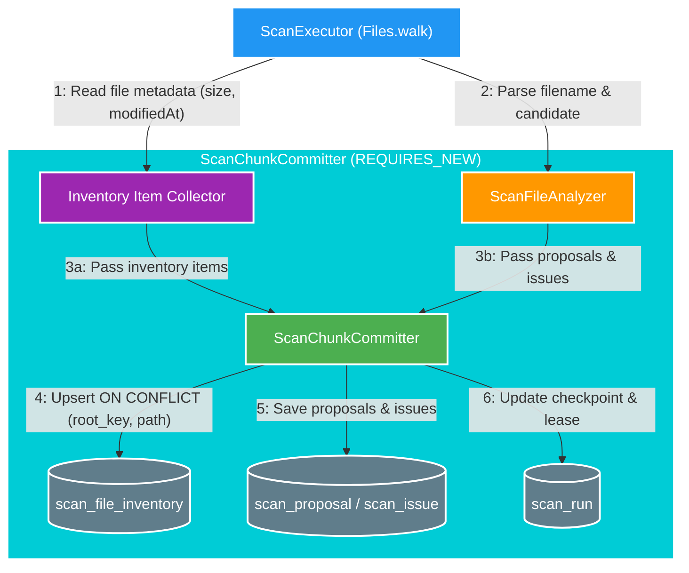

# 023 File inventory seed (BT-02) — Design

Owner: `scan-service`  
Brief: [01-brief.md](./01-brief.md)

## High Level Design

[Skill: mermaid-styling]

## Quyết định Thiết kế

1. **Database Schema cho `scan_file_inventory`**:
   - `id` (`uuid`, Primary Key).
   - `root_key` (`varchar(100)`, NOT NULL).
   - `source_relative_path` (`varchar(1000)`, NOT NULL).
   - `file_size` (`bigint`, NOT NULL).
   - `file_modified_at` (`timestamptz`, NOT NULL).
   - `state` (`varchar(30)`, NOT NULL) — Giá trị `PRESENT` ở BT-02.
   - `last_seen_run_id` (`uuid`, NOT NULL, FK đến `scan_run(id)`).
   - `created_at` (`timestamptz`, NOT NULL).
   - `updated_at` (`timestamptz`, NOT NULL).
   - Unique Constraint: `ux_scan_file_inventory_root_path (root_key, source_relative_path)`.

2. **Cơ chế Upsert Inventory trong `ScanChunkCommitter`**:
   - `ScanChunkCommitter` nhận thêm danh sách `ScanFileInventoryEntity` trong `ChunkBatch`.
   - Lưu/Upsert danh sách inventory trong cùng một transaction `REQUIRES_NEW` của chunk (cùng với `proposals` và `issues`).
   - Sử dụng Spring Data JPA `Persistable<UUID>` hoặc `@Modifying` native query / repository upsert theo `(rootKey, sourceRelativePath)` để tránh N+1 SELECT trước khi INSERT.

3. **Data Ownership & Idempotency**:
   - `scan-service` là owner duy nhất của bảng `scan_file_inventory`.
   - Đảm bảo tính idempotent khi scan lại: nếu 1 file được scan lại trong các run khác nhau, record trong `scan_file_inventory` sẽ được cập nhật `last_seen_run_id`, `file_size`, `file_modified_at` và `updated_at` mới nhất mà không sinh duplicate key.
