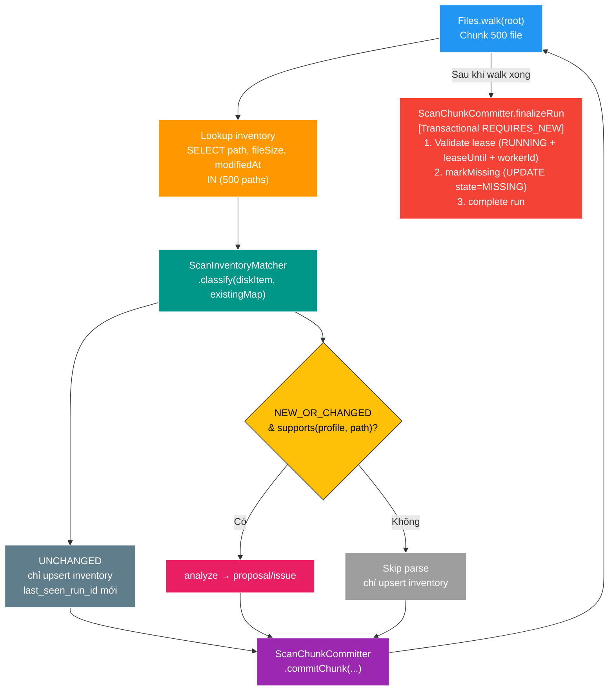

# FT-024 — Inventory Matcher: Design

## Owner

`scan-service` — chỉ chạm `scan_db`, không thay đổi contract bên ngoài.

## High Level Design



## Data Ownership

Chỉ sửa `scan_file_inventory` và `scan_run` (owner: scan-service). Không thêm bảng mới.

## API / Event

Không thay đổi REST API. Không thêm Kafka event.

## Thiết kế chi tiết

### 1. ScanInventorySnapshot (domain record)
```java
record ScanInventorySnapshot(String sourceRelativePath, long fileSize, Instant fileModifiedAt)
```
Dùng để so sánh với `ScanInventoryItem` đọc từ disk — không kéo toàn bộ entity.

### 2. ScanInventoryMatcher (application component)
```java
public sealed interface MatchResult permits MatchResult.Unchanged, MatchResult.NewOrChanged {
    record Unchanged(ScanInventoryItem item) implements MatchResult {}
    record NewOrChanged(ScanInventoryItem item) implements MatchResult {}
}
```
Logic classify: so sánh `fileSize` và `fileModifiedAt` (chuẩn hóa millisecond) với snapshot trong `existingMap`. Nếu khớp cả hai → `Unchanged`; ngược lại → `NewOrChanged`.

### 3. Tầng lọc 2 lớp (Two-Tier Filtering Invariant)
1. **Lớp 1 (Inventory Seeding)**: Tất cả file vật lý tìm thấy đều nằm trong `inventoryBuffer` và được upsert vào `scan_file_inventory`.
2. **Lớp 2 (Candidate Analysis)**: Chỉ những file được classify `NewOrChanged` **VÀ** thoả mãn `ScanCandidateParser.supports(profile, path)` mới được gửi sang `ScanFileAnalyzer.analyze()`. File không hỗ trợ (ví dụ `.jpg` trong profile video) được lưu inventory `PRESENT` nhưng không tạo proposal/issue.

### 4. Lookup strategy
- Trong chunk 500 file: 1 câu SELECT `WHERE root_key = ? AND source_relative_path IN (?)`.
- Trả `List<ScanInventorySnapshot>` qua JPA `@Query` projection interface.
- Không load toàn bộ inventory vào memory.

### 5. Application Finalizer có bảo vệ Lease (Lease-Fenced Finalization)
Thay vì gọi `markMissing` tự do ngoài transaction:
- Thêm method `ScanChunkCommitter.finalizeRun(runId, workerId, rootKey, finalProgress)` với `@Transactional(propagation = Propagation.REQUIRES_NEW)`.
- **Thứ tự thực thi nguyên tử**:
  1. `validateLease(run, lease)`: Bắt buộc `status == RUNNING`, `leaseUntil > Instant.now()` và `workerId` trùng khớp. Nếu lease hết hạn, ném `ScanLeaseExpiredException` và **KHÔNG** đánh dấu `MISSING`.
  2. `inventoryBatchWriter.markMissing(rootKey, runId)`: `UPDATE scan_file_inventory SET state = 'MISSING' WHERE root_key = ? AND last_seen_run_id != ?`.
  3. `run.complete(files, proposals, issues)`: Đổi trạng thái run thành `COMPLETED` và save database.

## Failure / Idempotency

- **Worker mất lease hoặc crash giữa chừng**: `finalizeRun` không được chạy hoặc bị ném `ScanLeaseExpiredException` tại bước validate lease. Bảng inventory giữ nguyên các record đã commit theo chunk; không file nào bị mark `MISSING` sai. `ScanService` đóng stale run thành `FAILED` trước khi start mới tạo một `scan_run` khác; BT-03 không có takeover trên cùng `runId`.
- **Scan lại từ đầu**: `upsertPresent` cập nhật `last_seen_run_id` cho các file còn xuất hiện → `finalizeRun` sau đó cập nhật đúng trạng thái `MISSING` cho những file thực sự biến mất.
- **Idempotency**: `upsertPresent` giữ tính idempotency nhờ `ON CONFLICT (root_key, source_relative_path) DO UPDATE`.

## Rủi ro

| Rủi ro | Mức | Giảm thiểu |
| --- | --- | --- |
| `IN (500 paths)` với path dài | Thấp | `source_relative_path` varchar(1000), PostgreSQL xử lý tốt |
| Lease hết hạn ngay trước finalize | Trung bình | `validateLease` trong `finalizeRun` chặn ngay, quăng exception đúng spec |
| `fileModifiedAt` precision mismatch | Thấp | So sánh `Instant.toEpochMilli()` nhất quán |
