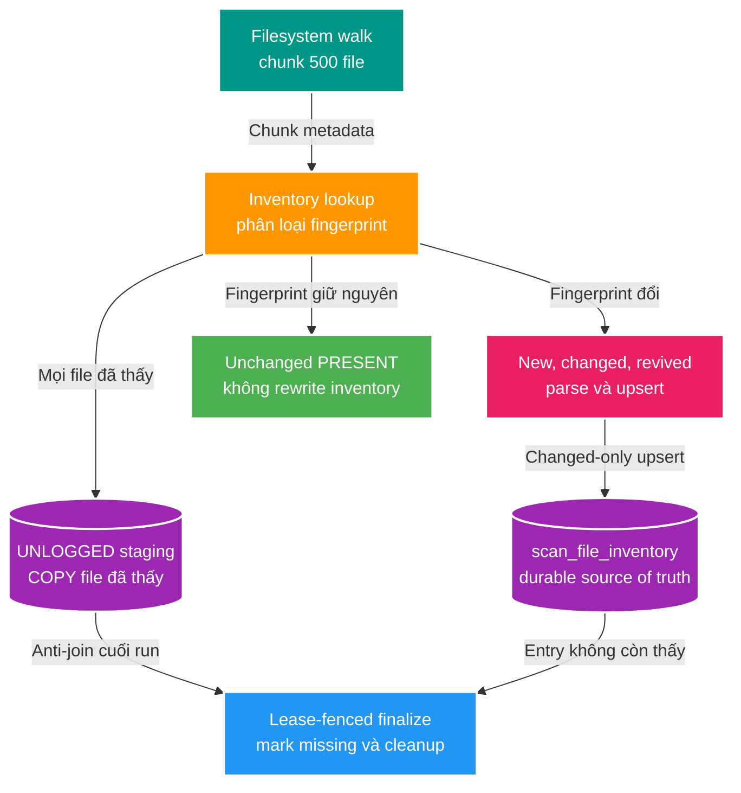

# FT-025 — Inventory staging reconciliation — Design

Owner: `scan-service`
Brief: [01-brief.md](./01-brief.md)

## High Level Design



## Quyết định

- Giữ flow classify theo chunk của FT-024 để bounded memory và không kéo set-based parser orchestration vào cùng feature.
- Ghi mọi `ScanInventoryItem` vào `scan_inventory_stage` bằng pgJDBC `CopyManager`; mỗi COPY nằm trong transaction commit chunk hiện tại.
- Staging là `UNLOGGED`: không là source of truth, không cần WAL/replication và được phép mất sau crash. Run cũ sẽ fail/restart và dựng lại staging.
- Inventory writer chỉ nhận `changedInventoryItems`. `UNCHANGED + PRESENT` không tạo SQL write vào inventory.
- Snapshot inventory mang thêm `state`; entry `MISSING` tái xuất hiện phải được classify `NEW_OR_CHANGED` dù fingerprint giữ nguyên để chuyển lại `PRESENT`.
- `last_seen_run_id` bị xóa. Anti-join staging theo `(scan_run_id, root_key, source_relative_path)` thay thế hoàn toàn vai trò phát hiện file vắng mặt.

## Domain và data ownership

`scan-service` tiếp tục sở hữu toàn bộ `scan_db`.

Migration V9:

```sql
CREATE UNLOGGED TABLE scan_inventory_stage (
    scan_run_id uuid NOT NULL,
    root_key varchar(100) NOT NULL,
    source_relative_path varchar(1000) NOT NULL,
    file_size bigint NOT NULL,
    file_modified_at timestamptz NOT NULL
);

CREATE INDEX idx_scan_inventory_stage_run_path
    ON scan_inventory_stage(scan_run_id, root_key, source_relative_path);

DROP INDEX idx_scan_file_inventory_run;
ALTER TABLE scan_file_inventory DROP COLUMN last_seen_run_id;
```

Không đặt FK staging → `scan_run` để tránh per-row FK lookup trong bulk ingest. Lifecycle được application quản lý theo `scan_run_id`; cleanup run/root là idempotent.

## REST/event contract

Không đổi REST hoặc Kafka contract. Đây là schema nội bộ của `scan_db`; không service nào khác được đọc staging/inventory.

## Luồng lỗi, idempotency và consistency

- COPY, changed-only upsert, proposal/issue và checkpoint cùng transaction chunk. Một bước lỗi thì cả chunk rollback.
- Staging có thể chứa row lặp nếu một chunk đã commit rồi bị rewalk trong cùng run; `NOT EXISTS` khi mark missing không bị sai bởi duplicate. Resume chính xác vẫn ngoài phạm vi.
- Finalization validate lease trước khi mark missing. `markMissingFromStage`, cleanup staging, update run `COMPLETED` cùng transaction.
- Executor lỗi sẽ cố cleanup staging sau khi persist `FAILED`; cleanup lỗi chỉ log warning và không che lỗi scan gốc.
- Trước run mới, staging cũ cùng root được xóa sau khi xác nhận không còn active lease, xử lý process crash không qua cleanup.
- Khi service ready, startup sweep xóa staging không còn run `RUNNING`, bao gồm cleanup lỗi tạm thời của run terminal và row mồ côi.

## Hiệu năng, quan sát và bảo mật tối thiểu

- COPY dùng buffer tối đa một chunk, không materialize một triệu path trong heap.
- Index staging phục vụ anti-join finalization; bảng/index đều unlogged theo semantics PostgreSQL.
- Loại bỏ update `last_seen_run_id` cũng loại bỏ index churn trên toàn bộ inventory.
- Không log absolute path hoặc đưa root/path vào metric label.
- Kết quả 80 giây hiện tại là baseline issue, không phải cam kết sau tối ưu. Benchmark chỉ ghi nhận khi người dùng cho phép chạy.

## Update FT-025.1 — Giảm transaction amplification sau benchmark

Kết quả runtime sau implementation đầu tiên cho thấy warm scan vẫn mất khoảng
69,7 giây và commit 2.000 chunk dù không có file thay đổi. Benchmark tách riêng
filesystem theo đúng access pattern hiện tại mất 17,832 giây cho một triệu file.
Phần chênh lệch lớn nằm ở 2.000 vòng inventory lookup, staging COPY,
lease/checkpoint transaction và log progress; không còn nằm ở inventory rewrite.

Điều chỉnh implementation:

- Tăng reconciliation chunk từ 500 lên 10.000 file. Một triệu file còn tối đa
  100 chunk transaction, giảm 95% số lookup/COPY/commit nhưng vẫn không
  materialize toàn bộ root vào heap.
- Progress log chuyển từ mỗi 5.000 sang mỗi 100.000 file để log volume tỷ lệ với
  workload SC-01.
- Transaction boundary và lease fencing không đổi: seen staging, changed
  inventory, proposal/issue và checkpoint của cùng chunk vẫn commit hoặc rollback
  cùng nhau.
- Batch 500 của Catalog API trong BT-04 là boundary cross-service riêng, không
  dùng chung với reconciliation batch nội bộ của Scan Service.

Mức 10.000 là tuning dựa trên bottleneck đã quan sát, chưa phải throughput/SLO
được xác nhận. Cần benchmark lại khi người dùng cho phép; nếu heap hoặc latency
transaction không đạt, điều chỉnh kích thước nhưng không quay lại per-file/N+1.

## Update FT-025.2 — Streaming COPY segment 500.000

Microbenchmark `walkFileTree` tái sử dụng `BasicFileAttributes` và một indexed
COPY cho một triệu fixture row hoàn tất trong 2,890 giây. Theo quyết định ngày
2026-08-07, discovery chuyển sang segment cố định tối đa 500.000 row:

- Filesystem producer dùng queue bounded và `walkFileTree`; PostgreSQL consumer
  stream thẳng từng item vào COPY, không giữ toàn segment trong heap.
- Mỗi segment commit staging cùng progress/checkpoint và lease. Một triệu file
  cần khoảng hai COPY hữu ích; mười triệu file cần khoảng hai mươi COPY.
- Sau khi discovery hoàn tất, SQL join staging với inventory trả theo keyset chỉ
  file new, fingerprint đổi hoặc `MISSING` tái xuất hiện. Java không còn gửi
  lookup `IN` cho mọi seen path.
- Changed inventory cùng proposal/issue vẫn commit theo business chunk nhỏ để
  giữ rollback bounded và không materialize toàn bộ cold scan.
- Finalization `MISSING`, cleanup staging và lease fencing giữ nguyên.

Kích thước 500.000 là quyết định tuning hiện tại, không phải public contract.
Nếu segment thực tế tiến gần lease duration hoặc tạo memory/DB pressure, feature
sau có thể đổi sang time/byte-bounded adaptive segment mà không đổi REST/Kafka.

## Update FT-025.3 — Sửa reconciliation query không kết thúc

Runtime run `cb6ed18e-f262-4c01-b7d2-a1478246bde7` đã discovery đủ 27.122 file
nhưng giữ trạng thái `RUNNING` hơn hai phút. `pg_stat_activity` xác nhận worker
kẹt ở changed diff. Execution plan của LEFT JOIN chỉ dùng phần `root_key` trong
inventory composite index; `source_relative_path` trở thành join filter. Đồng
thời staging statistics vẫn báo 0 row sau lifecycle COPY/delete, khiến planner
ước lượng current run chỉ có một row. Run cuối cùng chuyển `FAILED` sau 5 phút
45 giây vì query hoàn tất sau khi lease đã hết hạn.

Fix:

- Chạy `ANALYZE scan_inventory_stage` sau discovery và trước changed diff.
- Keyset staging theo page tối đa 100.000 row để một warm scan 10 triệu file
  không biến thành một JDBC query dài vượt lease.
- Trong từng page, correlated scalar lookup buộc subplan index condition dùng đủ
  `(root_key, source_relative_path)`.
- Page zero-change renew lease/checkpoint; page có changed item được business
  chunk commit gia hạn lease như trước.
- `COALESCE(..., FALSE)` giữ đúng classification: inventory absent, state khác
  `PRESENT`, size đổi hoặc modified time đổi đều là changed.

Không thêm index/migration vì composite index inventory và staging index hiện có
đã đúng; lỗi nằm ở query shape và stale statistics.
