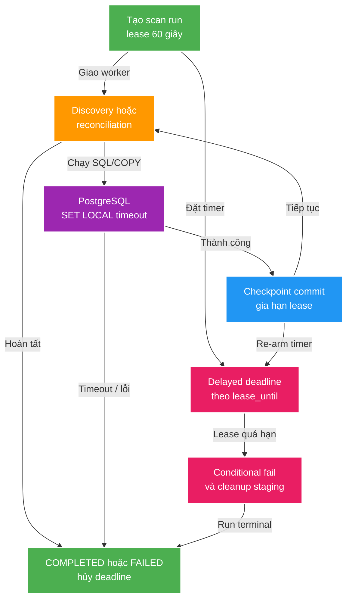

# 026 Scan run liveness guard — Design

Owner: `scan-service`
Brief: [01-brief.md](./01-brief.md)

## High Level Design

## Quyết định

1. `ScanLeaseDeadlineGuard` dùng Spring `TaskScheduler` và chỉ giữ
   `ScheduledFuture` theo `runId` trong RAM. `arm` cancel handle cũ rồi schedule
   one-shot task tại `lease_until`; `cancel` được gọi khi run terminal.
2. Guard chỉ schedule/re-arm sau khi transaction tạo run hoặc checkpoint đã return
   thành công. PostgreSQL vẫn là source of truth: timer luôn gọi conditional update,
   không quyết định theo state trong map.
3. `ScanLeaseExpiryHandler` fail atomically bằng database time, chỉ khi worker còn
   sở hữu run và `lease_until <= now()`. Chỉ winner mới cleanup staging; failure
   handler không ghi đè terminal state do deadline đã tạo.
4. `ScanTransactionTimeouts` dùng `set_config(..., true)` để phát `SET LOCAL` trên
   connection transaction-bound. Policy: diff/read `30s`; COPY, changed mutation,
   `ANALYZE`, finalization `45s`; lock `5s`.
5. Timer chỉ đổi status/cleanup; PostgreSQL timeout là lớp trả control cho JDBC.
   Lease fence đã có tiếp tục chặn worker thức dậy muộn ghi checkpoint/finalize.

## Domain và data ownership

- `scan_run` và `scan_inventory_stage` vẫn thuộc `scan_db`; không có bảng/cột mới.
- `ScheduledFuture` chỉ là volatile process state, không được dùng để suy ra status.

## REST/event contract

Không đổi REST response, ProblemDetail hoặc Kafka event. API run hiện hữu sẽ tự thấy
`FAILED` và `last_error` sau deadline.

## Luồng lỗi, idempotency và consistency

- Timer duplicate, timer bị cancel muộn hoặc hai trigger cùng nổ đều an toàn: update
  condition chỉ cho một transaction thắng.
- Query timeout ném exception vào executor; failure handler đóng run nếu nó còn
  `RUNNING`, rồi best-effort cleanup staging.
- Nếu process restart, timer map mất; `cleanupOrphanRunningScans` hiện hữu đóng run.
- Cleanup staging lỗi không làm trạng thái `FAILED` quay lại `RUNNING`.

## Hiệu năng, quan sát và bảo mật tối thiểu

- Chỉ có một scheduled handle cho mỗi run active, không polling scan table.
- Không log absolute root/path; log chỉ gồm `runId`, worker và deadline.
- 30/45 giây đều nhỏ hơn lease 60 giây, chừa thời gian để failure path persist trạng
  thái terminal.
