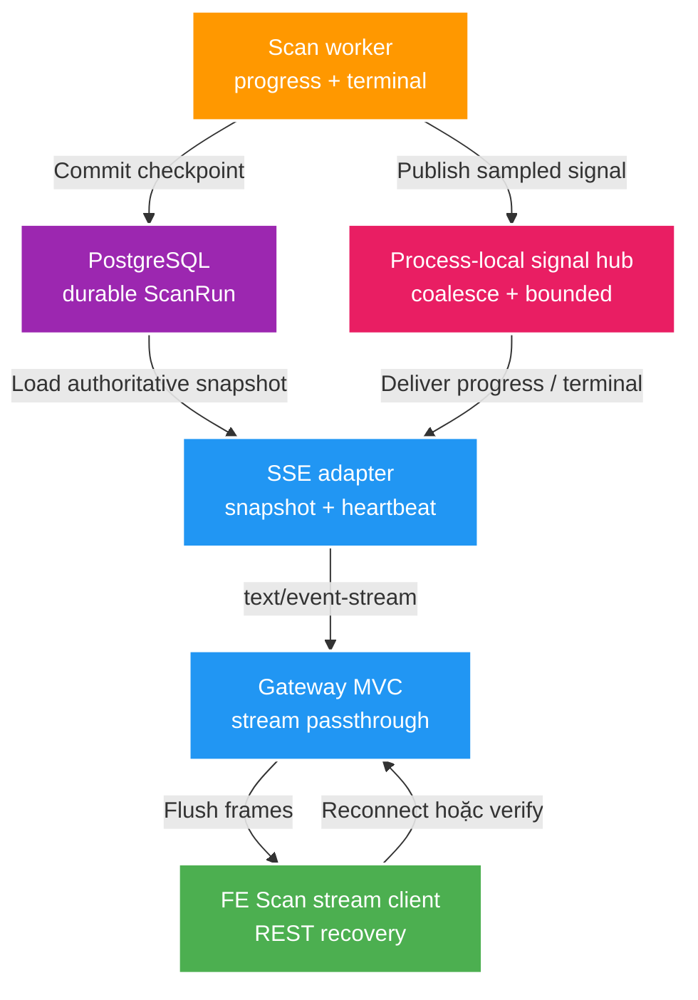

# 027 Scan run SSE progress — Design

Owner: `scan-service`, `gateway-service`
Brief: [01-brief.md](./01-brief.md)

## High Level Design

Diagram trả lời: durable scan state và progress best-effort đi tới FE qua SSE như thế nào?



## Quyết định

1. Spring MVC dùng `SseEmitter` với `produces = text/event-stream`; đăng ký
   `onCompletion`, `onTimeout`, `onError` và xử lý `IOException` để remove session.
2. `ScanRunSignalHub` framework-neutral giữ callback/subscription theo `scanId`;
   application/worker không phụ thuộc `SseEmitter` hoặc HTTP. Web adapter chỉ map
   `ScanRunStreamEvent` sang named SSE frame.
3. Endpoint đăng ký subscriber ở trạng thái initializing, sau đó đọc DB và gửi
   `scan.snapshot.v1`; signal đến trong cửa sổ này được queue bounded và flush sau
   snapshot. Cách này tránh mất hoặc đảo terminal event trong subscribe race.
4. Discovery signal là transient, coalesce tối đa 1 Hz/run và không ghi DB chỉ để
   phục vụ UI. Durable checkpoint/terminal signal chỉ publish sau transaction commit.
5. Không dùng SSE `id`/`Last-Event-ID`: không có durable event log để replay đúng.
   Reconnect luôn nhận snapshot hiện tại; named event và payload có version `v1`.
6. Một shared scheduler gửi heartbeat comment mỗi 15 giây và hết lifetime 5 phút;
   không tạo một scheduler thread riêng cho mỗi connection.
7. Gateway vẫn là browser-facing ingress. Heartbeat nhỏ hơn read timeout 30 giây;
   implementation phải chứng minh no-buffer/flush, không tự tăng timeout toàn route.
8. Khi shutdown, stream adapter ngừng accept session mới, complete/remove session và
   dừng heartbeat scheduler. Client tự reconnect/fallback; shutdown không chạm lease
   hoặc terminal transition của run.

Tài liệu Spring Framework 7 xác nhận `SseEmitter` là `ResponseBodyEmitter` chuyên
cho SSE, hỗ trợ named/id/data builder và callback timeout/error/completion.

## Domain và data ownership

- `scan_run` trong `scan_db` tiếp tục là nguồn chuẩn cho status và durable counters.
- `observedFileCount` chỉ là số worker đã quan sát trong process hiện tại; có thể trở
  về durable count sau reconnect/restart và không được dùng cho decision/inventory.
- Signal hub/session registry là volatile process state, không có migration.
- Gateway không sở hữu event/state, chỉ route và stream response.

## REST/event contract

Source of truth: [scan-v1.yaml](../../contracts/openapi/scan-v1.yaml).

```text
GET /api/v2/scans/{scanId}/events
Accept: text/event-stream

event: scan.snapshot.v1 | scan.progress.v1 | scan.terminal.v1
data: ScanRunStreamEvent JSON
```

`ScanRunStreamEvent` gồm `schemaVersion`, `eventType`, `scanId`, `emittedAt`,
`phase`, `status`, `observedFileCount`, `scannedFileCount`, `proposalCount`,
`issueCount`, `finishedAt`, `lastError`. `scannedFileCount` và các count DB là
durable; `observedFileCount` chỉ best-effort trong lúc `RUNNING`.

`phase = UNKNOWN` là giá trị hợp lệ cho snapshot sau reconnect/restart khi DB không
lưu execution phase; server không được đoán phase từ counter hoặc checkpoint.

- `SNAPSHOT`: luôn là frame data đầu tiên, lấy từ DB.
- `PROGRESS`: có thể mất/coalesce; chỉ giúp UX cập nhật nhanh hơn.
- `TERMINAL`: snapshot terminal authoritative, rồi server complete emitter.
- Heartbeat là SSE comment, không phải domain event và FE không render.
- Response `404`/`429` chỉ có trước khi stream commit; sau commit, lỗi transport làm
  connection đóng và FE dùng REST để phân loại/recover.

Contract additive; `GET /api/v2/scans/{scanId}` và polling client cũ vẫn tương thích.

## Luồng lỗi, idempotency và consistency

- Duplicate/coalesced progress an toàn vì FE replace aggregate state, không cộng dồn.
- Terminal signal gọi nhiều lần vô hại; session chỉ complete/remove một lần.
- Nếu client ngắt, send lỗi không được fail scan run hoặc giữ emitter mồ côi.
- Nếu signal transient bị mất, snapshot/REST vẫn trả durable state; SSE không nằm
  trong transaction business và không được làm checkpoint rollback.
- Nếu run bị truncate khi stream đang mở, connection lỗi/heartbeat send fail; FE
  verify bằng REST, nhận `404` rồi chạy stale-run recovery hiện hữu.
- Process restart mất hub/session; run vẫn được FT-026 xử lý, FE reconnect nhận DB state.

## Hiệu năng, quan sát và bảo mật tối thiểu

- Không event-per-file, không stream proposal/issue, không DB polling per emitter.
- Gauge active connections và counter opened/closed/send-failed/rejected; không dùng
  `scanId`, root/path làm metric label.
- Log lifecycle ở DEBUG/INFO vừa đủ với `scanId`, correlation ID và reason; không log
  absolute root, payload item hoặc heartbeat từng nhịp.
- Giới hạn connection chống resource exhaustion; response dùng `Cache-Control: no-cache`
  và header chống proxy buffering nếu Gateway/proxy hỗ trợ.
- Native `EventSource` không gửi custom Authorization header; feature hiện dựa trên
  local unauthenticated Gateway contract. Auth browser tương lai phải quyết định
  cookie/same-origin hoặc fetch-stream riêng, không nhét token vào query string.
- Resource budget mặc định tối đa 100 emitter/process, 1 shared heartbeat scheduler và
  1 Hz/run; các giá trị phải cấu hình được và được đo trước khi tăng.
