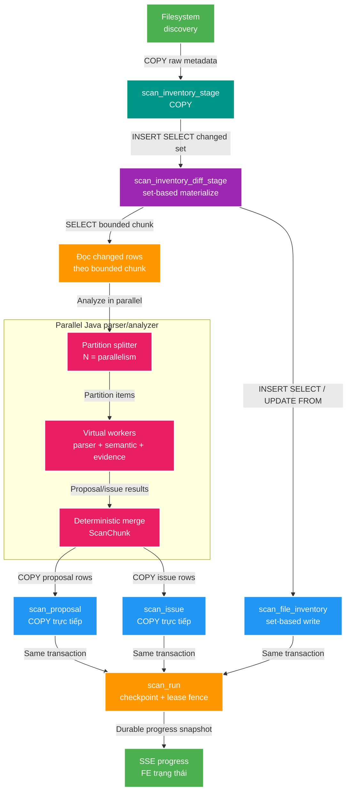

# FT-028 — Thiết kế pipeline reconciliation 1M file

Owner: `scan-service`
Brief: [01-brief.md](./01-brief.md)

## 1. Kiến trúc đích

Không thêm `parsed_result_stage`. Analyzer đã tạo ra đúng dữ liệu proposal và
issue cuối cùng, vì vậy ghi trực tiếp vào hai bảng source of truth bằng
PostgreSQL `COPY` trong transaction của từng chunk.

```text
Filesystem
  → COPY scan_inventory_stage
  → set-based materialize vào scan_inventory_diff_stage
  → Java đọc scan_inventory_diff_stage theo chunk
  → parallel parser/analyzer
  → COPY trực tiếp scan_proposal và scan_issue
  → set-based inventory từ scan_inventory_diff_stage vào scan_file_inventory
  → checkpoint + lease fence trên scan_run
  → SSE progress cho FE
```

Mục tiêu là giữ toàn bộ nghiệp vụ Java, bỏ round-trip JDBC batch và không tạo
thêm bảng trung gian cho kết quả parser.

## 2. Bảng và hướng dữ liệu

| Bảng | Vai trò | Ghi từ đâu | Cách ghi đích |
|---|---|---|---|
| `scan_inventory_stage` | Scratch metadata filesystem của một run | Filesystem discovery | PostgreSQL `COPY` |
| `scan_inventory_diff_stage` | Tập file `NEW`/`CHANGED`/`REVIVED` cần xử lý | `scan_inventory_stage` và `scan_file_inventory` | SQL `INSERT ... SELECT` set-based |
| `scan_file_inventory` | Source of truth inventory | `scan_inventory_diff_stage` | SQL `UPDATE ... FROM`, sau đó `INSERT ... SELECT ... NOT EXISTS` theo khoảng path của chunk |
| `scan_proposal` | Source of truth proposal chờ review | `ScanFileAnalyzer` sau parallel merge | PostgreSQL `COPY` trực tiếp |
| `scan_issue` | Source of truth lỗi phân tích | `ScanFileAnalyzer` sau parallel merge | PostgreSQL `COPY` trực tiếp |
| `scan_run` | State, progress, checkpoint và lease | `ScanRunProgressWriter` | Conditional `UPDATE` trong cùng transaction |

`scan_inventory_stage` và `scan_inventory_diff_stage` là scratch state. Ba bảng
`scan_file_inventory`, `scan_proposal` và `scan_issue` là dữ liệu nghiệp vụ
authoritative.

## 3. HLD chi tiết



## 4. Trình tự transaction của một chunk

Một chunk giữ `firstPath`/`lastPath` hoặc checkpoint key để ba nhánh cùng xử lý
đúng một tập dữ liệu từ `scan_inventory_diff_stage`:

1. Đọc các row của chunk từ `scan_inventory_diff_stage`.
2. Parallel analyzer parse/evaluate/evidence và phân loại proposal/issue.
3. Mở `REQUIRES_NEW`, validate `scan_run.status = RUNNING`, `worker_id` và lease.
4. `INSERT ... SELECT`/`UPDATE ... FROM scan_inventory_diff_stage` vào
   `scan_file_inventory` trong phạm vi chunk.
5. `COPY` trực tiếp các row đã phân loại vào `scan_proposal` và `scan_issue`.
6. Conditional update checkpoint/count/lease trên `scan_run`.
7. Commit toàn bộ; lỗi hoặc mất lease thì rollback inventory, proposal và issue.

Analyzer không giữ connection database trong lúc parse. Chỉ commit writer giữ
connection và transaction trong khoảng thời gian bounded.

## 5. Parallel analyze vẫn là thành phần bắt buộc

`ScanParallelAnalyzer` không bị loại bỏ:

- Chia chunk thành N partition trên virtual thread.
- Virtual-thread executor chờ tất cả partition thành công.
- Một partition lỗi sẽ hủy các partition còn lại.
- Mỗi partition tạo `ScanChunk` cục bộ; merge tuần tự sau khi tất cả hoàn tất.
- Parser, semantic evaluator và evidence codec giữ nguyên behavior hiện tại.

Set-based/COPY chỉ thay đổi lớp persistence sau analyzer, không thay thế logic
nghiệp vụ bằng SQL rule đơn giản như `Invalid*`.

## 6. Lease, retry và consistency

- Không gom 1M row vào một transaction duy nhất.
- `statement_timeout` phải nhỏ hơn no-progress/lease deadline.
- Lease được validate trước khi ghi; checkpoint dùng conditional update với
  `run_id + worker_id + lease_until`.
- Nếu checkpoint thất bại vì lease hết hạn, toàn bộ transaction chunk rollback.
- Retry sau rollback được phép xử lý lại cùng chunk; unique business constraint
  hiện tại bảo vệ duplicate.
- Finalization anti-join và mark missing inventory giữ nguyên.
- `scan_inventory_stage` và `scan_inventory_diff_stage` được cleanup theo run;
  bảng nghiệp vụ chỉ bị xóa theo lifecycle/cleanup policy hiện hữu.

Resume sau process restart/lease handoff không thuộc follow-up này. Phase hiện
tại giữ atomic commit theo chunk nhưng run bị gián đoạn vẫn chuyển `FAILED`;
durable `checkpoint_phase`/`checkpoint_path` và cơ chế claim để tiếp tục sẽ được
thiết kế trong feature riêng.

## 7. PostgreSQL 18 và UUIDv7

Môi trường study reset database từ đầu, dùng PostgreSQL 18 và native `uuidv7()`.
Compose vẫn mount volume bền vững `postgres-data` cho PostgreSQL 18 tại
`/var/lib/postgresql`, theo layout version-specific của official image. Volume dữ liệu
PostgreSQL 17 cũ phải được xóa/reset trước lần khởi tạo đầu tiên; không migrate trực tiếp
data directory cũ sang PostgreSQL 18.
Rà soát tất cả UUID đang tạo trong scan-service: scan run, proposal, issue,
inventory, decision event, outbox event và identifier tương ứng. ID mới phải
theo một UUIDv7 policy thống nhất; không chỉ đổi benchmark.

Migration schema phải là V12 mới, không sửa V11.

## 8. Foreign key policy

Foreign key proposal/issue → `scan_run` được giữ nguyên ở phase đầu. Benchmark
cho thấy FK đắt, nhưng nó vẫn bảo vệ ownership và `ON DELETE CASCADE`.

Chỉ đánh giá bỏ FK sau khi flow mới đã chứng minh correctness, retry, restart,
timeout, cleanup stale run và orphan audit bằng benchmark production-like.

## 9. Frontend khi scan đang chạy

Khi `scan_run.status = RUNNING`:

- FE không gọi REST để pull `scan_proposal` hoặc `scan_issue`.
- FE chỉ nhận SSE progress/count/state.
- Hiển thị dưới danh sách: **Đang scan, hãy đợi ...**.
- Khi nhận terminal state hoặc REST verify terminal, FE mới fetch proposal/issue
  authoritative một lần.

SSE vẫn best-effort; REST vẫn là source authoritative sau terminal state.

## 10. Iteration cũ đã triển khai nhưng chưa đạt SLO

Iteration đầu của FT-028 đã có:

- Parallel analyze bằng virtual-thread executor.
- JDBC batch writer cho persistence.
- V11 loại bỏ bốn index dư thừa.
- FE dừng timer auto-refetch khi run còn `RUNNING`.

Các phần này đúng về flow và lease fence nhưng chưa đạt SLO cold scan 1M dưới
30 giây. Evidence isolation:

- JDBC batch: `44,557s`.
- JDBC batch với `reWriteBatchedInserts=true`: `43,454s`.
- Set-based benchmark đơn giản: `18,674–19,348s` persistence.

Iteration JDBC batch này đã được thay thế trong reconciliation hot write path bởi
kiến trúc ở mục 1. Set-based benchmark là bằng chứng cho hướng mới, chưa phải kết quả production
cuối cùng vì chưa chạy đầy đủ parser/evidence. Chi tiết ở
[BENCHMARK_RESULTS.md](../../../apps/scan-service/src/test/java/com/filemngt/v2/scan/benchmark/BENCHMARK_RESULTS.md).

## 11. Trạng thái triển khai kiến trúc mới

Đã triển khai ở source code, chưa chạy build/test/migration hay benchmark end-to-end:

- PostgreSQL image đã nâng lên 18; V12 đặt `uuidv7()` làm default cho các bảng có
  UUID ID và UUID được tạo trong production Java của `scan-service` đã chuyển sang UUIDv7.
- `ScanParallelAnalyzer` vẫn giữ nguyên vai trò parser/analyzer song song.
- `ScanProposalCopyWriter` và `ScanIssueCopyWriter` ghi thẳng kết quả analyzer vào
  `scan_proposal` và `scan_issue` bằng PostgreSQL `COPY`.
- `ScanFileInventorySetWriter` update row hiện hữu bằng `UPDATE ... FROM` rồi insert
  row mới bằng `INSERT ... SELECT ... NOT EXISTS` từ `scan_inventory_diff_stage`.
- Ba write trên và conditional checkpoint vẫn nằm trong cùng transaction
  `REQUIRES_NEW` của chunk; mất lease hoặc write lỗi sẽ rollback toàn bộ chunk.
- FE không gọi API list proposal/issue khi run `RUNNING`, kể cả khi đổi tab, filter,
  phân trang hoặc search; UI chỉ hiển thị SSE progress và thông báo chờ.
- FK từ proposal/issue tới `scan_run` vẫn được giữ. Resume sau restart/lease handoff
  vẫn deferred sang feature riêng.

Kết quả thời gian thực tế của kiến trúc mới sẽ được bổ sung sau khi được phép chạy
verification và benchmark 1M file.

## 12. Contract và ownership

Không đổi REST API, Kafka event hoặc SSE contract. `scan-service` tiếp tục sở
hữu `scan_db`; JPA repository giữ vai trò query/read, còn persistence write path
mới dùng `COPY` trực tiếp vào `scan_proposal`/`scan_issue` và set-based SQL vào
`scan_file_inventory`.
