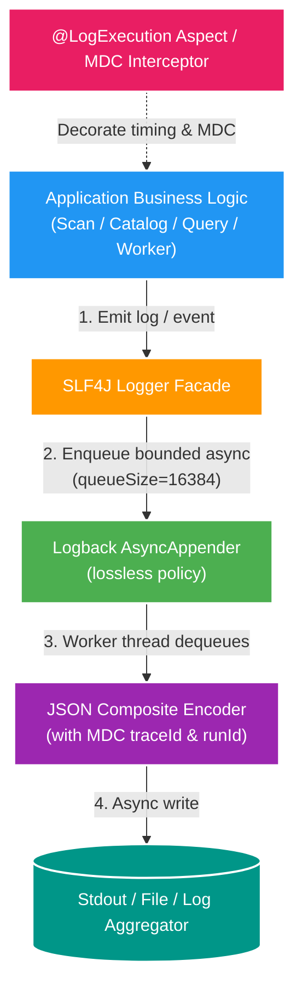

# 029 Async non-blocking logging foundation — Design

Owner: `cross-service`  
Brief: [01-brief.md](./01-brief.md)

## High Level Design

## Kiến trúc & Cấu hình Logging

### 1. Logback AsyncAppender (Non-blocking Queue)

Mỗi service bổ sung `logback-spring.xml` trong `src/main/resources/` với cấu hình:

- `AsyncAppender` với `queueSize = 16384`.
- `neverBlock = false`: Khi queue đầy, application thread backpressure ngắn thay vì silently drop bất kỳ severity nào.
- `discardingThreshold = 0`: Không discard sớm log ở queue threshold.

### 2. MDC Context Propagation

- Khai báo MDC key chuẩn: `runId`, `traceId`, `service`.
- Dùng `MDC.putCloseable(...)` tại async worker/consumer boundary; worker scan đặt `runId` trước khi ghi log.
- Mọi log statement tự động mang `runId` và `traceId` mà không cần ghép chuỗi trong câu log.

### 3. Log Hygiene trong Core Business Logic

- Gỡ bỏ `LOGGER.info` rải rác từng iteration trong hot-loop (ví dụ: `ScanParallelAnalyzer`, `ScanChunkCommitter`).
- Chỉ giữ 1 log summary duy nhất ở đầu và cuối process với tổng số lượng và thời gian thực thi (`durationMs`).
- Tạo `@LogExecution` Aspect trong `common-foundation` hoặc từng service để tự động đo đạc latency execution mà không viết code log thủ công trong use case.

## Dynamic Configuration & Compatibility

- Tương thích 100% với Spring Boot 4 / SLF4J 2.x / Logback 1.5+.
- Không thay đổi môi trường CI/CD hay Docker Compose.
