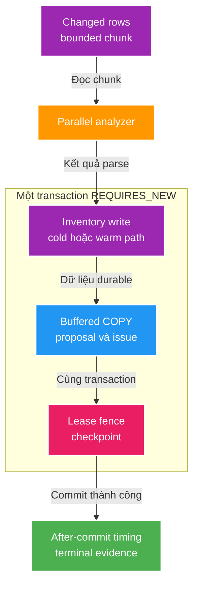

# FT-031 — Thiết kế tối ưu persistence reconciliation Scan 1M file

Owner: `scan-service`
Brief: [01-brief.md](./01-brief.md)

## High Level Design

## Quyết định

1. Triển khai và benchmark theo thứ tự 31.1 → 31.2 → 31.3 → 31.4. Mỗi bước có
   rollback độc lập; không gộp nhiều giả thuyết hiệu năng vào một benchmark.
2. FT-031.1 đo thao tác trong transaction và callback sau commit/rollback. Log
   có `runId`; metric chỉ dùng nhãn phase/result cardinality thấp.
3. FT-031.2 chỉ thay transport byte của PostgreSQL COPY: encoder vẫn giữ đúng
   grammar CSV hiện tại, một connection và transaction của chunk.
4. FT-031.3 chỉ chọn cold path khi inventory của root rỗng tại thời điểm bắt đầu
   reconciliation. Unique running-root bảo đảm không có scan cùng root cạnh
   tranh; mọi root có inventory dùng warm path hiện tại.
5. FT-031.4 thử các giá trị 100k, 200k, 250k và 500k trên cùng fixture. Giá trị
   mới chỉ được chọn khi không timeout, không mất lease, không tăng peak memory
   quá budget quan sát được và cải thiện end-to-end.

## Domain và data ownership

`scan-service` tiếp tục là owner duy nhất của `scan_db`. `scan_inventory_diff_stage`
là scratch `UNLOGGED`; `scan_file_inventory`, `scan_proposal`, `scan_issue` và
`scan_run` vẫn là state durable. Không có cross-database query/write.

## REST/event contract

Không đổi REST API, Kafka event hoặc SSE. Timing mới là log/metric nội bộ; REST
vẫn là source authoritative và SSE vẫn best-effort.

## Luồng lỗi, idempotency và consistency

- Mọi write durable và checkpoint giữ trong cùng `REQUIRES_NEW`; COPY/write/
  checkpoint lỗi hoặc lease fence thất bại rollback toàn bộ chunk.
- Timing chỉ được công bố `committed` sau after-commit; rollback ghi result
  `rolled_back`, không báo nhầm một chunk durable.
- Cold path chỉ tối ưu trường hợp không có inventory. Nếu điều kiện không thỏa
  hoặc không chứng minh được, quay về warm path bảo thủ.
- Unique constraint proposal/issue vẫn chặn duplicate khi retry; không thay
  semantics parser, evidence hoặc decision/outbox.

## Hiệu năng, quan sát và bảo mật tối thiểu

- Evidence phải tách `inventory`, `proposalCopy`, `issueCopy`, `checkpoint` và
  `transactionCommit`; không ghi path/root tuyệt đối vào structured log mới.
- So sánh cold filesystem, warm filesystem/cold run và warm reconciliation;
  không kết luận từ một lần chạy duy nhất.
- Không dùng `runId`, path hay identity làm metric label khi bổ sung metric;
  structured log theo `runId` chỉ phục vụ truy vết bounded của một execution.
