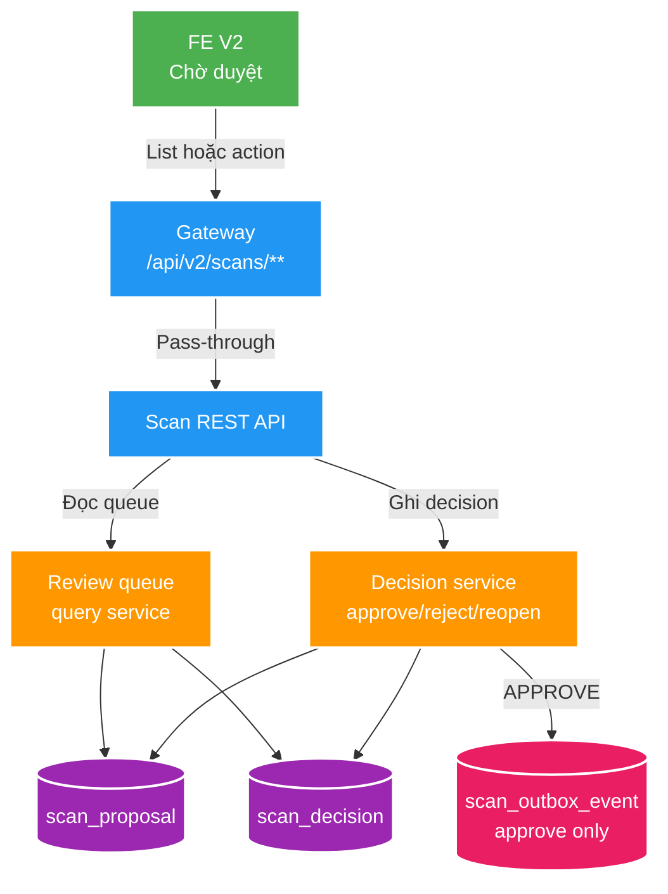

# FT-032 — Thiết kế Scan review queue

Owner: `scan-service` / `scan_db`; consumer: module `scan` của FE V2
`D:\Study\Project\file_mngt_fe_v2` qua `gateway-service`.
Brief: [01-brief.md](./01-brief.md)

## High Level Design

## Ownership và mô hình dữ liệu

- `scan-service` vẫn là owner duy nhất của proposal và decision trong `scan_db`.
  `PENDING` là trạng thái suy diễn khi thiếu row `scan_decision`; không thêm enum,
  cột hoặc bảng mới.
- Queue đọc `scan_proposal` left join `scan_decision` và `scan_run`; `scan_run`
  chỉ được dùng để trả `scanId`, `rootKey`, `profile` cho UI, không thay đổi
  ownership hay viết chéo database.
- Reopen chỉ xóa row decision có giá trị `REJECT`. Vì reject không có outbox, thao
  tác không thể tạo hoặc hủy event Kafka. Decision `APPROVE` và outbox liên quan
  giữ nguyên.
- Không sửa discovery, staging, diff, `scan_file_inventory`, lease hay SSE. Một
  scan không đổi vẫn thành công với `proposalCount = 0`.

## REST contract

Gateway đã route `/api/v2/scans/**` nguyên path nên không cần đổi route/config.
Scan OpenAPI là source of truth.

| API | Semantics | Response |
| --- | --- | --- |
| `GET /api/v2/scans/review-queue?state=PENDING&rootKey=&page=&size=` | Lấy queue toàn cục; `state` mặc định `PENDING`, chỉ chấp nhận `PENDING` hoặc `REJECTED`. `rootKey` là filter tùy chọn. | `200` trang `ReviewQueueProposal`; `400` state/page/size/rootKey không hợp lệ. |
| `POST /api/v2/scans/{scanId}/proposals/{proposalId}/reopen` | Đặt trạng thái mong muốn là `PENDING`: xóa decision nếu nó là `REJECT`; no-op nếu chưa có decision. | `204`; `404` nếu proposal/run không khớp; `409` nếu `APPROVE`. |

`ReviewQueueProposal` là response additive, gồm `proposalId`, `scanId`, `rootKey`,
`sourceRelativePath`, semantic/evidence hiện có và `state`. Endpoint proposal theo
run hiện hữu không đổi. Không có Kafka/event contract mới.

## Idempotency, consistency và failure

1. `POST .../reopen` kiểm tra proposal thuộc `scanId`.
2. Nếu không có decision, trả `204` mà không ghi gì. Nếu `REJECT`, xóa đúng row
   theo `proposalId + decision = REJECT` trong transaction. Nếu `APPROVE`, trả
   `409` và không đổi Scan/Catalog/outbox.
3. Hai request reopen đồng thời an toàn: tối đa một request xóa row; request còn
   lại quan sát `PENDING` và cũng hoàn tất `204`.
4. Queue là query read-after-commit từ PostgreSQL; không dùng Redis hay Kafka.
   FE refetch queue sau approve, reject hoặc reopen thành công.
5. Query chỉ trả proposal của run `COMPLETED`. Run `RUNNING` có thể đang COPY, còn
   run `FAILED` có thể chỉ chứa một phần chunk đã commit nên không được đưa vào
   inbox review; người dùng xử lý chúng qua retry/history hiện có.

## FE handoff

- Owner FE: [FT-005 Scan review queue](D:\Study\Project\file_mngt_fe_v2\docs\features\005-scan-review-queue\03-plan.md).
- Tab chính: `Chờ duyệt`; mặc định gọi queue `state=PENDING` và có filter root tùy
  chọn. Đây không phải màn hình History.
- Tab/filter phụ: `Đã bỏ qua`; gọi `state=REJECTED`, mỗi item có hành động `Đưa lại
  chờ duyệt` gọi endpoint reopen.
- Sau SSE terminal hoặc REST verify terminal của scan, nếu `proposalCount = 0`,
  hiển thị banner có link tới `Chờ duyệt`; không tự điều hướng và không fetch
  proposal/issues của run khi nó còn `RUNNING`.
- `APPROVE`/`REJECT` dùng endpoint hiện có. Sau action thành công, xóa item khỏi
  view hiện tại và refetch trang khi cần; `409` reopen approved được hiển thị là
  “Đã duyệt; không thể đưa lại hàng chờ”.

## Performance và observability

- API bắt buộc phân trang `size` 1–100, mặc định 50. Thứ tự ổn định: run mới nhất
  trước, sau đó `sourceRelativePath`, rồi `proposalId` để tránh duplicate/missing
  khi chuyển trang.
- Không tự thêm index vào hot-write `scan_proposal`. Implementation phải chạy
  `EXPLAIN (ANALYZE, BUFFERS)` bằng fixture representative trước khi quyết định một
  migration index chỉ phục vụ read queue; index chỉ được thêm khi có bằng chứng.
- Log action reopen bằng `scanId`, `proposalId`, outcome; không log absolute path.
