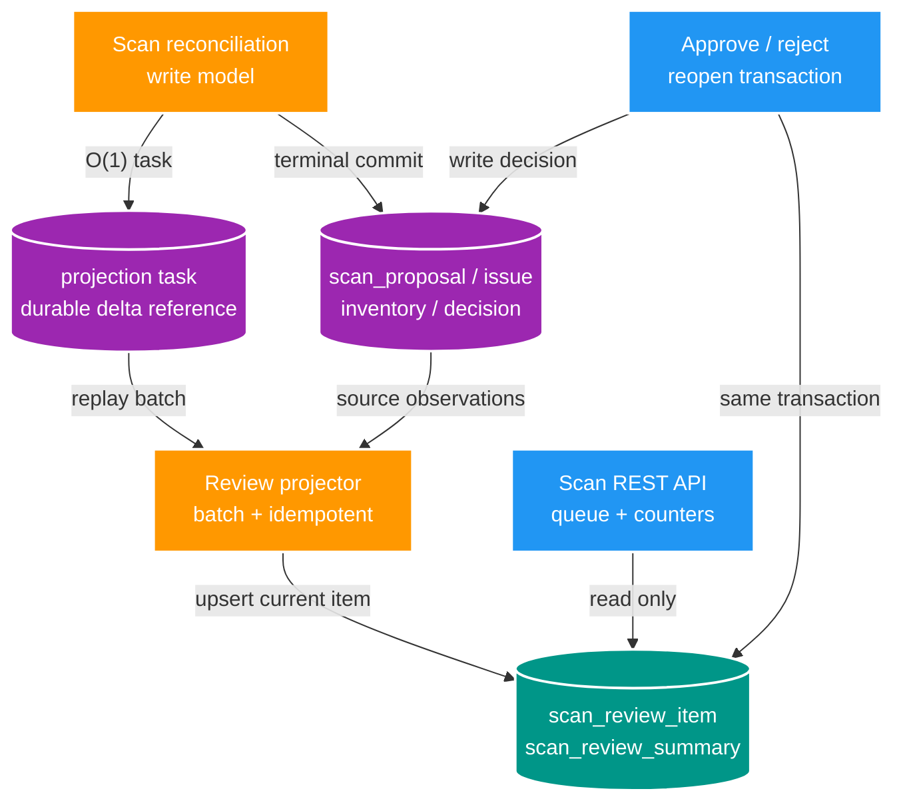

# FT-033 — Thiết kế Scan review read model

Owner: `scan-service` / `scan_db`.
Brief: [01-brief.md](./01-brief.md)

## High Level Design

## Quyết định

- Áp dụng CQRS-lite trong cùng `scan_db`: write model vẫn là authority; read model chỉ là
  projection có thể replay. Chưa tách physical read database để tránh replica lag sau
  approve/reject/reopen.
- Read API chỉ đọc projection sau cutover. Không dùng `scan_proposal`/`scan_issue` history
  để suy diễn current state trong request path.
- Projection của terminal scan chạy bất đồng bộ theo batch. Terminal transaction chỉ ghi
  task nhỏ, nên COPY/reconciliation không chờ projection viết hàng loạt.
- Decision người dùng cập nhật projection đồng bộ trong transaction quyết định. Điều này
  bảo đảm read-after-commit cho một action mà không ảnh hưởng scan worker.
- `V14__add_review_queue_read_indexes.sql` là biện pháp chuyển tiếp cho query lịch sử; khi
  projection phục vụ toàn bộ read path, benchmark quyết định giữ hay bỏ các index này.

## Domain và data ownership

`scan-service` sở hữu toàn bộ bảng mới trong `scan_db`:

| Thành phần | Dữ liệu chính | Mục đích |
| --- | --- | --- |
| `scan_review_item` | `root_key`, `source_relative_path`, kind proposal/issue, source ID/run, state, payload view, observed/updated time | Một item review hiện hành, khóa duy nhất theo root/path. |
| `scan_review_summary` | `root_key`, pending/rejected/approved/issue count, projection watermark | Counter O(1) theo root. |
| `scan_review_projection_task` | task ID, root/run, delta reference, status, attempts, checkpoint, error | Điều phối replay idempotent và theo dõi lag. |

`scan_proposal`, `scan_issue`, `scan_decision` và inventory không bị thay thế. Projection
không chứa absolute path, không là source of truth và phải tái tạo được từ write model cùng
durable delta đã chốt.

## REST/event contract

- Giữ nguyên `GET /api/v2/scans/review-queue`, `.../issues`, `GET /{scanId}` và decision
  endpoints. Response item/pagination tương thích ngược.
- Có thể bổ sung `projectionStatus` và `projectionUpdatedAt` vào scan summary theo kiểu
  additive; không dùng SSE để phát individual item.
- Không publish Kafka contract liên service trong pha đầu. Task/projector là cơ chế nội bộ
  `scan-service`; nếu sau này dùng outbox/Kafka phải version hóa event và dedupe theo task ID.

## Luồng lỗi, idempotency và consistency

1. Terminal scan commit write model và tạo task chỉ một lần theo `scanRunId`; retry cùng run
   không tạo task duplicate.
2. Projector lease task, xử lý batch, checkpoint và upsert theo unique root/path. Worker
   crash giữ task retryable; task stale được reclaim an toàn.
3. Projector phải xóa item khi inventory xác nhận `MISSING` hoặc khi changed path không còn
   observation review. Durable delta phải biểu diễn được cả hai trường hợp này.
4. Nếu projection lag, API trả watermark/status; queue có thể trả dữ liệu đến watermark nhưng
   không được báo số liệu đã đồng bộ hoàn toàn. Action decision vẫn đọc/ghi write model rồi
   cập nhật projection cùng transaction.
5. Rebuild root tạo task đặc biệt, chặn hai projector cùng root hoặc fence theo version; chỉ
   swap/read projection sau khi rebuild hoàn tất để tránh danh sách nửa cũ nửa mới.

## Hiệu năng, quan sát và bảo mật tối thiểu

- Projector dùng set-based SQL/batch bounded; không JPA loop trên hàng triệu item, không đọc
  lại full root cho từng trang REST.
- Index của read table phục vụ đúng query: primary key `(root_key, source_relative_path)`,
  state/page ordering và root summary. Các index này nằm ngoài COPY hot tables.
- Metric: backlog task, age watermark, item processed/s, retry/failure và read query latency;
  không dùng root/path làm metric label.
- Log chỉ task/run ID, root key và checkpoint; không log absolute filesystem path hoặc payload
  evidence đầy đủ.
