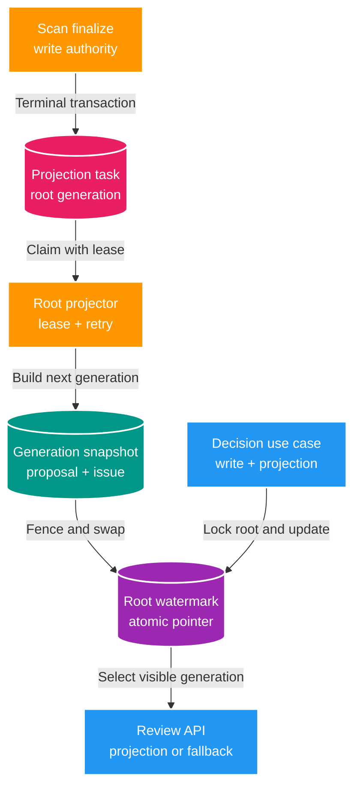

# FT-033 — Thiết kế Scan review read model

Owner: `scan-service` / `scan_db`.
Brief: [01-brief.md](./01-brief.md)

## High Level Design

## Quyết định

- Dùng CQRS-lite trong cùng `scan_db`; write model vẫn là authority và projection có thể rebuild.
- Chọn **async root rebuild set-based**, không lưu durable delta theo từng chunk. Terminal finalize chỉ enqueue
  một task O(1) trong cùng transaction với `markMissing` và `scan_run.COMPLETED`.
- Mỗi task nhận `generation` tăng đơn điệu theo root. Worker dựng generation mới bên cạnh generation đang
  phục vụ, sau đó conditional swap watermark; reader không thấy snapshot nửa cũ nửa mới.
- Task nội bộ dùng polling database, không thêm Kafka/event contract. Claim dùng lease, retry bounded và stale
  reclaim; worker cũ chỉ được swap khi còn lease và generation chưa bị task mới hơn vượt qua.
- Decision transaction khóa root watermark, ghi `scan_decision`/approval outbox và cập nhật generation đang
  hiển thị. Projector cũng khóa cùng root trước khi merge decision cuối và swap, tránh lost update.
- Khi projection của phạm vi query chưa `READY`, API dùng query lịch sử hiện tại làm authoritative fallback.
  Contract REST không đổi và không trả số liệu projection stale như thể đã đồng bộ.
- Bulk action chọn ID từ projection theo batch 500; write authority vẫn là proposal/decision/outbox. Fallback
  lịch sử chỉ tồn tại trong giai đoạn projection chưa READY.

## Domain và data ownership

`scan-service` sở hữu các bảng mới trong `scan_db`:

| Bảng | Trách nhiệm |
| --- | --- |
| `scan_review_projection_root` | Cấp generation, giữ visible generation, source run, status và lỗi gần nhất theo root. |
| `scan_review_projection_task` | Durable task, lease owner/deadline, retry budget và terminal state. |
| `scan_review_proposal` | Snapshot proposal theo `root_key + generation`, gồm decision state phục vụ queue. |
| `scan_review_issue` | Snapshot issue theo `root_key + generation` phục vụ filter/pagination. |

Không bảng mới nào là source of truth. `scan_proposal`, `scan_issue`, `scan_decision`, inventory và approval
outbox không bị thay thế. Không có cross-database join/write và không lưu absolute filesystem path.

## Transaction và ordering

1. `finalizeRun`: validate Scan lease, mark missing, xóa staging, complete run và enqueue task duy nhất theo
   `scan_run_id` trong cùng `REQUIRES_NEW` transaction.
2. Worker claim tối đa một task qua `FOR UPDATE SKIP LOCKED`; lease dài hơn statement timeout.
3. Worker insert snapshot proposal/issue set-based cho generation mới. Generation cũ vẫn phục vụ request.
4. Trước swap, worker khóa root, đồng bộ decision authority lần cuối và kiểm tra task lease/fence.
5. Generation cũ chỉ được dọn sau khi pointer mới commit. Task cũ hơn generation hiện tại trở thành no-op.
6. Worker crash làm transaction build rollback; task được reclaim sau lease. Quá retry/deadline chuyển `FAILED`.

## REST và compatibility

- Giữ nguyên endpoint, request/response và pagination của Scan v1; không cần đổi OpenAPI.
- Root-specific request dùng projection khi root `READY`. Global request chỉ dùng projection khi mọi root đã
  materialize xong; nếu không thì fallback toàn bộ sang query lịch sử để giữ ordering/count nhất quán.
- Không đổi SSE, Catalog event, Gateway route hay FE trong FT-033.

## Resource budget và operability

- Một worker mỗi service instance, một task mỗi lần; batch decision 500 item.
- Projection statement timeout 45 giây, lease 90 giây, tối đa 5 lần thử, total task deadline 30 phút.
- Scheduler không nhận task mới khi shutdown; không release lease trong callback shutdown. Instance khác chỉ
  reclaim sau deadline để worker cũ không commit chồng.
- Log/metric chỉ dùng task/run ID, generation và aggregate; không dùng path làm label hay log evidence payload.
- Benchmark bắt buộc so sánh Scan 1M khi projector có tải, projection lag và `EXPLAIN (ANALYZE, BUFFERS)`
  trước cutover production.
