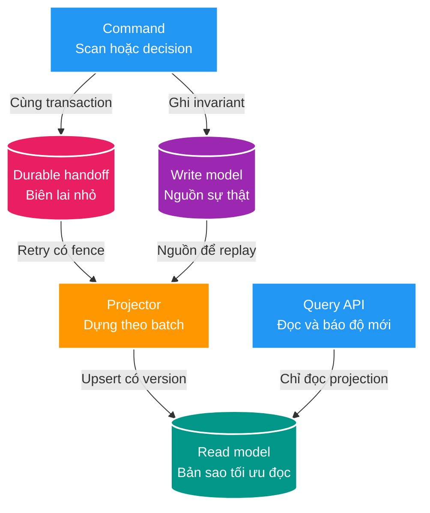
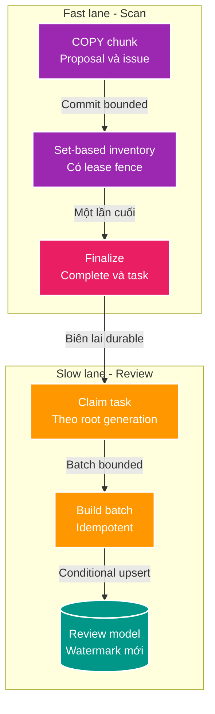

# Nền tảng tư duy tách Write Path và Read Path

Tài liệu này là learning note phục vụ thiết kế FT-033. Nó không thay thế Brief, Design, Plan,
contract hay service context và chưa phải quyết định triển khai.

## Mục tiêu học

Sau khi đọc, người học có thể:

- Nhìn một luồng vừa ghi nhiều vừa đọc phức tạp và xác định đúng nơi cần tách.
- Vẽ High Level Design trước khi chọn bảng, Kafka, scheduler hay framework.
- Phân biệt tách latency, tách trách nhiệm, tách tài nguyên và tách vật lý.
- Nhận ra những guarantee còn thiếu: atomic handoff, idempotency, ordering, replay và freshness.
- Giải thích trade-off của FT-033 mà không học thuộc một mẫu CQRS.

Prerequisite: hiểu transaction database, primary key, retry và pagination ở mức cơ bản.

## Bản chất trong một câu

> Write Path chỉ bảo vệ sự thật và giao một biên lai bền vững; Read Path dùng biên lai đó để dựng
> một bản sao dễ đọc, có thể chậm nhưng không được làm sai hoặc chặn đường ghi.

Keyword spine:

```text
Authority -> Atomic handoff -> Projection -> Freshness
Sự thật   -> Bàn giao nguyên tử -> Bản dựng  -> Độ mới
```

Câu dễ nhớ hơn:

> Đường ghi giao biên lai, không bê cả kho sang đường đọc.

## Mental model tổng thể: bốn vùng trách nhiệm



Mental model có bốn vùng, không phải hai:

| Vùng | Owns | Không owns | Input / Output | Có thể thay thế bằng |
| --- | --- | --- | --- | --- |
| Authority | Business invariant, trạng thái chuẩn, transaction ghi | Pagination, search view, cache | Command / canonical state | Write model khác giữ cùng invariant |
| Handoff | Bằng chứng durable rằng authority đã đổi | Business state đầy đủ, UI payload | Commit marker/delta reference / task | Outbox, CDC position, durable queue |
| Projector | Retry, ordering, batch, checkpoint, rebuild | Quyết định nghiệp vụ cuối cùng | Task + canonical data / projection mutations | Worker, scheduler, consumer |
| Read model | Shape cho filter, sort, counter, pagination | Nguồn sự thật | Projection mutations / query rows | Table, index, search engine, cache |

Sai lầm thường gặp là vẽ thẳng `write tables -> read API` rồi gọi đó là CQRS. Phần khó thật sự nằm
ở handoff và projector: mất task, task trùng, task chạy sai thứ tự, worker chết và dữ liệu bị stale.

## D0 — Vấn đề gốc: vì sao phải tách?

Một mô hình dữ liệu thường không thể đồng thời tối ưu cho hai mục tiêu đối nghịch:

- Write Path cần ít index, transaction ngắn, write amplification thấp và invariant rõ.
- Read Path cần join ít, filter/sort nhanh, counter sẵn có và shape gần với UI.

Nếu ép read query chạy trực tiếp trên lịch sử ghi, mỗi request phải tái dựng “trạng thái hiện tại”.
Nếu thêm nhiều index/counter vào bảng ghi, mỗi lần ingest lại trả giá. Tách read model là chuyển chi
phí từ **mọi request đọc** sang **một quá trình dựng có kiểm soát**.

Tách không tự động có nghĩa là hai service hoặc hai database. Có bốn mức độc lập:

| Mức | Đã tách gì? | Chưa tách gì? |
| --- | --- | --- |
| Logical | Package, use case và model | Thread, pool, database |
| Runtime | Worker/executor và backpressure | Database I/O, WAL, lock |
| Resource | Connection pool, concurrency, timeout, lịch chạy | PostgreSQL instance |
| Physical | Database/replica/service riêng | Chỉ còn contract và replication lag |

HLD phải nói rõ đang cần mức nào. FT-033 hiện hướng đến logical + runtime; nếu vẫn dùng cùng
`scan_db`, nó chưa tự động có resource isolation.

## D1 — Vocabulary và năm invariant

### Authority

Dữ liệu duy nhất được phép quyết định nghiệp vụ. Xóa read model không được làm mất sự thật.

### Handoff

Một record nhỏ, durable và được commit nguyên tử cùng thay đổi authority. Nó trả lời: “có việc cần
dựng”, không nhất thiết chứa toàn bộ dữ liệu cần dựng.

### Delta

Tập thay đổi kể từ lần dựng trước: create, update và delete. Delta muốn replay được phải durable.
Scratch table bị xóa hoặc `UNLOGGED` không phải durable delta.

### Projection

Bản biểu diễn suy ra từ authority, tối ưu cho câu hỏi cụ thể. Nó phải xóa được và dựng lại được.

### Watermark

Mốc authority mới nhất mà projection đã phản ánh đầy đủ. Watermark là lời hứa về độ mới, không chỉ
là timestamp để hiển thị.

Năm invariant cần chốt trước schema:

1. Authority không phụ thuộc projection để commit đúng.
2. Authority đổi thành công thì handoff không được mất.
3. Retry hoặc duplicate không làm projection sai.
4. Task cũ không được ghi đè dữ liệu từ task mới.
5. Reader biết projection đang mới đến đâu và xử lý được khi nó chưa bắt kịp.

## D2 — Cơ chế runtime chuẩn

### Fast lane: đường ghi

1. Nhận command.
2. Validate invariant.
3. Ghi canonical state.
4. Ghi đúng một handoff nhỏ trong cùng transaction.
5. Commit và trả control; không chờ projector quét hoặc upsert hàng loạt.

### Slow lane: đường dựng

1. Claim task bằng lease hoặc status có conditional update.
2. Kiểm tra version/root fence.
3. Đọc một batch bounded từ durable delta hoặc authority.
4. Upsert/delete read rows bằng incoming generation.
5. Cập nhật checkpoint trong cùng transaction batch.
6. Hoàn tất task và tiến watermark khi toàn bộ root/run đã dựng xong.

### Read lane: đường phục vụ query

1. Query chỉ dùng read model sau cutover.
2. Filter, sort, pagination và counter dùng index của read model.
3. Response hoặc metadata nói rõ freshness khi projection lag/fail/rebuild.

## Ví dụ cụ thể: scan một triệu file



Điểm kiểm soát quan trọng:

- Không thêm projection index hoặc projection write vào từng chunk `COPY`.
- `finalize` chỉ thêm handoff O(1), nhưng phải cùng transaction với terminal state.
- Projector có pool, concurrency, batch size và statement timeout riêng.
- Có thể pause projector của một root khi root đó đang có scan `RUNNING` nếu cần bảo vệ tài nguyên.
- Một decision nhỏ của người dùng có thể cập nhật authority và projection cùng transaction để có
  read-after-commit. Đây là ngoại lệ có chủ đích, không được suy rộng sang bulk scan.

## Tam giác không thể lấy đủ ba cạnh

Một hệ thống incremental chính xác thường không thể đồng thời có cả ba:

```text
A. Không ghi durable delta theo item
B. Không đọc/rebuild nặng từ write model
C. Projection incremental chính xác và replay được
```

Chọn A + C thì projector phải rebuild/query write model. Chọn B + C thì write path phải lưu delta.
Chọn A + B thì chỉ còn projection best effort hoặc không replay chính xác.

Đây là câu hỏi kiến trúc phải trả lời trước khi chọn bảng:

> Ta muốn trả chi phí ở lúc ghi, lúc dựng, hay chấp nhận giảm guarantee?

Với FT-033, proposal/issue của run lưu được observation mới, nhưng các path chuyển sang `MISSING`
không còn một delta durable sau khi staging bị dọn. Vì vậy “task O(1) + incremental delete chính xác +
không rebuild” chưa thể tự xuất hiện chỉ bằng cách thêm worker.

## D3 — Failure model và guarantee

| Failure | Nếu không có hàng rào | Hàng rào cần có |
| --- | --- | --- |
| Commit authority rồi chết trước khi tạo task | Projection mất vĩnh viễn | Handoff cùng transaction |
| Task được giao hai lần | Counter/row bị nhân đôi | Idempotent upsert + unique key |
| Run cũ chạy sau run mới | State mới bị ghi đè | Root generation + conditional mutation |
| Worker chết giữa batch | Task treo hoặc làm lại từ đầu | Lease, checkpoint, stale reclaim |
| Decision chạy cùng projector | Decision mới bị projector ghi đè | Merge rule hoặc field/version fence |
| Projection lag | UI tưởng dữ liệu đã đầy đủ | Watermark và status có semantics |
| Projection hỏng | Không có đường phục hồi | Rebuild từ authority + atomic cutover |
| Projector chiếm hết DB | Scan latency regress | Pool/concurrency/timeout/resource policy |

Phân loại lời hứa:

- Guarantee: authority và handoff commit atomically; stale generation không thể overwrite.
- Best effort: thời gian projector bắt kịp một SLA mục tiêu nếu tải nằm trong capacity đã đo.
- Assumption: database còn đủ I/O budget; assumption này phải được benchmark và monitor.

Async không đồng nghĩa với “không ảnh hưởng”. Nó chỉ loại bỏ việc chờ đồng bộ; worker vẫn có thể
tranh CPU, I/O, connection, lock, WAL và autovacuum với đường ghi.

## D4 — Cách nghĩ High Level Design khi gặp bài toán tương tự

Vẽ HLD theo thứ tự sau, không bắt đầu bằng tên công nghệ:

1. **Truth:** Bảng/service nào là authority? Invariant nào tuyệt đối không được đổi?
2. **Budget:** Đường ghi đang bảo vệ latency, throughput hay cả hai? Cấm thêm loại write/index nào?
3. **Handoff:** Record nhỏ nhất chứng minh một thay đổi đã commit là gì? Nó có atomic không?
4. **Change set:** Projector biết create/update/delete bằng nguồn durable nào?
5. **Order:** Đơn vị cần giữ thứ tự là entity, root, tenant hay toàn hệ thống?
6. **Replay:** Xóa projection rồi dựng lại từ đâu? Rebuild có atomic cutover không?
7. **Freshness:** Reader nhìn watermark/status nào? Lag/fail trả stale data hay lỗi?
8. **Isolation:** Pool, concurrency, timeout, backpressure và lịch chạy bảo vệ writer thế nào?
9. **Decision path:** Read-after-write nào thật sự bắt buộc? Có bulk path không?
10. **Rollout:** So sánh projection với query cũ và rollback mà không mất authority ra sao?

Nếu một HLD chưa trả lời được mười câu này, việc thêm schema/worker mới chỉ chuyển độ phức tạp sang
runtime.

## Decision table

| Phương án | Khi phù hợp | Giá phải trả |
| --- | --- | --- |
| Query trực tiếp write model | Dữ liệu nhỏ, query đơn giản, tải thấp | Read và write coupling |
| Projection cùng database | Cần query nhanh, owner không đổi, muốn rollout nhỏ | Vẫn tranh tài nguyên DB |
| Durable delta + projector | Change set nhỏ hơn full data, cần replay incremental | Write amplification và retention |
| Async root rebuild | Scan hiếm, ưu tiên giữ write path tối giản | Đọc nặng, lag dài, cần throttle |
| CDC/logical decoding | Không muốn application dual-write, cần stream thay đổi | Vận hành, ordering và schema evolution khó hơn |
| Read replica/database riêng | Read load cần physical isolation | Replica lag, cutover và chi phí vận hành |

Không có phương án “đúng chung”. Quyết định đúng là phương án đặt chi phí vào nơi hệ thống còn budget
và có failure mode mà đội ngũ kiểm soát được.

## Mapping vào Backend V2

| Khái niệm | Evidence hiện tại |
| --- | --- |
| Scan authority | `scan_proposal`, `scan_issue`, `scan_file_inventory`, `scan_decision`, `scan_run` |
| Fast lane | `ScanChunkCommitter` và direct PostgreSQL `COPY` |
| Scratch delta | `scan_inventory_diff_stage` là `UNLOGGED` và bị dọn khi finalize |
| Query lịch sử | `ScanProposalRepository`, `ScanIssueRepository` |
| Decision authority | `ScanDecisionService`; approval và outbox cùng transaction |
| Feature draft | `docs/features/033-scan-review-read-model/` |

Project invariant cần giữ: scan chunk `REQUIRES_NEW`, lease fence, set-based inventory, direct `COPY`
và approval outbox không bị read model kéo vào transaction nóng.

## Misconceptions và red flags

- “Async là không đụng write path”: sai; nó có thể vẫn tranh cùng database.
- “Có queue là không mất event”: sai nếu queue không commit atomically với authority.
- “Upsert là idempotent”: chưa đủ nếu task cũ có thể overwrite task mới.
- “Có timestamp là có ordering”: sai nếu clock/order không tạo monotonic fence theo aggregate.
- “Read model là cache”: không hẳn; projection có checkpoint, schema và guarantee rõ hơn cache.
- “Cùng database thì chưa phải CQRS”: sai; CQRS là tách model/trách nhiệm, không bắt buộc tách máy.
- “Tách service ngay sẽ sạch”: có thể chỉ chuyển bài toán sang replication lag và distributed failure.
- HLD có worker nhưng không có replay, watermark hoặc stale-task rule.
- HLD hứa không thêm write, không rebuild và vẫn incremental chính xác.

## Cầu nối phỏng vấn

### Trả lời 30 giây

Tách read/write không bắt đầu bằng Kafka hay hai database. Tôi xác định authority, tạo handoff nhỏ
commit cùng transaction, rồi projector idempotent có ordering fence dựng read model. Query chỉ đọc
projection và phải biết watermark. Async chỉ tách latency; muốn không ảnh hưởng writer còn phải tách
resource budget. Trade-off lớn nhất là lưu durable delta ở write path hay trả chi phí rebuild ở read
side.

### Câu hỏi tự kiểm tra

1. Vì sao tạo task “sau commit” có thể mất projection?
2. Tại sao unique `(root, path)` chưa ngăn run cũ overwrite run mới?
3. Async worker đã đủ để bảo vệ scan throughput chưa?
4. Nếu không lưu changed/missing delta, projector lấy delete event ở đâu?
5. Watermark khác timestamp cập nhật gần nhất thế nào?
6. Khi nào synchronous update read model trong decision transaction là ngoại lệ hợp lý?

## Tài liệu dự án liên quan

- [FT-033 Brief](./01-brief.md)
- [FT-033 Design](./02-design.md)
- [FT-033 Plan](./03-plan.md)
- [Review kiến trúc FT-033](./05-architecture-review.md)
- [Scan Service context](../../../apps/scan-service/CONTEXT.md)
- [Coding rules](../../architecture/03-CODING_RULES.md)

