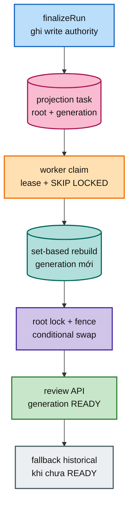

# FT-033 — Scan review read model: giải thích, scale và cloud

## 1. Vấn đề dành cho người mới

Review queue cần trả lời các câu hỏi như: proposal nào đang `PENDING`, issue nào thuộc root này, tổng cộng bao nhiêu item và trang tiếp theo là gì. Ban đầu các câu trả lời được suy ra trực tiếp từ nhiều bảng lịch sử: proposal, issue, decision, inventory và các run cũ.

Hãy hình dung một kho hàng. `scan_proposal` và `scan_issue` là sổ nhập kho gốc, phải chính xác và có lịch sử. Màn hình review chỉ cần một danh sách hiện tại để nhân viên làm việc. Nếu mỗi lần mở màn hình lại lật toàn bộ sổ cũ, việc đọc sẽ chậm và tranh chỗ với nhân viên đang ghi sổ.

FT-033 tạo một **read model** (bản sao tối ưu cho đọc) trong cùng `scan_db`. Bản sao này không thay thế write model — nơi giữ sự thật.

## 2. Vì sao chọn generation và rebuild bất đồng bộ?

**Generation** là số phiên bản của ảnh chụp, ví dụ generation 41 và generation 42. Worker dựng generation 42 bên cạnh 41. Chỉ khi 42 hoàn chỉnh, database mới đổi con trỏ hiển thị sang 42.

Ví dụ: nhân viên đang treo bảng danh sách số 41. Họ dựng bảng 42 ở bàn bên cạnh; khách vẫn xem bảng 41. Dựng xong mới đổi biển chỉ dẫn. Khách không thấy nửa bảng cũ nửa bảng mới.

**Rebuild bất đồng bộ** nghĩa là scan chỉ ghi một task “hãy dựng lại root này” sau khi transaction chính commit. Nó không đứng chờ toàn bộ projection.

Nếu không làm:

- mỗi request review phải anti-join lịch sử, latency tăng theo số entry;
- query review tranh CPU, connection và lock với scan;
- counter/filter dễ timeout;
- nếu ghi projection từng row trong scan 1M file, write amplification và WAL tăng mạnh.

**Write amplification** nghĩa là một thay đổi nghiệp vụ kéo theo nhiều lần ghi phụ. Giống nhập một món hàng nhưng phải sửa thêm mười sổ mục lục; đọc sau đó nhanh hơn, nhưng lúc nhập hàng rất nặng.

## 3. Các thuật ngữ khó

- **Read model:** bảng phục vụ query; giống bảng thực đơn đã sắp xếp, không phải kho nguyên liệu.
- **Write authority:** bảng chuẩn giữ sự thật; mọi quyết định nghiệp vụ phải ghi ở đây.
- **Watermark:** dấu ghi generation nào đang hiển thị.
- **Pointer swap:** đổi watermark một lần từ generation cũ sang generation mới.
- **Stale worker:** worker đã hết lease nhưng vẫn còn chạy. Fencing là điều kiện DB ngăn worker đó cập nhật.
- **Eventual freshness:** read model có thể chậm vài giây/phút sau write; không được giả vờ là đã cập nhật ngay.
- **OFFSET sâu:** DB bỏ qua nhiều dòng rồi mới lấy trang. Giống đếm bỏ qua 100.000 khách trước khi phục vụ 50 khách tiếp theo.
- **Keyset/cursor:** dùng khóa của dòng cuối trang trước làm mốc, giống phát số thứ tự tiếp theo thay vì đếm lại từ đầu.

## 4. Scale riêng của FT-033

1. Root nhỏ, query p95 đạt SLO: không scale; giữ historical fallback.
2. Deep page chậm: tối ưu index và chuyển cursor trước khi thêm worker.
3. Task age tăng, DB còn dư: thêm projector cho các root khác nhau.
4. Read tranh DB write: cân nhắc read replica sau khi có lock/CPU/WAL evidence.
5. Một root quá lớn: cần chia root/chunk hoặc manifest; không chạy nhiều worker cùng root nếu chưa có root fence.

Thêm pod không tự làm DB nhanh hơn. Nếu pool chỉ có 20 connection mà triển khai 100 worker, phần lớn chỉ chờ connection và làm lock contention tệ hơn.

## 5. Cloud cần chuẩn bị

- Worker stateless trên ECS/Kubernetes/VM; task và lease phải nằm PostgreSQL dùng chung.
- Private subnet/VPC, network policy chỉ cho worker tới `scan_db`.
- DB pool budget cho scan writer, projection worker và reader.
- Graceful shutdown: ngừng claim mới, hoàn tất transaction ngắn, không xóa lease; worker khác reclaim sau deadline.
- Autoscaling theo oldest task age/backlog, không chỉ CPU.
- Alert: root không READY, task retry exhausted, swap conflict, fallback rate, DB lock wait, projection lag.

## 6. Rollout và rollback

1. Migration additive, bootstrap task.
2. Bật worker nhưng API vẫn fallback.
3. Dual-read một root: so sánh projection với historical query.
4. Canary một root, theo dõi lag và lock.
5. Mở rộng từng nhóm root.

Rollback bằng `scan.review-projection.enabled=false`. Không drop projection hoặc write model. Projection hỏng có thể xóa generation phụ và rebuild lại từ authority.

## 7. Acceptance evidence

Phải có generation ordering test, stale lease race, decision/projector concurrency, Flyway/Testcontainers, query plan, deep-page benchmark, fixture 1M dưới tải projector, rolling restart và runbook rollback. Chưa có các bằng chứng này thì chỉ nói “đã có code”, không nói “đã scale”.

## 8. Failure drill cho người mới

### Projector chết giữa lúc dựng generation

Transaction dựng snapshot bị rollback. Generation cũ vẫn được phục vụ. Task chờ lease hết để worker khác reclaim. Đây là lý do không được đổi watermark trước khi build xong.

### Projector dựng xong nhưng mất lease trước swap

Worker phải bị DB từ chối khi swap. Nếu swap vẫn thành công, generation cũ có thể ghi đè generation mới. Đây là safety (không ghi sai); liveness (task cuối cùng có hoàn tất không) phải được test riêng.

### Projection chưa READY nhưng người dùng mở queue

API fallback về historical query hoặc trả trạng thái rõ ràng. Không được trả snapshot cũ mà không báo freshness.
