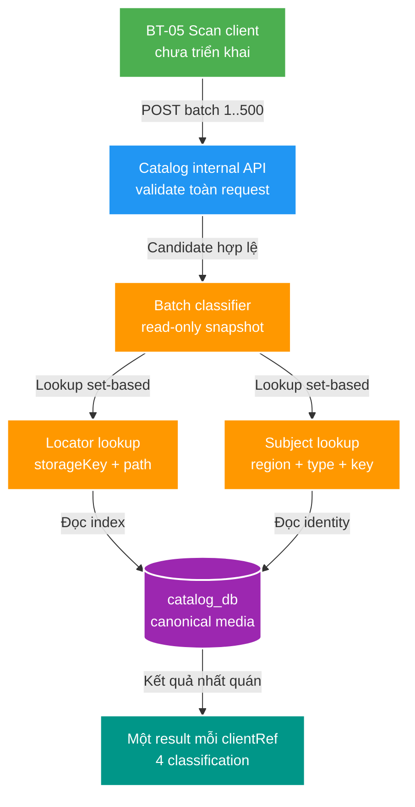

# FT-034 — Catalog batch existence API — Design

Owner: `catalog-service` / `catalog_db`; `scan-service` chỉ là consumer tương lai ở BT-05.
Brief: [01-brief.md](./01-brief.md)
Contract: [catalog-scan-existence-v1.yaml](../../contracts/openapi/catalog-scan-existence-v1.yaml)

## High Level Design



## Quyết định

### Contract và boundary

- Catalog sở hữu endpoint `POST /internal/v2/catalog/scan-existence` và OpenAPI
  `catalog-scan-existence-v1.yaml`. Path không được Gateway route và không dùng cho UI.
- `scanRunId` là correlation context do caller cung cấp; Catalog không đọc `scan_db` để xác thực run.
- Batch có `minItems: 1`, `maxItems: 500`. `clientRef` phải unique trong request; response correlate bằng
  `clientRef`, không dùng vị trí array làm identity.
- Đây là synchronous read dependency vì Scan cần classification trước khi dựng proposal ở BT-05. Không
  dùng Kafka cho request/response lookup nhỏ và có deadline theo chunk.

### Thứ tự classification

Catalog đánh giá trên một read-only transaction isolation `REPEATABLE_READ` và trả đúng một status/item:

1. Lookup global locator `(storageKey, relativePath)`.
2. Nếu locator tồn tại và subject identity cùng asset role đều khớp, trả `EXACT_ASSET_EXISTS` cùng
   `matchedSubjectId`, `matchedAssetId`.
3. Nếu locator tồn tại nhưng subject identity hoặc role khác, trả `CONFLICT` với `conflictCode` tương
   ứng; không tiếp tục đoán theo identity.
4. Nếu locator chưa có, lookup subject bằng `(region, subjectType, identityKey)`.
5. Nếu subject tồn tại và candidate có thể gắn thêm asset, trả `EXISTING_SUBJECT_NEW_ASSET` cùng
   `matchedSubjectId`.
6. Nếu subject đã có một `PRIMARY_VIDEO` khác mà candidate cũng yêu cầu `PRIMARY_VIDEO`, trả
   `CONFLICT/SUBJECT_PRIMARY_ASSET_EXISTS`.
7. Nếu locator và subject đều chưa có, trả `NEW_SUBJECT`.

`identityKey` do Scan chuẩn hóa theo semantic parser. Catalog exact-match key; không lowercase, fuzzy
match hoặc tự sửa key trong read API. Item `CONFLICT` vẫn nằm trong response `200`; request-level `409`
không phù hợp vì batch có thể chứa các item classification khác nhau.

### Data/index và query shape

- Không thêm table và không chuyển ownership. `media_subject`/`media_asset` tiếp tục thuộc `catalog_db`.
- Thêm unique partial index toàn cục:

  ```sql
  CREATE UNIQUE INDEX uq_media_asset_global_locator
      ON media_asset (storage_key, relative_path)
      WHERE storage_key IS NOT NULL;
  ```

- Giữ `uq_media_asset_locator` hiện có để tiếp tục bảo vệ locator legacy/null trong phạm vi subject.
- Migration không tự merge hay xóa duplicate. Nếu precondition có duplicate locator non-null, migration
  fail để người vận hành xử lý dữ liệu có chủ đích.
- Adapter persistence dùng lookup set-based theo tối đa 500 locator và 500 subject identity; cấm vòng
  lặp gọi repository/JPA query từng item. Chỉ select field cần cho classification và primary-role guard.

## Domain và data ownership

- Catalog là source of truth của canonical subject/asset và là nơi duy nhất quyết định một locator đang
  thuộc subject nào.
- Scan vẫn sở hữu filesystem inventory, proposal và scan run; request không cấp quyền cho Catalog đọc
  hoặc ghi `scan_db`.
- Existence result không reserve locator và không tạo lock xuyên thời gian. Write-side
  `media.file.discovered.v1/v2` consumer, processed-event dedupe và unique constraint xử lý race khi
  Catalog thay đổi sau response.
- `storageKey` trong request là logical root key, không phải absolute filesystem path. Asset
  `storage_key IS NULL` là legacy/manual và không exact-match với candidate có storage key.

## REST/event contract

OpenAPI chi tiết nằm tại
[catalog-scan-existence-v1.yaml](../../contracts/openapi/catalog-scan-existence-v1.yaml):

- Request: `{ scanRunId, items[1..500] }`; mỗi item có `clientRef`, `storageKey`, `relativePath`,
  `region`, `subjectType`, `identityKey`, `assetRole`.
- Response `200`: echo `scanRunId` và một result cho mỗi `clientRef`, gồm `classification`; matched IDs
  hoặc `conflictCode` chỉ có khi áp dụng.
- Error: `400` cho validation toàn request, `503` khi Catalog/database tạm unavailable.
- Không pagination vì request đã bounded; không side effect nên không cần idempotency header.
- Đây là contract mới, additive; không đổi Catalog public API hay event. Thay đổi breaking request,
  meaning classification hoặc correlation rule phải tạo contract version mới. Consumer tương lai phải
  fail closed nếu nhận classification không biết.

## Luồng lỗi, idempotency và consistency

- Validation fail trước lookup: batch rỗng/quá 500, duplicate `clientRef`, enum/key/path không hợp lệ
  trả một `ProblemDetail` `400`; không trả result một phần.
- Database unavailable/timeout được map thành `503`; caller BT-05 sau này quyết định retry/defer scan,
  không được tự coi item là `NEW_SUBJECT`.
- POST được dùng vì request batch lớn, nhưng operation read-only và retry-safe. Hai retry không ghi gì;
  response có thể khác hợp lệ nếu canonical state đổi giữa hai snapshot.
- Một request đọc trên transaction `REPEATABLE_READ` để các lookup locator/subject cùng thấy một
  snapshot. Không giữ lock/reservation sau response và không tuyên bố serializable với approval/event
  diễn ra sau đó.
- `CONFLICT` là business classification, không phải transport failure. Caller phải đưa item vào review
  ở BT-05 thay vì drop hoặc auto-approve.

## Hiệu năng, quan sát và bảo mật tối thiểu

- Hard limit 500 bảo vệ request size, query parameters và heap; không tự tăng theo SC-01 reconciliation
  batch 10.000/500.000 vì hai boundary có latency/failure budget khác nhau.
- Hai tập lookup phải set-based và dùng index global locator cùng unique subject identity. Không cache
  trước khi benchmark chứng minh database read là bottleneck.
- Metric tối thiểu: request count/duration, batch size và item count theo classification; không dùng
  `scanRunId`, `storageKey`, `relativePath` hoặc `identityKey` làm metric label.
- Log có correlation/trace và aggregate count; không log absolute path hay toàn payload. Relative path
  chỉ được dùng trong diagnostic có kiểm soát, không ghi mặc định theo từng item.
- Endpoint chỉ expose trên direct Catalog port theo network boundary hiện tại; không thêm Gateway route.
  Authentication service-to-service nằm ngoài FT-034 và không được giả định endpoint là public.
