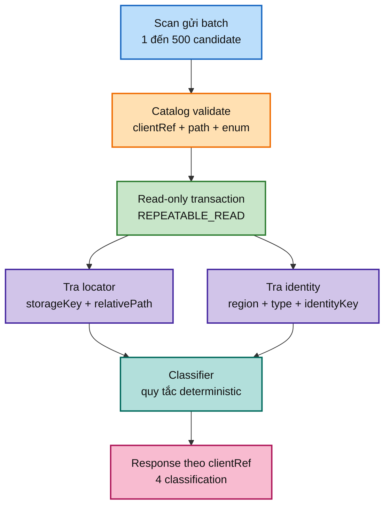

# FT-034 — Catalog batch existence API: giải thích từ đầu, scale và cloud

## 1. Tài liệu này dành cho ai?

Tài liệu này dành cho người mới chưa quen với `catalog-service`, `scan-service`, database ownership và các từ như `identity key`, `locator`, `set-based query`, `snapshot` hay `fail closed`. Đọc xong cần trả lời được bốn câu hỏi:

1. Scan đang hỏi Catalog chuyện gì?
2. Vì sao phải hỏi qua HTTP API mà không đọc thẳng database của Catalog?
3. Nếu tăng lên hàng triệu file thì điểm nghẽn nằm ở đâu và scale theo thứ tự nào?
4. Đưa lên cloud cần thêm những gì ngoài việc tăng số pod?

Tài liệu này là study material trong feature FT-034. Nó không thay thế OpenAPI, Design, Plan hoặc `apps/catalog-service/CONTEXT.md`. Code hiện tại đã có nhưng verification runtime của feature còn deferred.

## 2. Bài toán đời thường trước khi nói kỹ thuật

Hãy tưởng tượng có hai phòng trong một công ty:

- Phòng **Scan** đi đến các kệ đĩa trên filesystem và lập danh sách “tôi vừa thấy những file này”.
- Phòng **Catalog** giữ sổ cái chính thức: bộ phim nào đã tồn tại, asset nào thuộc bộ phim nào, file nào đã được ghi nhận.

Phòng Scan gặp một file mới tên `movie-01.mp4`. Trước khi tạo phiếu review, nó cần hỏi phòng Catalog:

> “File ở kho `JOKE`, đường dẫn tương đối `movie-01.mp4` đã có trong sổ chưa? Nếu chưa có file nhưng bộ phim đã tồn tại thì sao? Nếu thông tin mâu thuẫn thì báo tôi.”

FT-034 là quầy tiếp nhận câu hỏi đó. Quầy nhận một danh sách tối đa 500 candidate, tra sổ Catalog một cách hiệu quả và trả lời từng candidate.

## 3. Từ vựng nền tảng — giải thích thật chậm

### 3.1 Service là gì?

Một service là một chương trình có trách nhiệm tương đối rõ. `catalog-service` sở hữu dữ liệu canonical về subject/asset; `scan-service` sở hữu run, inventory, proposal và issue. “Sở hữu” không chỉ là biết bảng nào; nó có nghĩa là service đó quyết định quy tắc dữ liệu và chịu trách nhiệm khi dữ liệu sai.

Ví dụ: phòng Catalog giống phòng kế toán. Phòng Scan có thể gửi đề nghị “hãy kiểm tra hóa đơn này”, nhưng không được tự mở sổ kế toán và tự sửa số dư.

### 3.2 Database ownership là gì?

`catalog_db` là database của Catalog. Scan không được tạo repository trỏ vào `catalog_db`. Thay vào đó Scan gọi một API mà Catalog công bố.

Nếu phá ownership, lúc Catalog đổi tên cột hoặc thay migration, Scan có thể hỏng mà không có contract rõ ràng. Tệ hơn, hai service có thể cùng sửa một dòng theo hai quy tắc khác nhau.

### 3.3 Locator là gì?

**Locator** là địa chỉ logic của một file trong hệ thống: `storageKey + relativePath`.

- `storageKey` là tên root logic, ví dụ `JOKE` hoặc `USE`.
- `relativePath` là đường dẫn tính từ root, ví dụ `2026/movie-01.mp4`.

Nó không phải đường dẫn máy tính tuyệt đối như `D:\Media\JOKE\2026\movie-01.mp4`. Absolute path chứa chi tiết máy chủ và có thể làm lộ filesystem; logical locator ổn định hơn khi chạy trên cloud.

Ví dụ đời thường: thay vì ghi “tủ số 3 trong căn phòng có địa chỉ nhà X”, ta ghi “kho JOKE, kệ 2026, ô movie-01”. Khi chuyển kho sang cloud, mã logic vẫn giữ nguyên.

### 3.4 Subject, asset và asset role

- **Subject:** thực thể nội dung, ví dụ một bộ phim hoặc một album.
- **Asset:** file vật lý thuộc subject, ví dụ video, image hoặc GIF.
- **Asset role:** vai trò của file, ví dụ `PRIMARY_VIDEO`, `IMAGE`, `GIF`.

Một subject có thể có nhiều asset. Vì vậy “đã có subject” không đồng nghĩa “file này đã tồn tại”.

### 3.5 Identity key là gì?

`identityKey` là tên chuẩn mà Scan tạo ra để nói “candidate này thuộc về subject nào”. Nó không phải tên file nguyên bản và cũng không phải một chuỗi tùy ý.

Ví dụ parser đọc các tên:

```text
Movie-01 [1080p].mp4
movie_01-1080p.mp4
Movie 01.mp4
```

Nếu quy tắc parser của region `JOKE` coi cả ba là cùng một bộ phim, nó chuẩn hóa thành một khóa duy nhất, ví dụ `movie-01`. Catalog chỉ so sánh chính xác khóa đã chuẩn hóa này.

**Fuzzy matching** nghĩa là so sánh “gần giống” thay vì giống tuyệt đối. Ví dụ tìm `movie-01` rồi cho rằng `movie01`, `movie 01`, `movie-01-final` chắc chắn là cùng một thứ vì chúng nhìn khá giống. Fuzzy matching dễ đoán sai: hai bộ phim khác nhau có thể có tên gần giống, hoặc một hậu tố thực sự mang ý nghĩa khác.

FT-034 không fuzzy-match. Catalog không tự đoán, không lowercase thêm, không tự sửa key. Scan/parser chịu trách nhiệm chuẩn hóa trước; Catalog thực hiện exact matching — tức là hai chuỗi phải giống đúng theo quy tắc contract.

### 3.6 Set-based query là gì?

Có hai cách kiểm tra 500 candidate:

- Cách chậm: lặp 500 lần, mỗi candidate một câu SQL.
- Cách set-based: gom 500 locator/identity thành tập dữ liệu, chạy một vài query theo tập.

Ví dụ đời thường: thay vì gọi thủ kho 500 cuộc điện thoại “anh kiểm tra món A chưa?”, ta gửi một bảng danh sách 500 món để thủ kho tra một lượt. Số round-trip đến database không tăng tuyến tính theo số candidate.

### 3.7 Snapshot và advisory result

**Snapshot** là ảnh chụp trạng thái tại thời điểm request. API trả lời đúng theo ảnh chụp đó, nhưng ngay sau khi trả lời, một request khác có thể tạo asset mới.

**Advisory** nghĩa là kết quả dùng để định hướng, không phải lệnh giữ chỗ. FT-034 không reserve locator. Approval và unique constraint ở write side vẫn phải bảo vệ race.

### 3.8 Fail closed

Nếu Catalog bị timeout, response thiếu candidate hoặc trả classification không hiểu được, Scan phải dừng an toàn. Nó không được đoán rằng candidate là `NEW_SUBJECT`.

Ví dụ thủ kho không mở được sổ. Cách an toàn là để phiếu “chờ kiểm tra”, không tự cấp mã hàng mới; nếu tự cấp, sau này có thể có hai mã cho cùng một sản phẩm.

## 4. Luồng hiện tại từng bước

1. Scan tạo request gồm `scanRunId` và `items`.
2. Mỗi item có `clientRef` duy nhất để liên kết request với response.
3. Catalog validate toàn bộ request: không rỗng, không quá 500, không trùng `clientRef`, path phải là relative path.
4. Catalog đọc locator set và subject identity set trong read-only transaction `REPEATABLE_READ`.
5. Classifier quyết định một trong bốn classification.
6. Response trả đúng một item cho mỗi `clientRef`; consumer không được dựa vào thứ tự mảng.
7. Endpoint không tạo subject, asset hoặc outbox event.



## 5. Bốn classification bằng ví dụ

| Classification | Ý nghĩa | Ví dụ đời thường | Scan nên làm gì |
| --- | --- | --- | --- |
| `EXACT_ASSET_EXISTS` | Locator, subject identity và role đều khớp | Đúng sản phẩm, đúng mã kệ, đúng loại hộp đã có | Skip proposal vì không cần review lại |
| `EXISTING_SUBJECT_NEW_ASSET` | Subject đã có nhưng file asset này chưa có | Đã có sản phẩm trong sổ, nay nhập thêm ảnh/video mới | Tạo proposal để review asset mới |
| `NEW_SUBJECT` | Chưa có locator và chưa có subject identity | Sản phẩm hoàn toàn mới | Tạo proposal subject mới |
| `CONFLICT` | Có dữ liệu nhưng không khớp identity/role | Cùng mã kệ nhưng trên kệ là sản phẩm khác, hoặc hai PRIMARY_VIDEO | Không auto-approve; đưa reviewer xem |

## 6. Vì sao không cho Scan đọc thẳng Catalog DB?

Làm vậy có vẻ nhanh vì bỏ qua HTTP, nhưng đó là tối ưu ngắn hạn làm hỏng kiến trúc dài hạn:

- Scan biết quá nhiều schema Catalog.
- Catalog không thể migration độc lập.
- Quyền DB phải cấp rộng hơn.
- Không có boundary để định nghĩa timeout, status code và compatibility.
- Khi scale, query Scan và query nghiệp vụ Catalog tranh cùng connection/IO.

API là một “cửa sổ có kiểm soát”. Catalog có thể đổi cách lưu bên trong miễn là vẫn giữ request/response contract.

## 7. Scale FT-034 theo các mức

### Mức 0 — Giữ nguyên batch 500 và đo

Đây là mặc định. Đo request p50/p95/p99, batch size, query count, DB CPU, lock wait, connection pool và response error. Không tăng batch chỉ vì 500 có vẻ nhỏ.

### Mức 1 — Tối ưu query/index

Nếu DB CPU hoặc query time cao, kiểm tra `EXPLAIN (ANALYZE, BUFFERS)`, unique partial locator index và subject identity index. Chỉ thêm index nếu workload đọc được lợi nhiều hơn write amplification.

**Write amplification** là lượng công việc ghi phụ do index. Ví dụ mỗi khi thêm một cuốn sách, ngoài sổ chính phải cập nhật thêm năm bảng mục lục; đọc nhanh hơn nhưng nhập sách chậm hơn.

### Mức 2 — Scale ngang Catalog API

Catalog controller/service stateless có thể chạy nhiều instance sau load balancer. Tuy nhiên mỗi instance tạo connection đến cùng DB; 10 pod không biến một PostgreSQL nhỏ thành 10 PostgreSQL.

Cần tính: `scan concurrency × batch request × DB queries/request` và tổng `max_connections`. Nếu vượt pool, thêm pod chỉ làm timeout nhiều hơn.

### Mức 3 — Read replica hoặc cache (chỉ khi evidence cho phép)

Read replica có thể giảm tải primary nhưng có replication lag. Nếu Scan vừa ghi canonical rồi đọc ngay replica, nó có thể không thấy dữ liệu mới và phân loại sai. Cache còn nguy hiểm hơn nếu TTL dài. Chỉ dùng khi chấp nhận eventual consistency và có invalidation/freshness metric.

### Mức 4 — Tách lookup materialization

Chỉ khi Catalog dataset rất lớn và lookup chiếm phần lớn DB cost mới cân nhắc một projection lookup riêng. Projection này vẫn phải rebuild từ Catalog authority, có version/freshness và không được trở thành nơi ghi canonical.

## 8. Cloud deployment checklist

### Network và security

- Đặt Scan và Catalog trong private subnet/VPC.
- Security group/network policy chỉ cho Scan gọi endpoint internal.
- Dùng mTLS hoặc workload identity; không coi tên `/internal` là cơ chế auth.
- Không log absolute path, full payload hoặc identity nhạy cảm.

### Database

- Migration unique locator phải kiểm tra duplicate trước khi tạo index.
- Có backup/restore và kiểm tra query plan sau migration.
- Tách pool cho request nếu cần; đặt max pool để không làm cạn PostgreSQL.
- Có statement timeout và caller timeout.

### Compute và autoscaling

- Catalog instance stateless; load balancer health check không chỉ kiểm tra process sống mà nên kiểm tra dependency phù hợp.
- Scale theo request rate + p95 + DB saturation, không theo CPU một mình.
- Có min/max replica, cooldown và circuit breaker/fail-closed policy.

## 9. Rollout và rollback

1. Audit duplicate locator non-null trên dữ liệu thật.
2. Deploy migration additive; nếu duplicate thì dừng, không tự xóa dữ liệu.
3. Deploy endpoint direct Catalog với network policy.
4. Smoke test batch 1, 500, 501; duplicate `clientRef`; conflict; Catalog unavailable.
5. Bật caller FT-035 cho một root.
6. Theo dõi request p95, 503, query count, DB pool, classification distribution.

Rollback ứng dụng bằng cách ngừng caller hoặc ngừng expose endpoint. Không drop unique index nếu nó là invariant canonical. Nếu endpoint trả lỗi, caller phải fail closed.

## 10. Trade-off cần nhớ

- REST đồng bộ: dễ hiểu, dễ trace, nhưng Catalog outage trực tiếp chặn Scan.
- Batch 500: bảo vệ memory và failure boundary, nhưng nhiều batch hơn cho 1M candidate.
- Set-based query: ít round-trip, nhưng câu SQL và mapping phức tạp hơn.
- Read replica/cache: giảm tải primary, nhưng stale data và invalidation khó.
- Scale ngang API: tăng request capacity, nhưng DB vẫn là giới hạn.

## 11. Điều kiện để nói “đã sẵn sàng scale”

- Test exact skip, existing subject, new subject và tất cả conflict code.
- Test 1/500/501 item và duplicate `clientRef`.
- Chứng minh query count không tăng tuyến tính theo item.
- Test Catalog timeout/503 và response protocol sai.
- Đo p95 dưới nhiều concurrency, có DB pool/lock/WAL evidence.
- Có auth/network/TLS cloud proof.

Nếu thiếu các bằng chứng trên, FT-034 chỉ là code đã triển khai, chưa phải năng lực scale đã được xác nhận.
