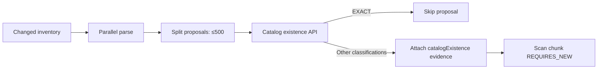

# FT-035 — Scan–Catalog filtering — Design

## Decision đã chốt

1. Scan parse proposal bằng CPU/virtual thread như hiện tại, sau đó gọi Catalog ngoài mọi transaction
   persistence. Vì vậy network chậm không giữ connection, lock hay lease-fenced `REQUIRES_NEW` chunk.
2. Một business chunk có thể 100.000 item nhưng existence request luôn bị split tuần tự tối đa 500. Chọn
   tuần tự thay vì fan-out để giới hạn outbound pressure và giữ failure boundary dễ chứng minh; virtual
   thread không biến Catalog thành dependency không bounded.
3. Không retry trong FT-035. Request Catalog read-only nhưng retry tự động kéo dài deadline và có thể tạo
   storm lúc Catalog unavailable. Lỗi network/503/timeout hoặc response thiếu/duplicate/unknown đều làm
   run fail; rewalk/resume của Scan là recovery path hiện hữu.
4. `EXACT_ASSET_EXISTS` bị loại trước COPY proposal. Các result còn lại được lưu cùng evidence bounded:
   classification, matched IDs và conflict code để reviewer biết snapshot Catalog đã quyết định gì.
5. Catalog snapshot vẫn advisory: proposal/approval và write-side unique constraint là authority cuối.

## Luồng

## Failure contract

Catalog call xảy ra trước `ScanChunkCommitter.commitChangedChunk`. Nếu bất kỳ micro-batch lỗi thì chunk đó
không ghi inventory/proposal/issue/checkpoint. Failure handler đánh dấu run failed và cleanup staging theo
behavior hiện hành. FT-035 không thêm cross-database transaction hoặc fallback `NEW_SUBJECT`.

## Verification deferred

Theo ưu tiên thông luồng, chưa chạy build/test. Cần bổ sung integration evidence cho exact skip, conflict
evidence, response protocol lỗi, Catalog 503/timeout và proof transaction không mở khi chờ HTTP.
