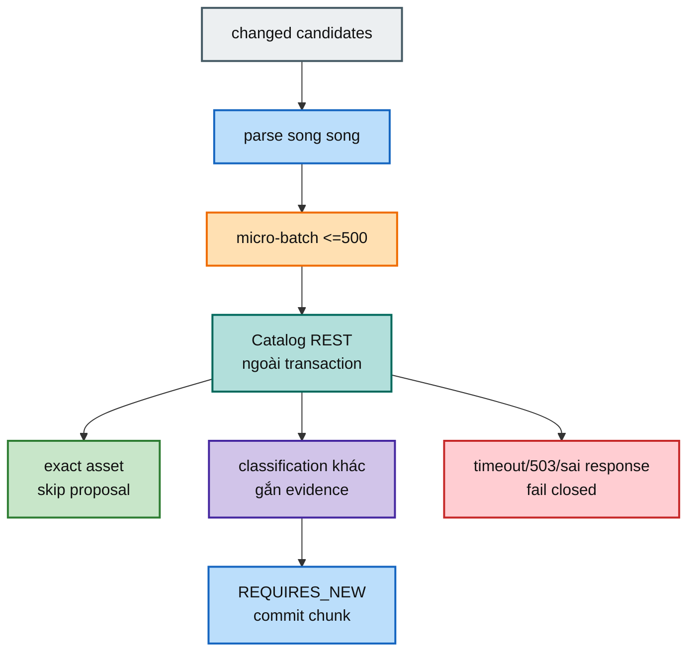

# FT-035 — Scan–Catalog filtering: giải thích, scale và cloud

## 1. FT-035 làm gì?

Sau khi Scan đọc filesystem và parse candidate, nó chưa được ghi proposal ngay. Nó phải hỏi Catalog xem file/subject đã tồn tại chưa. FT-035 gọi FT-034 theo các micro-batch tối đa 500 item.

Luồng đơn giản:

1. Parse candidate.
2. Chia candidate thành nhóm nhỏ không quá 500.
3. Gọi Catalog ngoài transaction persistence.
4. `EXACT_ASSET_EXISTS` thì bỏ proposal trùng.
5. Classification khác thì giữ proposal và gắn evidence để reviewer hiểu Catalog đã thấy gì.
6. Chỉ sau khi lookup thành công mới commit chunk.

## 2. Tại sao HTTP phải ở ngoài transaction?

Transaction database là khoảng thời gian connection và lock được giữ để ghi atomically. HTTP có thể chậm vì mạng, Catalog bận hoặc timeout. Nếu mở transaction rồi mới gọi HTTP, connection Scan phải ngồi chờ.

Ví dụ: thu ngân mở két tiền rồi đi gọi điện hỏi kho trong 30 giây. Trong thời gian đó người khác không dùng được két. Cách đúng là hỏi kho trước, nhận câu trả lời, rồi mới mở két ghi sổ.

Nếu không filter, mỗi lần scan lại một file đã canonical sẽ tạo proposal rác. Nếu timeout mà tự coi candidate là `NEW_SUBJECT`, hệ thống có thể tạo duplicate subject.

## 3. Từ vựng cho người mới

- **Micro-batch:** nhóm nhỏ trong một công việc lớn. Ví dụ 1M phiếu chia thành các xấp 500 để nếu một xấp lỗi không phải bỏ cả kho.
- **Evidence:** bằng chứng lưu cùng proposal, ví dụ “Catalog nói subject đã có nhưng asset này chưa có”. Nó giúp reviewer không phải đoán.
- **Fail closed:** không chắc thì dừng an toàn; không tự biến lỗi thành file mới.
- **Retry storm:** nhiều worker cùng retry liên tục khi dependency đang hỏng, giống hàng trăm người cùng gọi lại một số điện thoại đang mất mạng.
- **Semaphore:** giới hạn số request chạy cùng lúc. Có 100 virtual thread nhưng semaphore 4 nghĩa là chỉ 4 ghế được ngồi trong Catalog.

## 4. Scale riêng

### Hiện tại

Batch 500 chạy tuần tự để bảo vệ Catalog. Đây là lựa chọn an toàn ban đầu, không phải con số tối ưu vĩnh viễn.

### Khi Catalog còn dư capacity

Có thể chạy vài batch song song, nhưng phải có semaphore, timeout và tổng deadline. Đo Catalog p95, DB CPU, pool usage, 503 và Scan lease loss trước/sau.

### Khi Catalog là bottleneck

Tối ưu FT-034 query/index trước. Thêm Scan worker không giúp vì mọi worker vẫn gọi cùng Catalog DB. Tăng batch lên 5.000 làm một request lỗi ảnh hưởng lớn hơn và heap tăng.

### Khi filesystem là bottleneck

Không tăng HTTP concurrency; nó chỉ làm Scan đọc filesystem nhanh/chậm không liên quan. Tách bottleneck theo phase timing.

## 5. Cloud deployment

- Scan và Catalog cùng region/VPC để giảm latency mạng.
- Private service discovery, security group/network policy chỉ cho Scan gọi internal endpoint.
- mTLS/workload identity, timeout connect/read riêng, secret rotation.
- Connection pool Catalog phải tính số Scan worker × request concurrency.
- Circuit breaker chỉ dùng khi policy fail closed rõ ràng; mở mạch không được trả `NEW_SUBJECT`.
- Dashboard: Catalog request p95, batch size, classification count, 503, timeout, run failure, lease loss.

## 6. Rollout, rollback và trade-off

Canary một root. So sánh tỷ lệ proposal trước/sau, exact skip và Catalog load. Nếu Catalog lỗi, dừng caller/filter hoặc để run fail theo policy; không âm thầm “thành công”.

REST đồng bộ dễ hiểu, trace dễ, nhưng outage Catalog chặn Scan. Retry có thể cứu lỗi mạng ngắn nhưng kéo dài run. Parallel request tăng throughput nhưng có thể làm Catalog quá tải.

## 7. Điều kiện verify

Cần test batch 1/500/501, response thiếu/duplicate/unknown, timeout/503, exact skip, conflict evidence và proof transaction không mở khi HTTP đang chờ. Cần benchmark p95 theo concurrency và kiểm tra connection pool.

## 8. Kịch bản lỗi cụ thể

### Catalog tắt giữa hai micro-batch

Batch 1 đã commit, batch 2 nhận `503`. Đây không phải lý do rollback batch 1 nếu mỗi chunk là transaction độc lập. Run phải chuyển sang failure rõ ràng, giữ last checkpoint và không ghi batch 2 dở dang. Người vận hành có thể rerun theo policy.

### Response thiếu một `clientRef`

Nếu request có 500 candidate nhưng response chỉ có 499, Scan không được ghép theo vị trí mảng rồi đoán item còn lại. Nó phải reject toàn response vì nếu ghép sai, evidence của file A có thể gán sang file B.

### Catalog trả classification lạ

Consumer chưa biết giá trị mới phải fail closed. Đó là dấu hiệu contract version chưa đồng bộ, không phải lý do tự chuyển thành `NEW_SUBJECT`.

## 9. Ngân sách timeout và capacity

Giả sử một Catalog micro-batch p95 mất 200ms, không được lấy con số đó làm cam kết production ngay. Cần đo p99 dưới peak và cộng thời gian network, retry budget (nếu sau này bật), parse và DB commit. Tổng thời gian gọi Catalog của một run phải nhỏ hơn no-progress deadline và lease còn safety margin.

Nếu muốn 4 request chạy song song, phải chứng minh:

- Catalog chịu được 4 × số worker Scan;
- connection pool không cạn;
- thứ tự kết quả không phụ thuộc array order;
- một request chậm không giữ transaction;
- cancellation/deadline dừng được request thực sự.
