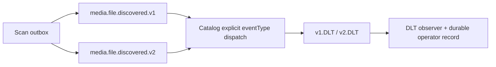

# FT-036 — Event contract/DLT alignment — Design

## Quyết định

Giữ v1 backward-compatible và ghi v2 theo record producer đang phát hành. Dispatch dựa trên `eventType` JSON
được parse trước khi deserialize để payload malformed/unknown version đi qua error handler và DLT. DLT observer
dùng một consumer group cho cả hai topic; event coordinate vẫn là `(originalTopic, partition, offset)`.

Trade-off: chưa hợp nhất envelope schema hoặc thay retry policy trong lát này để tránh breaking migration;
đổi lại v2 được ghi rõ và lỗi version không bị nhận nhầm thành v1.

## Verification deferred

Chưa build/test hoặc chạy Kafka. Cần verify contract serialization, retry/DLT của cả hai topic và duplicate
dedupe trước production cutover.
