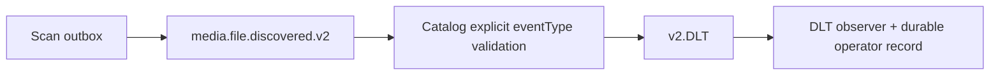

# FT-036 — Event contract/DLT alignment — Design

## Quyết định

Chốt v2 là contract runtime duy nhất. Dispatch dựa trên `eventType` JSON được parse trước khi deserialize để
payload malformed/unknown version đi qua error handler và DLT. DLT observer dùng một consumer group cho topic v2;
event coordinate vẫn là `(originalTopic, partition, offset)`.

Trade-off: v1 producer/backlog không còn được consume sau reset; đổi lại E2E chỉ có một contract và không còn
nhánh dispatch/compatibility mơ hồ.

## Verification deferred

Chưa build/test hoặc chạy Kafka. Cần verify contract serialization, retry/DLT của v2 và duplicate
dedupe trước production cutover.
