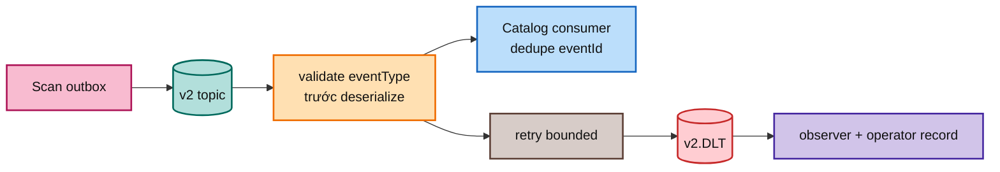

# FT-036 — Event contract và DLT: giải thích, scale và cloud

## 1. Vì sao cần contract?

Scan phát event `media.file.discovered.v2` sau approval. Catalog phải biết event này có field nào, version nào và xử lý ra sao. Contract giống mẫu phiếu giao hàng: bên gửi điền đúng mẫu, bên nhận không phải đoán.

Consumer đọc `eventType` trước khi deserialize. **Deserialize** là biến JSON thành object Java. Nếu payload sai mà deserialize trước, lỗi có thể xảy ra trong mapping nửa chừng và khó phân loại.

## 2. DLT giải thích bằng kho hàng lỗi

**DLT — Dead Letter Topic** là topic chứa event không thể xử lý sau retry. Giống kho cách ly hàng lỗi: dây chuyền chính không bị một kiện hỏng chặn mãi, nhưng operator phải xem và quyết định sửa/replay/bỏ.

Nếu không có contract rõ:

- producer và consumer hiểu khác field/version;
- event sai retry vô hạn;
- poison event chiếm partition;
- operator không biết event nào đang mắc.

## 3. Thuật ngữ dễ hiểu

- **At-least-once:** cố gửi ít nhất một lần, chấp nhận gửi trùng nếu crash.
- **EventId dedupe:** lưu mã event đã xử lý; nhận lại cùng mã thì bỏ qua. Giống đóng dấu “đã nhận” trên phiếu.
- **Poison event:** một event luôn lỗi vì payload/schema sai, không phải lỗi mạng tạm thời.
- **Partition:** ngăn xử lý Kafka. Ordering chỉ chắc chắn trong cùng ngăn.
- **Consumer lag:** số event còn chờ xử lý, giống số kiện hàng còn trên băng chuyền.

## 4. Scale riêng

Consumer chỉ scale hữu ích theo partition. Topic 3 partition thì 20 pod không tạo 20 luồng xử lý hữu ích. Tăng partition có thể tăng throughput nhưng thay đổi ordering và tạo hot partition nếu partition key lệch.

DLT observer cũng cần bounded concurrency và idempotency theo original topic/partition/offset. Replay phải có version guard; không bơm lại hàng loạt DLT mà không đo Catalog capacity.

## 5. Cloud deployment

- Kafka managed hoặc cluster tự quản trị với replication factor >=3.
- TLS/SASL hoặc workload identity; ACL producer, consumer và DLT observer riêng.
- Retention cho topic/DLT, disk/network quota và backup/DR.
- Alert lag theo partition, retry rate, DLT age, duplicate rate.
- Replay runbook có dry-run, batch limit và rollback policy.

## 6. Rollout và trade-off

Deploy topic v2 → canary consumer → gửi malformed/unknown test → xác nhận retry/DLT/observer → chuyển producer → theo dõi lag. Rollback producer về v1 chỉ an toàn khi consumer v1 và dữ liệu v1 còn được hỗ trợ; không chỉ đổi tên topic rồi hy vọng tương thích.

DLT bảo vệ flow chính nhưng tạo eventual consistency và manual work. Retry nhiều cứu lỗi tạm thời nhưng có thể kéo dài queue. Acceptance: malformed vào đúng DLT, duplicate không tạo duplicate Catalog, rolling restart không mất event và operator record durable.

## 7. Đọc một message từ đầu đến cuối

1. Người dùng approve proposal.
2. Scan ghi decision và outbox cùng local transaction. Nếu transaction rollback, không có event hợp lệ để publish.
3. Outbox publisher gửi payload với topic/key đã quy định.
4. Kafka lưu message trong một partition. Partition key giúp các message cùng identity đi cùng ngăn, nhưng không biến toàn hệ thống thành một transaction.
5. Catalog listener nhận message và đọc `eventType` trước khi map JSON.
6. Nếu `eventId` đã có trong processed-event, consumer bỏ qua duplicate.
7. Nếu chưa xử lý, Catalog ghi canonical subject/asset và processed-event trong transaction của nó.
8. Lỗi tạm thời được retry với backoff; lỗi không thể xử lý được chuyển DLT.

## 8. Phân biệt lỗi tạm thời và lỗi vĩnh viễn

| Loại lỗi | Ví dụ | Cách xử lý |
| --- | --- | --- |
| Tạm thời | DB connection pool hết trong vài giây, broker leader đang chuyển | Retry có giới hạn và backoff |
| Vĩnh viễn | JSON thiếu field bắt buộc, eventType không được hỗ trợ | DLT, không retry vô hạn |
| Nghiệp vụ | locator conflict, primary asset đã tồn tại | Consumer ghi nhận/đẩy trạng thái business theo contract |

Nếu không phân biệt, poison event sẽ đứng đầu partition và ngăn event khỏe phía sau. Đó là lý do retry count phải có giới hạn.

## 9. Scale consumer bằng ví dụ

Có 3 partition và 1 consumer: một người xử lý ba quầy. Có 3 consumer: mỗi người một quầy, throughput có thể tăng. Có 10 consumer: 7 người không có quầy, không tăng throughput. Muốn thêm consumer hữu ích phải tăng partition, nhưng tăng partition làm ordering và rebalancing phức tạp hơn.

**Rebalancing** là Kafka chia lại partition khi consumer vào/ra. Trong lúc đó xử lý có thể tạm dừng; consumer phải idempotent vì message có thể được xử lý lại.

## 10. DLT replay an toàn

Operator không nên lấy toàn bộ DLT bơm lại cùng lúc. Quy trình dễ hiểu:

1. Xem reason/error và original coordinate.
2. Kiểm tra lỗi đã được sửa chưa.
3. Chọn batch nhỏ, ghi replay operation id.
4. Publish lại với eventId cũ hoặc replay marker theo policy.
5. Theo dõi Catalog duplicate guard và Query freshness.
6. Dừng nếu DLT tăng lại hoặc DB saturation vượt ngưỡng.

Replay là “phát lại phiếu”, không phải “xóa lịch sử rồi làm như chưa từng gửi”.

## 11. Cloud checklist chi tiết

- Topic v2 và DLT tạo bằng IaC, không tạo tay trên console.
- ACL tách producer Scan, consumer Catalog và observer; observer không được quyền ghi canonical.
- TLS certificate rotation phải không làm restart toàn bộ consumer cùng lúc.
- Broker disk alert trước ngưỡng đầy; retention phù hợp replay window.
- Consumer group có static/explicit configuration, readiness không báo healthy nếu không kết nối dependency theo policy.
- Log chỉ dùng eventId/correlation/partition/offset; không log full payload nếu payload có dữ liệu nhạy cảm.

## 7. Một event đi qua hệ thống như thế nào?

1. Approval ghi outbox cùng transaction với decision.
2. Publisher claim row và gửi payload v2.
3. Kafka ghi message vào partition theo key.
4. Catalog consumer nhận message, kiểm tra `eventType`, parse payload và kiểm tra `eventId` đã xử lý chưa.
5. Nếu xử lý được, Catalog ghi canonical state và processed-event trong transaction của consumer.
6. Nếu lỗi tạm thời, error handler retry theo backoff.
7. Nếu vẫn lỗi hoặc payload không thể hiểu, recoverer gửi sang DLT.
8. Observer ghi original topic/partition/offset/error để operator điều tra.

**Backoff** là khoảng nghỉ tăng dần giữa các lần thử, giống không gọi lại người giao hàng liên tục mà chờ 1 phút rồi 2 phút. Backoff không chữa poison event; nó chỉ giảm áp lực khi lỗi tạm thời.

## 8. Cloud failure cần chuẩn bị

- Broker mất một node: replication factor và ISR phải đủ để producer/consumer tiếp tục.
- Consumer restart: offset commit và idempotency phải giúp xử lý lại an toàn.
- DLT observer restart: record không được mất; observer phải có group riêng.
- DLT đầy: retention/quota/alert phải rõ, không để disk broker đầy âm thầm.
- Replay: operator phải chọn batch, kiểm tra reason và biết replay có thể tạo duplicate message nhưng không duplicate canonical state.
