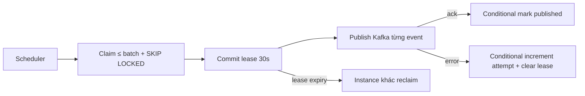

# FT-037 — Outbox backlog capacity — Design

## Quyết định

Publisher claim các bản ghi pending theo `created_at,id` trong transaction ngắn với `FOR UPDATE SKIP LOCKED`,
ghi `lease_owner/lease_until`, commit rồi mới gọi Kafka. Mỗi event cập nhật published/failed bằng câu lệnh
conditional theo owner; nếu process chết sau broker ack trước DB update, lease hết hạn và event được publish lại.
Đây là at-least-once có chủ ý, được bảo vệ bằng `eventId` dedupe của consumer.

Trade-off: giữ batch mặc định 20 để giới hạn heap/network pressure và không tự tuning concurrency khi chưa có
backlog evidence. Lease 30 giây là safety bound, không phải delivery deadline; Kafka client timeout vẫn là
operation timeout.

## Reliability/operations

Không dùng absolute path hoặc event identity làm metric label. Metrics chỉ gồm pending count, oldest age,
publish success/failure. Shutdown không làm mất record: record đang lease sẽ tự reclaim sau expiry.

## Verification deferred

Chưa build/test/migration/runtime. Cần verify Postgres lock plan, multi-instance claim, crash sau Kafka ack,
lease reclaim, backlog age và Catalog dedupe dưới duplicate delivery.
