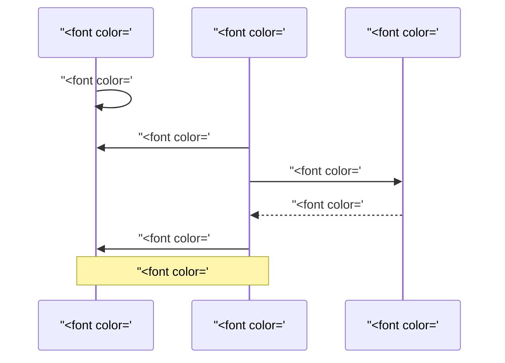

# FT-037 — Outbox backlog capacity: giải thích, scale và cloud

## 1. Outbox là gì?

Approval cần ghi decision vào DB và phát event Kafka. Nếu ghi DB trước rồi process chết trước khi gửi Kafka, dữ liệu đã đổi nhưng Catalog downstream không biết.

**Transactional outbox** là hộp thư bền: cùng transaction ghi decision và một outbox row. Publisher lấy row sau commit, gửi Kafka, rồi mark published.

Ví dụ: nhân viên bán hàng vừa ghi hóa đơn vừa bỏ bản sao vào hộp thư giao hàng. Nếu xe giao hàng hỏng, phiếu vẫn nằm trong hộp để gửi lại.

## 2. Thuật ngữ cho người mới

- **Outbox row:** phiếu chờ gửi.
- **Claim:** worker nhận quyền xử lý row.
- **SKIP LOCKED:** worker bỏ qua row đang bị worker khác giữ, thay vì đứng chờ.
- **Lease:** quyền xử lý có thời hạn.
- **Fencing:** DB từ chối worker đã hết quyền cập nhật.
- **At-least-once:** không mất event, nhưng có thể gửi trùng.
- **In-flight:** số send đang chờ Kafka ack.
- **Backpressure:** van giới hạn số send khi Kafka chậm.

## 3. Nếu không làm?

Không claim bounded: nhiều publisher gửi cùng row. Giữ transaction lúc chờ Kafka: connection/lock bị chiếm. Không conditional mark: worker cũ sau lease expiry có thể mark row của worker mới. Không consumer dedupe: crash sau Kafka ack tạo canonical duplicate.

Code hiện tại đã claim `SKIP LOCKED`, lease 30s và conditional update, nhưng publish từng event tuần tự. Batch lớn có thể chạy quá lease; row bị reclaim và gửi lại.

## 4. Scale riêng

### Bước 1 — Async bounded

Thêm `maxInFlight`, timeout từng send và backpressure. Công thức dễ nhớ: thời gian xử lý worst-case của claimed rows phải nhỏ hơn lease còn lại với safety margin.

### Bước 2 — Nhiều publisher

Chỉ thêm replicas khi claim query, DB pool và Kafka còn dư. `SKIP LOCKED` phân chia row, không biến DB primary thành nhiều DB.

### Bước 3 — Kafka consumer

Khi publish ổn mà Catalog lag tăng, scale partition/consumer. Tăng publisher khi bottleneck là DB/Kafka producer; tăng consumer khi bottleneck là handler/Catalog write.

## 5. Cloud cần chuẩn bị

- PostgreSQL primary HA, claim index, pool budget và backup.
- Kafka RF >=3, TLS/SASL, ACL, retention, disk/network quota.
- Producer timeout, consumer dedupe, DLT observer và replay runbook.
- Metrics pending count, oldest age, send p95, lease loss, duplicate, lag, DLT.
- Graceful shutdown: dừng claim mới, row đang lease để reclaim; không xóa pending.

## 6. Rollout, rollback và trade-off

Shadow metrics → một publisher async → canary một instance → tăng in-flight → thêm replicas → mở partition/consumer. Rollback bằng giảm in-flight, tắt async hoặc dừng replicas mới; không xóa outbox pending.

Async tăng throughput nhưng khó giữ ordering, tốn heap/network và duplicate vẫn có. Acceptance: crash sau ack, reclaim, multi-instance claim, backlog age dưới SLO và duplicate trong budget.

## 7. Vì sao `SKIP LOCKED` quan trọng?

Nếu publisher A đang lấy row 1, publisher B gặp row 1 và phải chờ lock, B có thể đứng im dù row 2/3 sẵn sàng. `SKIP LOCKED` cho B bỏ qua row đang bị giữ và lấy row khác.

Ví dụ: quầy phát phiếu có một người đang cầm phiếu số 1. Nhân viên thứ hai không đứng nhìn; họ lấy phiếu số 2. Điều này tăng concurrency nhưng thứ tự claim không còn là thứ tự tuyệt đối.

## 8. Các mốc state của một outbox row

`PENDING` nghĩa là chưa publish. `RUNNING/leased` nghĩa là một publisher tạm giữ quyền. `PUBLISHED` nghĩa là publisher đã nhận Kafka acknowledgement và conditional update thành công. `FAILED`/attempt count cho biết lần gửi lỗi nhưng row có thể còn retry theo policy.

Kafka acknowledgement chỉ nói broker nhận message; nó không nói Catalog đã commit. Vì vậy consumer phải chịu duplicate và out-of-order.

## 9. Capacity budget dễ hiểu

Giả sử lease còn 25 giây, một send p99 mất 500ms và publisher chạy tuần tự. 20 row có thể mất khoảng 10 giây, còn an toàn; 100 row có thể mất 50 giây, vượt lease. Đây chỉ là ví dụ tính budget, không phải cấu hình production đã được xác nhận.

Async 10 in-flight có thể giảm wall-clock time, nhưng nếu mỗi message lớn, heap có thể tăng. Cần đo message size, producer buffer, network và Kafka throttle.

## 10. Cloud operations

- PostgreSQL claim query cần index và vacuum/retention; bảng outbox không được phình vô hạn.
- Publisher pod phải có readiness/liveness khác nhau: process sống chưa chắc Kafka/DB usable.
- Shutdown phải dừng scheduler claim mới; row đang lease để instance khác reclaim sau hạn.
- Alert theo oldest pending age, không chỉ pending count. 1.000 row mới có thể bình thường; 1 row cũ 1 giờ có thể là incident.
- Cost gồm DB WAL, Kafka retention, network egress, backup và DLT storage.

## 7. Tại sao lease 30 giây không phải delivery SLO?

Lease chỉ là thời gian worker được quyền giữ row trước khi worker khác được phép thử reclaim. Delivery SLO là mục tiêu toàn hệ thống, ví dụ “95% event đến Catalog trong 10 giây”. Một lease 30 giây không chứng minh event sẽ tới trong 30 giây; publisher có thể bị treo, Kafka có thể chậm và row có thể được gửi lại.

Ví dụ: thẻ giữ chỗ bàn ăn có hạn 30 phút không có nghĩa nhà hàng cam kết món ăn ra trong 30 phút. Hai khái niệm phải đo riêng.

## 8. Failure matrix

| Tình huống | Kết quả đúng | Rủi ro cần test |
| --- | --- | --- |
| Crash trước Kafka send | Row còn pending/reclaim | Không mất event |
| Kafka ack rồi process chết | Row có thể pending và gửi lại | Consumer dedupe eventId |
| Kafka timeout | Mark failed có điều kiện owner | Không để worker khác ghi đè |
| Lease hết giữa batch | Update cũ bị từ chối | Duplicate có kiểm soát |
| Hai publisher claim | `SKIP LOCKED` chia row | Không cùng claim một row |

## 9. Cloud cost và retention

Async in-flight cao làm tăng network buffer và producer memory. Kafka retention dài và outbox history không purge làm tăng disk, backup và WAL cost. Cần đặt retention, archive/purge, quota và alert data age trước khi autoscale.
