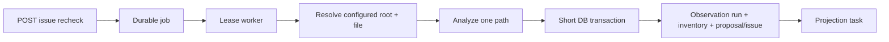

# FT-038 — Targeted issue recheck — Design

## Quyết định

Một request tạo một persisted job cho một issue. Worker claim bằng `FOR UPDATE SKIP LOCKED`, lease 60 giây,
resolve root/path từ server-side issue data, rồi thực hiện filesystem/Catalog I/O ngoài transaction. Transaction
ngắn chỉ ghi observation `scan_run`, inventory, proposal/issue và enqueue projection task.

Trade-off: API hiện nhận từng issue để giữ payload/idempotency đơn giản; bulk issue selection là lát mở rộng.
Một observation run mới giữ current-item semantics của projection, nhưng chạy analyzer/catalog lookup riêng và
không dùng scan lease full-root.

## Verification deferred

Chưa build/test/runtime. Cần verify lease reclaim, path race, file disappeared, projection race, Catalog outage,
duplicate request và API job status/observability.
