# FT-038 — Targeted issue recheck: giải thích, scale và cloud

## 1. Bài toán

Một issue có thể do file tạm thời mất, rename hoặc Catalog lookup lỗi. FT-038 tạo durable job theo `issueId`, resolve root/path từ server-side data, đọc đúng một file và tạo observation run mới.

Ví dụ: một món hàng bị ghi “không tìm thấy” thì nhân viên đi thẳng đến đúng ô kệ đó, không kiểm kê lại cả kho.

**Durable job** là việc được lưu trong DB, không mất khi HTTP request kết thúc. **Lease** là thẻ ca có hạn; worker chết thì worker khác reclaim sau deadline. **Path traversal** là cố dùng `../` hoặc absolute path để đi ra ngoài root được cấp phép.

## 2. Nếu không làm?

Không có recheck nhỏ, muốn xác minh một issue phải full-root scan, đọc lại hàng triệu entry và tranh tài nguyên. Nếu nhận absolute path từ client, người gọi có thể đọc file ngoài vùng được cho phép.

```mermaid
flowchart LR
    API["<font color='#111111'>POST issue recheck</font>"] --> JOB[("<font color='#111111'>durable job<br/>issueId</font>")]
    JOB --> CLAIM["<font color='#111111'>claim lease<br/>SKIP LOCKED</font>"]
    CLAIM --> RESOLVE["<font color='#111111'>resolve configured root<br/>+ relative path</font>"]
    RESOLVE --> READ["<font color='#111111'>read one file<br/>Catalog lookup</font>"]
    READ --> WRITE["<font color='#111111'>short transaction<br/>observation + issue</font>"]
    WRITE --> REFRESH["<font color='#111111'>refresh projection</font>"]
    style API fill:#BBDEFB,stroke:#1565C0,stroke-width:2px,color:#111111
    style JOB fill:#F8BBD0,stroke:#AD1457,stroke-width:2px,color:#111111
    style CLAIM fill:#FFE0B2,stroke:#EF6C00,stroke-width:2px,color:#111111
    style RESOLVE fill:#B2DFDB,stroke:#00695C,stroke-width:2px,color:#111111
    style READ fill:#ECEFF1,stroke:#455A64,stroke-width:2px,color:#111111
    style WRITE fill:#D1C4E9,stroke:#4527A0,stroke-width:2px,color:#111111
    style REFRESH fill:#C8E6C9,stroke:#2E7D32,stroke-width:2px,color:#111111
```

## 3. Luồng và giới hạn

API kiểm tra issue tồn tại, lưu `scan_issue_recheck_job`, trả `202 + jobId`. Worker claim lease 60s, resolve server-side root/path, đọc một file, phân tích, ghi observation/inventory/proposal/issue và enqueue projection. File mất là `MISSING`/`FILE_NOT_FOUND`; đó là kết quả terminal hợp lệ, không phải worker crash.

Scale tốt theo số issue vì mỗi job nhỏ. Nhưng nhiều worker cùng một filesystem mount có thể làm disk seek/IOPS quá tải. Cần per-root semaphore hoặc quota: mỗi root chỉ cho N job đọc cùng lúc.

Khoảng trống hiện tại `TD-006`/`TD-012`: complete/fail chưa fenced đủ theo `leaseOwner + attempt`, enqueue chưa idempotent theo request key. Claim đúng nhưng final update sai vẫn nguy hiểm.

## 4. Cloud

- Worker và volume cùng region/zone; CSI/read-only mount đúng root.
- IAM/workload identity chỉ đọc approved root, không cho client quyết định absolute path.
- Autoscale theo job age/queue age, có min/max và IOPS guard.
- Status API qua Gateway có authn/authz; log không ghi absolute path.
- Alert job stuck, reclaim, failed classification, Catalog timeout và projection lag.

## 5. Rollout, rollback và acceptance

Canary một issue, test missing/rename/path race, bật một worker rồi tăng theo root khác nhau. Rollback bằng pause scheduler; job pending giữ lại để reclaim, không xóa observation history.

Cần idempotency enqueue, stale worker test, terminal/reaper test, Catalog outage policy, filesystem deadline và projection refresh evidence. Trade-off: recheck nhanh hơn nhưng observation là run mới và dữ liệu có thể đổi ngay sau khi đọc.

## 6. Một job chạy như thế nào?

1. API kiểm tra `issueId` có thuộc Scan không.
2. API lưu job `PENDING` và trả `202`; HTTP request kết thúc ngay.
3. Scheduler tìm job claimable, khóa row bằng `SKIP LOCKED` và ghi owner/deadline.
4. Worker lấy root/path từ issue history và configured root, không lấy absolute path từ request.
5. Worker đọc metadata/file hiện tại và gọi analyzer/Catalog nếu cần.
6. Transaction ngắn ghi observation run, inventory, proposal/issue mới và projection task.
7. Job chuyển terminal `COMPLETED` hoặc `FAILED` theo policy.

Nếu process chết ở bước 5, transaction bước 6 chưa commit; job cần reclaim. Nếu chết sau commit nhưng trước complete, state phải idempotent và fenced để không tạo observation trùng hoặc worker cũ ghi đè.

## 7. Vì sao observation run mới?

Issue cũ là lịch sử: “lần scan trước không tìm thấy”. Recheck là một quan sát mới ở thời điểm khác. Gộp đè vào lịch sử cũ sẽ làm mất khả năng trả lời “lúc nào file đã xuất hiện?”. Tạo run mới giữ audit rõ, đổi lại projection phải hiểu current-item semantics.

## 8. Các trạng thái file và lỗi

- File tồn tại: analyzer tạo observation/proposal theo kết quả hiện tại.
- File mất: ghi `MISSING`/`FILE_NOT_FOUND` rồi job có thể `COMPLETED`; mất file là kết quả nghiệp vụ đã biết.
- Permission denied: có thể là `FAILED` kỹ thuật hoặc issue code riêng; phải chốt contract, không nuốt exception.
- Path race: resolver thấy file nhưng open thất bại; ghi outcome rõ và không để job RUNNING vô hạn.
- Catalog timeout: fail/defer theo policy; không tự đoán subject mới.

## 9. Scale và cloud sâu hơn

Worker replicas phù hợp khi nhiều issue độc lập. Nhưng nếu tất cả issue thuộc cùng một root/mount, bottleneck là IOPS chứ không phải CPU. Per-root semaphore giống quy định mỗi kho chỉ cho 2 nhân viên vào cùng lúc.

Cloud cần volume/CSI mount có access mode phù hợp, region locality, IAM read-only, encryption at rest/in transit, metric per-root queue age và quota open handles. Không mount toàn bộ drive cho mọi pod.

## 6. Idempotency giải thích bằng ví dụ

Người dùng có thể bấm nút hai lần hoặc browser retry vì response đầu tiên bị mất. **Idempotency** nghĩa là hai request cùng một ý định chỉ tạo một kết quả nghiệp vụ theo policy.

Ví dụ gửi cùng một lá đơn hai lần: hệ thống phải nhận ra `requestKey` giống nhau và trả job cũ, không xếp hai nhân viên cùng đi kiểm tra một ô kệ.

Hiện enqueue tạo UUID job mới mỗi lần; đây là gap cần ghi trong `TD-006`. Không nên chỉ dựa vào “người dùng không bấm hai lần”.

## 7. Path race và terminal state

File có thể bị rename sau khi resolver kiểm tra nhưng trước khi mở. Đây là **path race**: hai thao tác nhìn thấy hai thời điểm khác nhau. Code phải coi missing/permission/changed metadata là kết quả đã phân loại hoặc lỗi rõ ràng, không để job RUNNING mãi.

**Reaper** là tác vụ quét job không tiến triển và chuyển/requeue sau deadline. Cleanup khi service startup không đủ nếu filesystem call đang treo.
