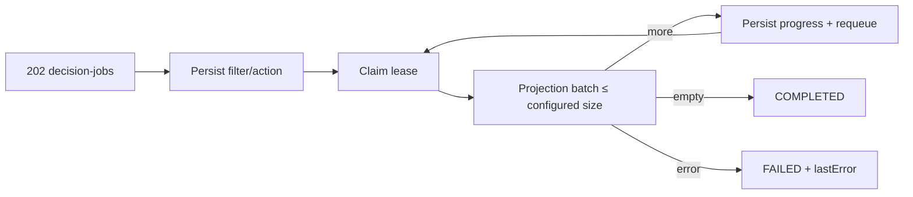

# FT-039 — Durable bulk decision — Design

## Quyết định

Job lưu filter `rootKey/search`, action và progress. Worker claim một job bằng `SKIP LOCKED`, sau đó gọi
`ScanReviewQueueDecisionBatch` đúng một bounded batch trong transaction riêng. Còn candidate thì trả job về
`PENDING`; batch rỗng thì `COMPLETED`. Lỗi batch chuyển `FAILED`, không rollback các chunk đã commit.

Trade-off: filter hiện được đánh giá theo current projection ở từng batch, nên candidate phát sinh giữa các
batch có thể được chọn; đây là lý do job snapshot/cutoff và status API được ghi là follow-up hardening.

## Verification deferred

Chưa build/test/runtime. Cần verify crash/reclaim, duplicate request, concurrent user decision, stable selection,
partial chunk semantics và outbox duplicate.
