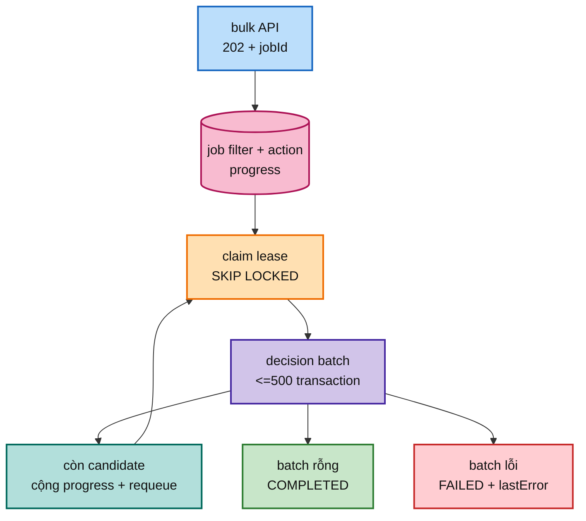

# FT-039 — Durable bulk decision: giải thích, scale và cloud

## 1. Bài toán

Bulk approve/reject/reopen có thể match hàng trăm nghìn proposal. FT-039 không giữ một HTTP request và một transaction cho toàn bộ danh sách. API trả `202 + jobId`; worker xử lý tối đa 500 item mỗi transaction, ghi progress rồi requeue.

Ví dụ: thu ngân không ghi một hóa đơn 100.000 món. Họ chia thành các giỏ 500 món; giỏ nào xong có biên lai riêng. Nếu giỏ thứ 7 lỗi, sáu giỏ trước vẫn đã commit.

**202 Accepted** nghĩa là server đã nhận công việc, chưa có nghĩa công việc hoàn tất. **Partial commit** nghĩa là một số batch đã commit trước khi batch sau lỗi.

## 2. Nếu không làm?

Request đồng bộ giữ connection quá lâu, transaction phình, lock lâu, browser retry có thể quyết định trùng và user không biết đã xử lý tới đâu. Durable job cho phép polling status, retry từng batch và dừng intake mà không mất progress đã commit.

## 3. Thuật ngữ quan trọng

- **Filter:** điều kiện chọn candidate, ví dụ root + search.
- **Cutoff snapshot:** mốc đóng danh sách lúc tạo job. Giống chụp ảnh hàng chờ lúc 10:00; người vào lúc 10:01 không tự lọt vào ảnh đó.
- **Current projection:** trạng thái read model tại lúc một batch chạy; nếu dùng nó mỗi batch, danh sách có thể thay đổi giữa job.
- **Requeue:** trả job về `PENDING` để lần sau xử lý tiếp.
- **Fenced transition:** update state chỉ thành công nếu worker vẫn là owner hợp lệ.

## 4. Giới hạn code hiện tại

Selection đang đọc current projection từng batch, chưa snapshot cutoff/generation. Candidate mới có thể lọt vào batch sau. `BulkDecisionJobWorker` load entity theo id và save khi progress/complete/fail; chưa conditional đủ theo owner/attempt. Worker cũ sau reclaim có thể ghi sai (`TD-007`, `TD-012`).

Trước khi scale phải chốt semantics: job xử lý danh sách tại thời điểm tạo, hay xử lý mọi item match cho tới khi rỗng. Nếu không chốt, “đã hoàn thành” không có nghĩa rõ ràng.

## 5. Scale riêng

- Tăng batch giảm số transaction nhưng làm lock/WAL/rollback lớn hơn.
- Tăng worker tăng throughput nhưng concurrent decisions tranh nhau và ép DB pool.
- Một job nên có một owner; nhiều job trên root khác nhau mới song song.
- Autoscaling theo job age/progress rate, không theo CPU một mình.

## 6. Cloud deployment

- Job table và decision authority ở PostgreSQL primary HA, có claim/filter index.
- Worker stateless private subnet, Gateway status có authentication/authorization.
- DB pool guard, min/max worker, cooldown và pause khi lock/WAL cao.
- Metrics job age, progress rate, failed batch, lease reclaim, duplicate decision, outbox backlog.
- Runbook pause/resume/retry failed job; backup/restore phải giữ job và decision consistency.

## 7. Rollout, rollback, trade-off

Deploy schema additive → bật endpoint async nhưng giữ API cũ → canary một root → test crash/reclaim/concurrent decision → chuyển FE → tăng worker. Rollback bằng pause worker mới; job pending sẽ reclaim. Không rollback bằng xóa decision/outbox đã commit.

Trade-off: request latency và UX tốt hơn, nhưng completion eventual, partial commit và replay phức tạp. Acceptance: cutoff ổn định, batch atomic, stale worker không ghi đè, duplicate request policy rõ, outbox duplicate an toàn, status terminal chính xác.

## 8. Đọc progress đúng cách

`processedCount` là số candidate đã commit qua các batch, không nhất thiết là tổng cuối cùng nếu selection không có cutoff. UI không nên nói “100%” chỉ vì worker đang không tìm thấy batch tiếp theo một lần; cần state `COMPLETED` từ DB.

Ví dụ nhân viên đã đóng 6 giỏ hàng, nhưng còn giỏ thứ 7 đang trên xe. `processedCount=3000` không có nghĩa toàn bộ kho đã xử lý.

## 9. Những failure cần mô phỏng

| Failure | Điều cần chứng minh |
| --- | --- |
| Worker chết khi transaction batch đang chạy | Batch rollback toàn bộ, không nửa batch |
| Worker chết sau commit decision trước progress update | Retry không quyết định trùng hoặc progress sai |
| Lease hết hạn rồi worker cũ quay lại | Conditional transition từ chối worker cũ |
| Hai user quyết định cùng proposal | Invariant decision/outbox không bị lost update |
| Candidate mới xuất hiện giữa job | Cutoff semantics quyết định rõ có xử lý hay không |
| Outbox publish lại | Catalog dedupe eventId |

## 10. Cloud rollout chi tiết

Job table ở primary DB; worker private subnet; status endpoint qua Gateway có auth. Autoscaling theo job age và progress rate nhưng phải stop scale khi DB lock/WAL/pool vượt budget. IaC phải quản lý migration, index, worker count, timeout và alert cùng một release.

Rollback là pause worker mới, để job pending reclaim và giữ các batch đã commit. Không xóa decision/outbox để “trở về trước” vì đó là dữ liệu canonical và cần compensation/reopen có chủ đích.

## 8. Vì sao candidate cutoff quan trọng?

Giả sử lúc 10:00 job chọn 20.000 proposal. Trong lúc worker chạy, một scan khác tạo thêm 2.000 proposal phù hợp. Nếu mỗi batch lại query projection hiện tại, job có thể xử lý cả 2.000 item mới; lần chạy thứ hai lại thấy trạng thái khác. Người dùng không biết “bulk approve” ban đầu áp dụng cho danh sách nào.

Cutoff có thể là generation, `createdAt` watermark hoặc một durable selection table. Mỗi cách có chi phí khác nhau, nhưng phải chọn một semantics rõ ràng.

## 9. Fencing của state transition

Claim lease chỉ nói worker được bắt đầu. Khi progress/complete/fail, câu update phải kiểm tra worker vẫn là owner, attempt vẫn đúng và lease chưa hết. Nếu không, worker A hết ca nhưng vẫn complete job sau khi worker B đã reclaim.

Ví dụ nhân viên A giao lại phiếu cho B. A không được quay lại đánh dấu “đã xong” sau khi B đã xử lý phiên bản mới.

## 10. Scale/cloud guard

Tăng worker chỉ sau khi decision batch atomic, outbox duplicate-safe và DB lock/pool budget đã có evidence. Autoscale theo job age/progress rate; dừng scale khi DB lock/WAL vượt ngưỡng. Cloud status API phải có auth, không expose filter nội bộ hoặc lastError nhạy cảm.
